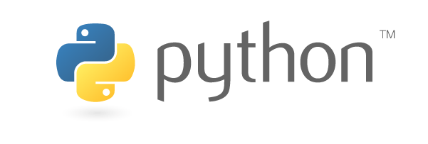

Title: Aprendendo Github
Date: 2014-05-10 19:25
Tags: exemplo
Category: Tutorial
Slug: aprendedo-github
Author: Fábio Caritas Barrionuevo da Luz
Email:  bnafta@gmail.com

Lorem Ipsum
-----------

### Sub-titulo

Lorem ipsum dolor sit amet, consectetur adipisicing elit, sed do eiusmod
tempor incididunt ut labore et dolore magna aliqua. Ut enim ad minim veniam,
quis nostrud exercitation ullamco laboris nisi ut aliquip ex ea commodo
consequat. Duis aute irure dolor in reprehenderit in voluptate velit esse
cillum dolore eu fugiat nulla pariatur. Excepteur sint occaecat cupidatat non
proident, sunt in culpa qui officia deserunt mollit anim id est laborum.

Lorem ipsum dolor sit amet, consectetur adipisicing elit, sed do eiusmod
tempor incididunt ut labore et dolore magna aliqua. Ut enim ad minim veniam,
quis nostrud exercitation ullamco laboris nisi ut aliquip ex ea commodo
consequat. Duis aute irure dolor in reprehenderit in voluptate velit esse
cillum dolore eu fugiat nulla pariatur. Excepteur sint occaecat cupidatat non
proident, sunt in culpa qui officia deserunt mollit anim id est laborum.

Lorem ipsum dolor sit amet, consectetur adipisicing elit, sed do eiusmod
tempor incididunt ut labore et dolore magna aliqua. Ut enim ad minim veniam,
quis nostrud exercitation ullamco laboris nisi ut aliquip ex ea commodo
consequat. Duis aute irure dolor in reprehenderit in voluptate velit esse
cillum dolore eu fugiat nulla pariatur. Excepteur sint occaecat cupidatat non
proident, sunt in culpa qui officia deserunt mollit anim id est laborum.

### Lista

* Outro Texto
* Lorem ipsum
* dolor sit amet
* consectetur adipisicing elit
* sed do eiusmod

### Imagem

### Syntax Highlight

    :::python

    from django.views.generic import TemplateView

    from braces.views import LoginRequiredMixin

    class IndexView(LoginRequiredMixin, TemplateView):
        template_name = 'core/index.html'
