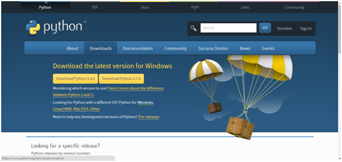
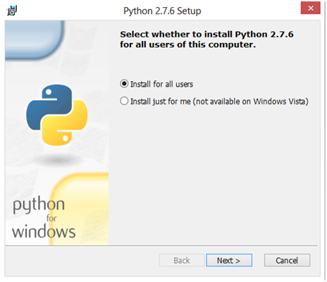
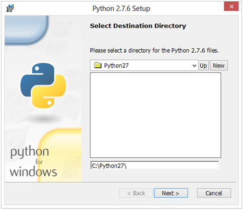
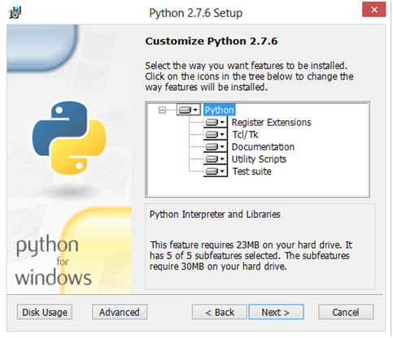
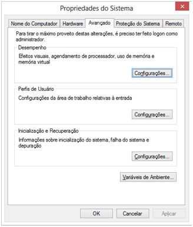
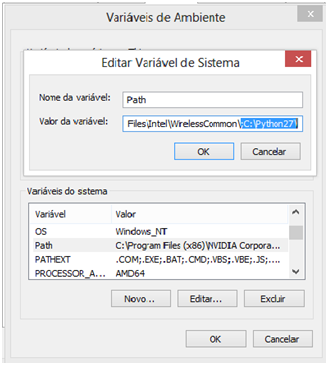

Instalando e Configurando o Python e Django no Windows
######################################################
:date: 2014-05-12 12:00
:tags: python django windows
:category: Tutoriais
:slug: instalacao-python-django-windows
:author: Thiago Corôa
:email:  macabroaff@hotmail.com

=========================
Instalação do Python 2.7
=========================

Para começar a desenvolver algo em Python, devemos baixar o Python(Nossa, que descoberta!), 
sendo a versão mais indicada o 2.7, por ser mais estável, possuir mais bibliotecas disponíveis
 e compatíveis e ser utilizada por mais desenvolvedores no mundo pythonico.

Vejamos como fazer esta instalação:
-----------------------------------
-Baixar a versão 2.7 do Python no endereço: https://www.python.org/downloads/

Seguindo os passos:

Após feita a instalação é hora de adicionar o Python às variáveis de ambiente, o Windows não o faz sozinho, para testar, podemos digitar "python" no prompt de comando, caso esteja funcionando corretamente ele deverá mostrar a versão do python que está instalada e ativar o console interativo Python para uso, não estando adicionada a variável ao ambiente, faremos a seguinte operação:

Procurar em variáveis do sistema a Variável "Path" e editar a mesma com o caminho onde foi instalado o Python, neste caso, "C:\Python27\" .

Não esquecer de adicionar um ponto e vírgula antes do caminho, pois é o que define o fim da variável anterior e início da próxima.

Pronto! O Python 2.7 está instalado, agora instalaremos o Pip, baixaremos do site:

"http://www.pip-installer.org/en/latest/installing.html#install-pip"

Baixar o arquivo get-pip.py na pasta “C:\Python27\Scripts”, logo após no cmd digite: as seguintes linhas:

Syntax Highlight
----------------

.. code-block:: python
	cd “C:\Python27\Scripts\”
	python get-pip.py install

Ele efetuará a instalação do pip, para testar digite pip no prompt de comando e execute, ele aparecerá a lista de comandos disponíveis para uso do PIP incluindo o Install que é uma bela mão na roda, onde ele instala pacotes sem precisar baixar arquivos e instalar manualmente.
O próximo passo será a instalação do Virtualenv, como recomendação para um ambiente de desenvolvimento saudável, instalaremos para evitar problemas com o uso de muitas bibliotecas diferentes para cada projeto, ele separa os ambientes de produção por ambientes virtuais, então é possível usar distribuições e bibliotecas diferentes em diferentes projetos mas no mesmo sistema operacional(usando a instalação limpa), o que seria impossível sem o Virtualenv.
Instalaremos digitando no prompt de comando:

Syntax Highlight
----------------
.. code-block:: python
	pip install virtualenv

Agora o passo mais difícil, instalar o Django depois do Pip instalado, digite o comando:

Syntax Highlight
----------------

.. code-block:: python
	pip install django==1.4.3

Muito difícil não?

					
