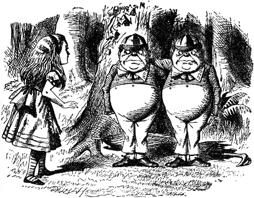
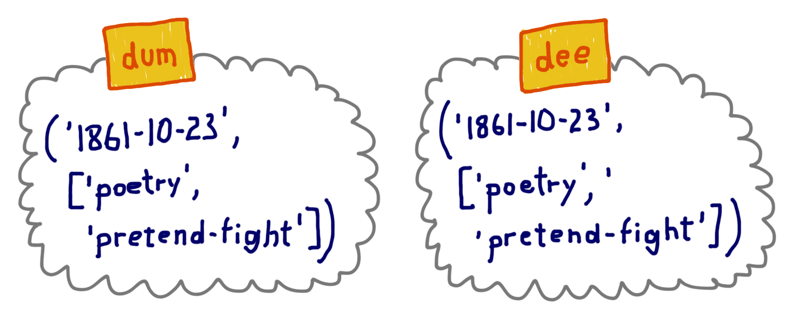
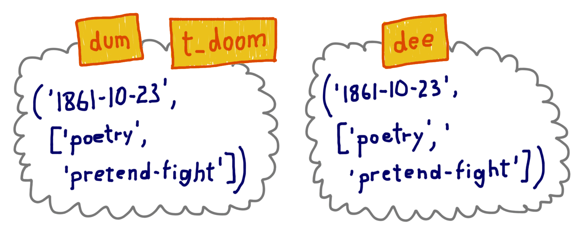
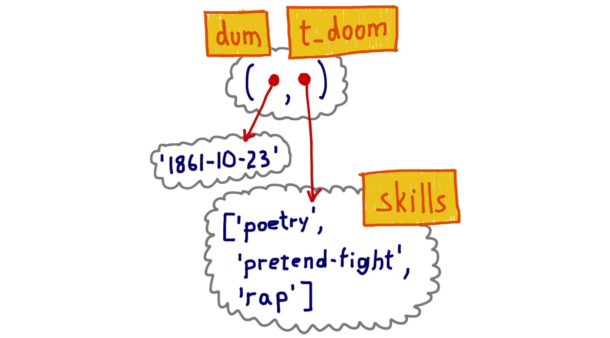

Tuplas mutantes em Python
=========================

:status: draft
:date: 2015-02-24 03:00
:tags: python,tuplas
:category: python-por-dentro
:slug: tuplas-mutantes-em-python
:author: Luciano Ramalho
:email:  luciano@ramalho.org
:about_author: Ramalho é autor do livro Fluent Python (O'Reilly, 2014) e sócio/professor em Python.pro.br, oferecendo cursos in-company e também online. Foi diretor técnico do Brasil Online, primeiro portal da Abril na Web, lançado uma semana antes do UOL. Depois liderou times para os sites IDG Now, BOL, UOL, AOL Brasil e outros, usando Python desde 1998. Palestrante em eventos internacionais como PyCon US, OSCON e FISL, ajudou a criar a Associação Python Brasil e foi seu presidente. É membro da Python Software Foundation e fundador do Garoa Hacker Clube, o primeiro hackerspace do Brasil.
:github: ramalho
:site: https://adm.python.pro.br/
:twitter: ramalhoorg
:linkedin: lucianoramalho

Por Luciano Ramalho, autor do livro `Fluent Python`_ (O'Reilly, 2014)

    See also the original article in English: http://radar.oreilly.com/2014/10/python-tuples-immutable-but-potentially-changing.html

Tuplas em Python têm uma característica surpreendente: elas são imutáveis, mas seus valores podem mudar. Isso pode acontecer quando uma ``tuple`` contém uma referência para qualquer objeto mutável, como uma ``list``. Se você precisar explicar isso a um colega iniciando com Python, um bom começo é destruir o senso comum sobre variáveis serem como caixas em que armazenamos dados.

Em 1997 participei de um curso de verão sobre Java no MIT. A professora, Lynn Andrea Stein - uma premiada educadora de ciência da computação - enfatizou que a habitual metáfora de "variáveis como caixas" acaba atrapalhando o entendimento sobre variáveis de referência em linguagens OO. Variáveis em Python são como variáveis de referência em Java, portanto é melhor pensar nelas como etiquetas afixadas em objetos.

Eis um exemplo inspirado no livro *Alice Através do Espelho e O Que Ela Encontrou Por Lá*, de Lewis Carroll.

Tweedledum e Tweedledee são gêmeos. Do livro: “Alice soube no mesmo instante qual era qual porque um deles tinha 'DUM' bordado na gola e o outro, 'DEE'”.

Vamos representá-los como tuplas contendo a data de nascimento e uma lista de suas habilidades:

.. code-block:: python

    >>> dum = ('1861-10-23', ['poesia', 'fingir-luta'])
    >>> dee = ('1861-10-23', ['poesia', 'fingir-luta'])
    >>> dum == dee
    True
    >>> dum is dee
    False
    >>> id(dum), id(dee)
    (4313018120, 4312991048)

É claro que ``dum`` e ``dee`` referem-se a objetos que são iguais, mas que não são o mesmo objeto. Eles têm identidades diferentes.

Agora, depois dos eventos testemunhados por Alice, Tweedledum decidiu ser um rapper, adotando o nome artístico T-Doom. Podemos expressar isso em Python dessa forma:

.. code-block:: python

    >>> t_doom = dum
    >>> t_doom
    ('1861-10-23', ['poesia', 'fingir-luta'])
    >>> t_doom == dum
    True
    >>> t_doom is dum
    True

Então, ``t_doom`` e ``dum`` são iguais - mas Alice acharia tolice dizer isso, porque ``t_doom`` e ``dum`` referem-se à mesma pessoa: ``t_doom is dum``.

Os nomes ``t_doom`` e ``dum`` são apelidos. O termo em inglês "alias" significa exatamente apelido. Gosto que os documentos oficiais do Python muitas vezes referem-se a variáveis como “nomes“. Variáveis são nomes que damos a objetos. Nomes alternativos são apelidos. Isso ajuda a tirar da nossa mente a ideia de que variáveis são como caixas. Qualquer um que pense em variáveis como caixas não consegue explicar o que vem a seguir.

Depois de muito praticar, T-Doom agora é um rapper experiente. Codificando, foi isso o que aconteceu:

.. code-block:: python

    >>> skills = t_doom[1]
    >>> skills.append('rap')
    >>> t_doom
    ('1861-10-23', ['poesia', 'fingir-luta 'rap'])
    >>> dum
    ('1861-10-23', ['poesia', 'fingir-luta 'rap'])

T-Doom conquistou a habilidade ``rap``, e também Tweedledum — óbvio, pois eles são um e o mesmo. Se ``t_doom`` fosse uma caixa contendo dados do tipo ``str`` e ``list``, como você poderia explicar que uma inclusão à lista ``t_doom`` também altera a lista na caixa ``dum``?  Contudo, é perfeitamente plausível se você entende variáveis como etiquetas.

A analogia da etiqueta é muito melhor porque apelidos são explicados mais facilmente como um objeto com duas ou mais etiquetas. No exemplo, ``t_doom[1]`` e ``skills`` são dois nomes dados ao mesmo objeto da lista, da mesma forma que ``dum`` e ``t_doom`` são dois nomes dados ao mesmo objeto da tupla.

Abaixo está uma ilustração alternativa dos objetos que representam Tweedledum. Esta figura enfatiza o fato de a tupla armazenar referências a objetos, e não os objetos em si.

O que é imutável é o conteúdo físico de uma tupla, que armazena apenas referências a objetos. O valor da lista referenciado por ``dum[1]`` mudou, mas a identidade da lista referenciada pela tupla permanece a mesma. Uma tupla não tem meios de prevenir mudanças nos valores de seus itens, que são objetos independentes e podem ser encontrados através de referências fora da tupla, como o nome ``skills`` que nós usamos anteriormente. Listas e outros objetos imutáveis dentro de tuplas podem ser alterados, mas suas identidades serão sempre as mesmas.

Isso enfatiza a diferença entre os conceitos de identidade e valor, descritos em *Python Language Reference*, no capítulo `Data model`_:

    Cada objeto tem uma identidade, um tipo e um valor. A identidade de um objeto nunca muda, uma vez que tenha sido criado; você pode pensar como se fosse o endereço do objeto na memória. O operador ``is`` compara a identidade de dois objetos; a função ``id()`` retorna um inteiro representando a sua identidade.

Após ``dum`` tornar-se um rapper, os irmãos gêmeos não são mais iguais:

.. code-block:: python

    >>> dum == dee
    False

Temos aqui duas tuplas que foram criadas iguais, mas agora elas são diferentes.

O outro tipo interno de coleção imutável em Python, ``frozenset``, não sofre do problema de ser imutável mas com possibilidade de mudar seus valores. Isso ocorre porque um ``frozenset`` (ou um ``set`` simples, nesse sentido) pode apenas conter referências a objetos ``hashable`` (objetos que podem ser usados como chave em um dicionário), e o valor destes objetos, por definição, nunca pode mudar.

Tuplas são comumente usadas como chaves para objetos ``dict``, e precisam ser ``hashable`` - assim como os elementos de um conjunto. Então, as tuplas são ``hashable`` ou não? A resposta certa é **algumas** tuplas são. O valor de uma tupla contendo um objeto mutável pode mudar, então uma tupla assim não é ``hashable``. Para ser usada como chave para um ``dict`` ou elemento de um ``set``, a tupla precisa ser constituída apenas de objetos ``hashable``. Nossas tuplas de nome ``dum`` e ``dee`` não são ``hashable`` porque cada elemento contem uma referência a uma lista, e listas não são ``hashable``.

Agora vamos nos concentrar nos comandos de atribuição que são o coração de todo esse exercício.

A atribuição em Python nunca copia valores. Ela apenas copia referências. Então quando escrevi ``skills = t_doom[1]``, não copiei a lista referenciada por ``t_doom[1]``, apenas copiei a referência a ela, que então usei para alterar a lista executando ``skills.append('rap')``.

Voltando ao MIT, a Profa. Stein falava sobre atribuição de uma forma muito cuidadosa. Por exemplo, ao falar sobre um objeto gangorra em uma simulação, ela dizia: “A variável ``g`` é atribuída à gangorra“, mas nunca “A gangorra é atribuída à variável ``g`` “. Em se tratando de variáveis de referência, é mais coerente dizer que a variável é atribuída ao objeto, e não o contrário. Afinal, o objeto é criado antes da atribuição.

Em uma atribuição como ``y = x * 10``, o lado direito é computado primeiro. Isto cria um novo objeto ou retorna um já existente. Somente após o objeto ser computado ou retornado, o nome é atribuído a ele.

Eis uma prova disso. Primeiro criamos uma classe ``Gizmo``, e uma instância dela:

.. code-block:: python

    >>> class Gizmo:
    ...     def __init__(self):
    ...         print('Gizmo id: %d' % id(self))
    ...
    >>> x = Gizmo()
    Gizmo id: 4328764080

Observe que o método ``__init__`` mostra a identidade do objeto tão logo criado. Isso será importante na próxima demonstração.

Agora vamos instanciar outro ``Gizmo`` e imediatamente tentar executar uma operação com ele antes de atribuir um nome ao resultado:

.. code-block:: python

    >>> y = Gizmo() * 10
    Gizmo id: 4328764360
    Traceback (most recent call last):
      ...
    TypeError: unsupported operand type(s) for *: 'Gizmo' and 'int'
    >>> 'y' in globals()
    False

Este trecho mostra que o novo objeto foi instanciado (sua identidade é ``4328764360``) mas antes que o nome ``y`` possa ser criado, uma exceção ``TypeError`` abortou a atribuição. A verificação ``'y' in globals()`` prova que não existe o nome global ``y``.

Para fechar: sempre leia lado direito de uma atribuição primero. Ali o objeto é computado ou retornado. Depois disso, o nome no lado esquerdo é vinculado ao objeto, como uma etiqueta afixada nele. Apenas esqueça aquela idéia de variáveis como caixas.

Em relação a tuplas, certifique-se que elas apenas contenham referências a objetos imutáveis antes de tentar usá-las como chaves em um dicionário ou itens em um ``set``.

    Este texto foi originalmente publicado no `blog`_ da editora O'Reilly em inglês. A tradução para o português foi feita por Paulo Henrique Rodrigues Pinheiro. O conteúto é baseado no capítulo 8 do meu livro `Fluent Python`_. Esse capítulo, intitulado *Object references, mutability and recycling* também aborda a semântica da passagem de parâmetros para funções, melhores práticas para manipulação de parâmetros mutáveis, cópias rasas (*shallow copies*) e cópias profundas (*deep copies*), e o conceito de referências fracas (*weak references*) - além de outros tópicos. O livro foca em Python 3 mas grande parte de seu conteúdo se aplica a Python 2.7, como tudo neste texto.

.. _blog: http://radar.oreilly.com/2014/10/python-tuples-immutable-but-potentially-changing.html
.. _Fluent Python: http://shop.oreilly.com/product/0636920032519.do
.. _Data Model: https://docs.python.org/3/reference/datamodel.html#objects-values-and-types

