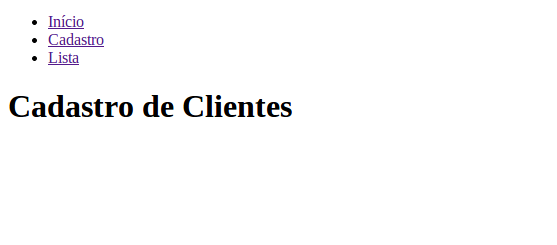
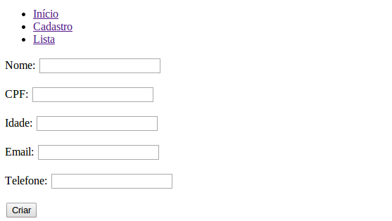
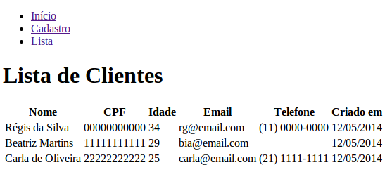

Como criar um site com formulário e lista em 30 minutos?
########################################################

:date: 2014-05-13 23:00
:tags: python, django
:category: Django
:slug: criar-site-com-form-lista-30-min
:author: Regis da Silva
:email: regis.santos.100@gmail.com
:summary: Como criar um site com formulário e lista em 30 minutos?
:github: rg3915

Se você já leu as [principais dúvidas de quem quer aprender Django]() agora você já está pronto para criar um site com:

* um **modelo de dados** simples
* um **formulário** para inserção dos dados
* uma **lista** para exibição dos dados

Não iremos mexer com CSS e nem imagens por enquanto, mas em breve farei um artigo sobre isso também.

Bom, abra o **terminal** e vamos começar. Considere os seguintes nomes:

	Ambiente: env_crm

		Projeto: crm

			App: cadastro

				Classe: Inscricao

					Atributos: nome, cpf, idade, email, telefone, criado_em

Criando um virtualenv

.. code-block:: bash

	$ virtualenv env_crm
	$ cd env_crm

Ativando o virtualenv no Windows

.. code-block:: bash

	$ Scripts\activate

Ativando o virtualenv no Linux ou Mac

.. code-block:: bash

	$ source bin/activate

Instalando as bibliotecas do Requirements.

.. code-block:: bash

	$ wget https://raw.githubusercontent.com/rg3915/wttd/master/requirements.txt
	$ pip install -r requirements.txt

Se não quiser instalar tudo, *instale apenas o* **Django** *e o* **Unipath**:

.. code-block:: bash

	$ pip install django
	$ pip install unipath

Criando o projeto **crm**.

.. code-block:: bash

	$ django-admin.py startproject crm

Criando uma app **cadastro** em *env_crm/crm*.

.. code-block:: bash

	$ cd crm
	$ python manage.py startapp cadastro

Rodando o projeto.

.. code-block:: bash

	$ python manage.py runserver

Abra o navegador e digite [http://127.0.0.1:8000/](http://127.0.0.1:8000/). Parabéns, seu projeto está funcionando.

Agora vamos criar todos os demais elementos. Considere que estamos na pasta *env_crm/crm*.

Criando **forms.py**

.. code-block:: bash

	$ touch cadastro/forms.py

Criando os *templates*.

.. code-block:: bash

	$ mkdir cadastro/templates
	$ touch cadastro/templates/{base.html,index.html,cadastro.html,lista.html}

Veja no diagrama abaixo a relação de dependência entre os arquivos.

.. image:: images/regisdasilva/diagrama.png

	:alt: diagrama.html

Agora vamos editar alguns arquivos usando o [Sublime Text 3](http://www.sublimetext.com/3), leia também [Seu primeiro projeto Django com Sublime Text no Linux](http://pythonclub.com.br/primeiro-projeto-django-no-linux-com-sublime.html) de [Fabiano Góes](http://pythonclub.com.br/author/fabiano-goes.html).

Vamos carregar a pasta *env_crm* clicando em

	File > Open Folder...

Primeiro vamos editar *crm/settings.py*.

.. code-block:: python

	...
	INSTALLED_APPS = (
    	'django.contrib.admin',
    	'django.contrib.auth',
    	'django.contrib.contenttypes',
     	'django.contrib.sessions',
    	'django.contrib.messages',
    	'django.contrib.staticfiles',
    	'cadastro',
	)
	...
	
	LANGUAGE_CODE = 'pt-br'

Agora vamos editar *crm/cadastro/models.py*.

.. code-block:: python

	# -*- coding: utf-8 -*-
	from django.db import models
	
	class Inscricao(models.Model):
		nome = models.CharField(max_length=100)
		cpf = models.CharField('CPF', max_length=11, unique=True)
		idade = models.IntegerField()
		email = models.EmailField(unique=True)
		telefone = models.CharField(max_length=20, blank=True)
		criado_em = models.DateTimeField('criado em', auto_now_add=True)
	
		class Meta:
			ordering = ['criado_em']
			verbose_name = (u'nome')
			verbose_name_plural = (u'nomes')
	
		def __unicode__(self):
			return self.name

Vamos criar o banco de dados através do comando **syncdb**.

.. code-block:: bash

	$ python manage.py syncdb

Agora vamos editar *crm/cadastro/views.py*. Vamos usar [Generic Views](https://docs.djangoproject.com/en/1.2/ref/generic-views/).

.. code-block:: python

	# -*- coding: utf-8 -*-
	from django.shortcuts import render
	from django.views.generic import CreateView, ListView
	
	from cadastro.models import Inscricao
	from cadastro.forms import InscricaoForm
	
	def home(request):
		return render(request, 'index.html')
	
	class Criar(CreateView):
		template_name = 'cadastro.html'
		model = Inscricao
		success_url = '../lista'
	
		def form_valid(self,form):
			print(self.request.POST['nome'])
			return super(Criar,self).form_valid(form)
	
	class Lista(ListView):
		template_name = 'lista.html'
		model = Inscricao
		context_object_name = 'nome'

Agora vamos editar *crm/urls.py*.

.. code-block:: python

	# -*- coding: utf-8 -*-
	from django.conf.urls import patterns, include, url
	from cadastro.views import *
	
	from django.contrib import admin
	admin.autodiscover()
	
	urlpatterns = patterns('cadastro.views',
    	url(r'^$', 'home', name='home'),
    	url(r'^cadastro/$', Criar.as_view(), name='cadastro'),
    	url(r'^lista/$', Lista.as_view(), name='lista'),
    	url(r'^admin/', include(admin.site.urls)),
	)

Agora vamos editar *crm/cadastro/forms.py*.

.. code-block:: python

	# -*- coding: utf-8 -*-
	from django import forms
	from models import Inscricao

	class InscricaoForm(forms.ModelForm):

		class Meta:
			model = Inscricao

Agora vamos editar *crm/cadastro/templates/base.html*.

.. code-block:: html

	<!DOCTYPE html>
	<html>
	<head>
		
			<title>Título</title>
		
	</head>
	<body>
		

			<ul>
				<li><a href="">Início</a></li>
				<li><a href="">Cadastro</a></li>
				<li><a href="">Lista</a></li>
			</ul>
		

		
			
		
	</body>
	</html>

Agora vamos editar *crm/cadastro/templates/index.html*.

.. code-block:: html

	

	
		<h1>Cadastro de Clientes</h1>
	

	:alt: index.html

Agora vamos editar *crm/cadastro/templates/cadastro.html*.

.. code-block:: html

	

	
		<form action="" method="POST">
			
			{{ form.as_p }}
			<button type="submit">Criar</button>
		</form>
	

	:alt: cadastro.html

Leia sobre [as_p](http://docs.djangobrasil.org/topics/forms/#mostrando-um-formul-rio-usando-um-template) que significa que os campos ficarão em parágrafos, e [crsf_token (en)](https://docs.djangoproject.com/en/dev/ref/contrib/csrf/) que é uma proteção usada durante a inserção de dados.

Agora vamos editar *crm/cadastro/templates/lista.html*.

.. code-block:: html

	

	
		<h1>Lista de Clientes</h1>

			<table>
				<tr>
					<th>Nome</th>
					<th>CPF</th>
					<th>Idade</th>
					<th>Email</th>
					<th>Telefone</th>
					<th>Criado em</th>
				</tr>
			
				<tr>
					<td>{{ nome.nome }}</td>
					<td>{{ nome.cpf }}</td>
					<td>{{ nome.idade }}</td>
					<td>{{ nome.email }}</td>
					<td>{{ nome.telefone }}</td>
					<td>{{ nome.criado_em|date:"d/m/Y" }}</td>
				</tr>
			
				<li>Sem itens na lista.</li>
			
			</table>
	

	:alt: lista.html

Leia também [Seu primeiro projeto Django com Sublime Text no Linux](http://pythonclub.com.br/primeiro-projeto-django-no-linux-com-sublime. html) de [Fabiano Góes](http://pythonclub.com.br/author/fabiano-goes.html).

Baixe o projeto no .