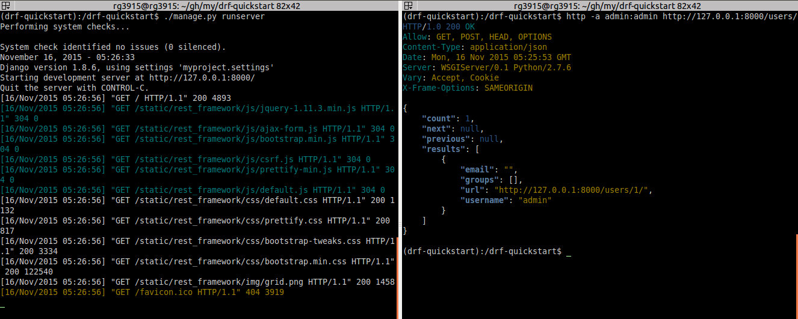
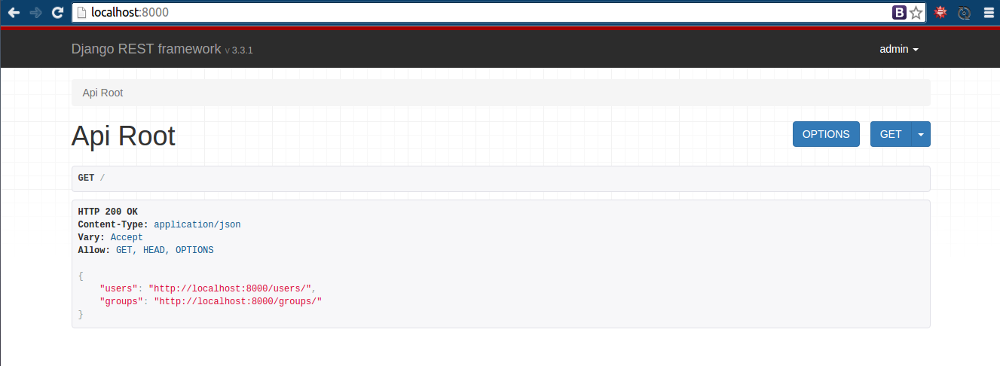

title: Django Rest Framework Quickstart
Slug: django-rest-framework-quickstart
Date: 2015-11-17 14:00
Tags: Python, Django, REST
Author: Regis da Silva
Email:  regis.santos.100@gmail.com
Github: rg3915
Twitter: rg3915
Category: Python, Django, REST

Veremos aqui uma forma rápida de criar uma API REST com [Django Rest Framework][0].

> Este artigo foi atualizado em 14 de Fevereiro de 2018.

Este artigo está usando:

* Python 3.5.2
* Django 2.0.2
* djangorestframework 3.7.7

Favor clonar o projeto do [GitHub](https://github.com/rg3915/drf#clonando-o-projeto), favor ler o README para instalação.

Repare nas alterações das urls na nova versão do Django.

```python
urls.py
from django.urls import include, path
from django.contrib import admin

urlpatterns = [
    path('', include('core.urls')),
    path('admin/', admin.site.urls),
]
```

```python
# core/urls.py
from django.urls import path
from core import views

urlpatterns = [
    path('persons/', views.person_list),
    path('persons/<int:pk>/', views.person_detail),
]
```

Além disso, tivemos alterações significativas em [settings.py](https://github.com/rg3915/drf/blob/master/myproject/settings.py).

**Obs**: *Tem coisas que é melhor nem traduzir. ;)*

* 0 - **Quickstart**
* 1 - [Serialization][11]
* 2 - Requests & Responses
* 3 - Class based views

> **Obs**: se você não sabe [Django][3] sugiro que leia este [tutorial][4] antes.

## Começando

```bash
$ python3 -m venv .venv
$ source env/bin/activate
$ mkdir drf-quickstart
$ cd drf-quickstart
$ pip install django djangorestframework
$ pip freeze > requirements.txt
$ django-admin.py startproject myproject . # tem um ponto '.' aqui
$ python manage.py startapp core
$ python manage.py migrate
$ python manage.py createsuperuser  --username='admin' --email=''
```

Veja o meu requirements.txt

```bash
dj-database-url==0.4.2
Django==2.0.2
django-extensions==1.9.9
django-filter==1.1.0
djangorestframework==3.7.7
drf-nested-routers==0.90.0
python-decouple==3.1
```

## Editando `settings.py`

Abra o arquivo `settings.py` e em `INSTALLED_APPS` acrescente

```python
INSTALLED_APPS = (
	...
    'rest_framework',
)

REST_FRAMEWORK = {
    'DEFAULT_PERMISSION_CLASSES': ('rest_framework.permissions.IsAdminUser',),
    'PAGE_SIZE': 10
}
```

## Editando `serializers.py`

Crie o arquivo 

```bash
$ cd core/
$ touch serializers.py
```

Edite

```python
from django.contrib.auth.models import User, Group
from rest_framework import serializers


class UserSerializer(serializers.HyperlinkedModelSerializer):

    class Meta:
        model = User
        fields = ('url', 'username', 'email', 'groups')


class GroupSerializer(serializers.HyperlinkedModelSerializer):

    class Meta:
        model = Group
        fields = ('url', 'name')
```

## Editando `views.py`

```python
from django.contrib.auth.models import User, Group
from rest_framework import viewsets
from core.serializers import UserSerializer, GroupSerializer


class UserViewSet(viewsets.ModelViewSet):
    """
    API endpoint that allows users to be viewed or edited.
    """
    queryset = User.objects.all().order_by('-date_joined')
    serializer_class = UserSerializer


class GroupViewSet(viewsets.ModelViewSet):
    """
    API endpoint that allows groups to be viewed or edited.
    """
    queryset = Group.objects.all()
    serializer_class = GroupSerializer
```


## Editando `urls.py`


```python
from django.conf.urls import url, include
from rest_framework import routers
from core import views

router = routers.DefaultRouter()
router.register(r'users', views.UserViewSet)
router.register(r'groups', views.GroupViewSet)

urlpatterns = [
    url(r'^', include(router.urls)),
    url(r'^api-auth/', include('rest_framework.urls', namespace='rest_framework'))
]
```

## Rodando a API

Abra duas abas no terminal, numa rode a aplicação.

```bash
$ python manage.py runserver
```



Na outra teste a API.

```bash
curl -H 'Accept: application/json; indent=4' -u admin:admin http://127.0.0.1:8000/users/
```

onde `admin:admin` equivale a `username:password`.

Experimente com [httpie][7]

```bash
http -a admin:admin http://127.0.0.1:8000/users/
```

> **Atenção**: se você receber erro 301, muito provavelmente é porque você esqueceu da barra `/` no final da url.



Veja o código no [GitHub][8].

> Haverá continuação ...

[0]: http://www.django-rest-framework.org/
[3]: https://www.djangoproject.com/
[4]: http://pythonclub.com.br/tutorial-django-17.html
[7]: https://github.com/jakubroztocil/httpie#installation
[8]: https://github.com/rg3915/drf-quickstart.git
[11]: http://pythonclub.com.br/django-rest-framework-serialization.html