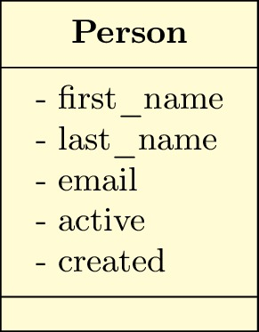

title: Django Rest Framework Serialization
Slug: django-rest-framework-serialization
Date: 2016-04-24 18:00
Tags: Python, Django, REST
Author: Regis da Silva
Email:  regis.santos.100@gmail.com
Github: rg3915
Twitter: rg3915
Category: Python, Django, REST

Eu resolvi estudar um pouco mais de [DRF][0] depois do tutorial do [Hugo Brilhante][1] na [Python Brasil 11][2].

> **Obs**: se você não sabe Django sugiro que leia este [tutorial][4] antes.

Este tutorial é a parte 1/6 de uma série de posts sobre DRF.

**Obs**: *Tem coisas que é melhor nem traduzir. ;)*

* 0 - [Quickstart][10]
* 1 - **Serialization**
* 2 - Requests & Responses
* 3 - Class based views
* 4 - Authentication & permissions
* 5 - Relationships & hyperlinked APIs
* 6 - Viewsets & routers

Pra quem não sabe, para usar API Web usamos REST, no caso, [Django Rest Framework][0], framework web do [Django][3].

> **Nota:** este tutorial não é exatamente igual ao do Hugo, é baseado nele. E baseado também em [Tutorial 1: Serialization][9].

Então para criar a API, no meu caso, eu usei:

* Ambiente: .venv
* Projeto: myproject
* App: core
* Model: Person
* Fields: first_name, last_name, email, active (boolean), created




## Configurando um novo ambiente

```bash
$ virtualenv -p python3 .venv
$ source .venv/bin/activate
$ mkdir drf; cd drf
$ pip install django==1.9.5 djangorestframework==3.3.3
$ pip install django-filter drf-nested-routers
$ pip freeze > requirements.txt
$ django-admin.py startproject myproject .
$ python manage.py startapp core
```

Veja o meu requirements.txt

```bash
Django==1.9.5
django-filter==0.11.0
djangorestframework==3.3.3
drf-nested-routers==0.10.0
```
## Step-0 Projeto inicial

Abra o arquivo `settings.py` e em `INSTALLED_APPS` acrescente

```python
INSTALLED_APPS = (
    ...
    'rest_framework',
    'core',
)
```

## Step-1 Serializer

### `models.py`: Criando o modelo `Person`

```python
from django.db import models

class Person(models.Model):
    first_name = models.CharField(max_length=30)
    last_name = models.CharField(max_length=30)
    email = models.EmailField(null=True, blank=True)
    active = models.BooleanField(default=True)
    created = models.DateTimeField(auto_now_add=True, auto_now=False)

    class Meta:
        ordering = ['first_name']
        verbose_name = u'pessoa'
        verbose_name_plural = u'pessoas'

    def __str__(self):
        return self.first_name + " " + self.last_name

    full_name = property(__str__)
```


### `serializers.py`: Criando `PersonSerializer`

Precisamos proporcionar uma forma de [serialização][5] e desserialização das instâncias de `person` em uma representação JSON.

```bash
$ cd core/
$ touch serializers.py
```

Edite

```python
from rest_framework import serializers
from core.models import Person

class PersonSerializer(serializers.Serializer):
    pk = serializers.IntegerField(read_only=True)
    first_name = serializers.CharField(max_length=30)
    last_name = serializers.CharField(max_length=30)
    email = serializers.EmailField()
    active = serializers.BooleanField(default=True)
    created = serializers.DateTimeField()

    def create(self, validated_data):
        """
        Create and return a new `Person` instance, given the validated data.
        :param validated_data:
        """
        return Person.objects.create(**validated_data)

    def update(self, instance, validated_data):
        """
        Update and return an existing `Person` instance, given the validated data.
        """

        instance.first_name = validated_data.get(
            'first_name', instance.first_name)
        instance.last_name = validated_data.get(
            'last_name', instance.last_name)
        instance.email = validated_data.get('email', instance.email)
        instance.save()
        return instance
```

A primeira parte da classe define os campos que serão serializados. Os métodos `create()` e `update()` criam e atualizam as instâncias, respectivamente, quando chamados.

Uma classe de serialização é similar a uma classe `Form` do Django, e inclui validações similares para os campos, tais como `required`, `max_length` e `default`.


### Fazendo a migração

```bash
$ ./manage.py makemigrations core
$ ./manage.py migrate
```

### Trabalhando com a serialização

Abra o `shell` do Django.

```bash
$ ./manage.py shell
```

Primeiro vamos criar uma pessoa.

```python
>>> from core.models import Person
>>> from core.serializers import PersonSerializer
>>> from rest_framework.renderers import JSONRenderer
>>> from rest_framework.parsers import JSONParser

>>> person = Person(first_name='Paul', last_name='Van Dyke', email='paul@email.com')
>>> person.save()

>>> person = Person(first_name='Regis', last_name='Santos', email='regis@email.com')
>>> person.save()
```

Agora que já temos alguns dados podemos ver a serialização da última instância.

```python
>>> serializer = PersonSerializer(person)
>>> serializer.data
# {'pk': 2, 'first_name': 'Regis', 'created': '2015-11-15T03:20:25.084990Z', 'last_name': 'Santos', 'email': 'regis@email.com', 'active': True}
```

Neste ponto nós traduzimos a instância do modelo em tipos de dados nativos do Python. Para finalizar o processo de serialização nós vamos renderizar os dados em `json`.

```python
>>> content = JSONRenderer().render(serializer.data)
>>> content
# b'{"pk":2,"first_name":"Regis","last_name":"Santos","email":"regis@email.com","active":true,"created":"2015-11-15T03:20:25.084990Z"}'
```


A desserialização é similar.

```python
>>> from core.models import Person
>>> from core.serializers import PersonSerializer
>>> from rest_framework.renderers import JSONRenderer
>>> from rest_framework.parsers import JSONParser
>>> from django.utils.six import BytesIO

>>> person = Person.objects.get(pk=1)
>>> serializer = PersonSerializer(person)
>>> content = JSONRenderer().render(serializer.data)
>>> stream = BytesIO(content)
>>> data = JSONParser().parse(stream)
>>> serializer = PersonSerializer(data=data)
>>> serializer.is_valid()
# True
>>> serializer.validated_data
# OrderedDict([('first_name', 'Paul'), ('last_name', 'Van Dyke'), ('email', 'paul@email.com'), ('active', True)])
```

## Step-2 ModelSerializer

Nossa classe `PersonSerializer` está replicando um monte de informações que está contido no modelo `Person`. 

Da mesma forma que o Django fornece `Form` e `ModelForm`, REST framework inclui as classes `Serializer` e `ModelSerializer`.

Vamos refatorar nosso arquivo `serializers.py`, que agora ficará assim:

```python
from rest_framework import serializers
from core.models import Person

class PersonSerializer(serializers.ModelSerializer):

    class Meta:
        model = Person
        fields = ('pk', 'first_name', 'last_name','email', 'active', 'created')
```

Uma propriedade legal que a serialização tem é que você pode inspecionar todos os campos em uma instância serializer, imprimindo sua representação. Abra o `shell` do Django.

```bash
$ ./manage.py shell
```

```python
>>> from core.serializers import PersonSerializer
>>> serializer = PersonSerializer()
>>> print(repr(serializer))
# PersonSerializer():
#     pk = IntegerField(label='ID', read_only=True)
#     first_name = CharField(max_length=30)
#     last_name = CharField(max_length=30)
#     email = EmailField(allow_blank=True, allow_null=True, max_length=254, required=False)
#     active = BooleanField(required=False)
#     created = DateTimeField(read_only=True)
```

É importante lembrar que as classes `ModelSerializer` não faz nenhuma mágica, são simplesmente um atalho para a criação das classes de serialização:

* Os campos são definidos automaticamente.
* Os métodos `create()` e `update()` são implementados por padrão de uma forma simplificada.


### `views.py`: Criando *views* regulares usando nosso *Serializer*

Vamos criar uma *view* simples para visualizar os dados em `json`.

Edite o arquivo `views.py`

```python
from django.http import HttpResponse
from django.views.decorators.csrf import csrf_exempt
from rest_framework.renderers import JSONRenderer
from rest_framework.parsers import JSONParser
from core.models import Person
from core.serializers import PersonSerializer

class JSONResponse(HttpResponse):
    """
    An HttpResponse that renders its content into JSON.
    """

    def __init__(self, data, **kwargs):
        content = JSONRenderer().render(data)
        kwargs['content_type'] = 'application/json'
        super(JSONResponse, self).__init__(content, **kwargs)
```

A raiz da nossa API será uma lista de todas as pessoas, ou podemos criar uma pessoa nova.


```python
@csrf_exempt
def person_list(request):
    """
    List all persons, or create a new person.
    """
    if request.method == 'GET':
        persons = Person.objects.all()
        serializer = PersonSerializer(persons, many=True)
        return JSONResponse(serializer.data)

    elif request.method == 'POST':
        data = JSONParser().parse(request)
        serializer = PersonSerializer(data=data)
        if serializer.is_valid():
            serializer.save()
            return JSONResponse(serializer.data, status=201)
        return JSONResponse(serializer.errors, status=400)
```

Note que nós queremos usar o POST mas não temos o CSRF Token, por isso usamos o `@csrf_exempt`.

Também vamos precisar visualizar os detalhes de cada pessoa. Assim podemos recuperar, atualizar ou deletar cada registro.

```python
@csrf_exempt
def person_detail(request, pk):
    """
    Retrieve, update or delete a person.
    """
    try:
        person = Person.objects.get(pk=pk)
    except Person.DoesNotExist:
        return HttpResponse(status=404)

    if request.method == 'GET':
        serializer = PersonSerializer(person)
        return JSONResponse(serializer.data)

    elif request.method == 'PUT':
        data = JSONParser().parse(request)
        serializer = PersonSerializer(person, data=data)
        if serializer.is_valid():
            serializer.save()
            return JSONResponse(serializer.data)
        return JSONResponse(serializer.errors, status=400)

    elif request.method == 'DELETE':
        person.delete()
        return HttpResponse(status=204)
```

Agora, vamos criar as urls. Crie um novo arquivo `core/urls.py`.

```python
from django.conf.urls import url
from core import views

urlpatterns = [
    url(r'^persons/$', views.person_list),
    url(r'^persons/(?P<pk>[0-9]+)/$', views.person_detail),
]
```

E acrescente a seguinte linha em `myproject/urls.py`.

```python
urlpatterns = [
    url(r'^', include('core.urls')),
    url(r'^admin/', include(admin.site.urls)),
]
```

## Instalando `httpie`

Podemos usar o [curl][6], mas o [httpie][7] é mais amigável, e escrito em Python.

```bash
$ sudo pip install httpie
```

Vamos usar o `httpie` digitando

```bash
$ http http://127.0.0.1:8000/persons/

HTTP/1.0 200 OK
Content-Type: application/json
Date: Sun, 15 Nov 2015 03:24:44 GMT
Server: WSGIServer/0.2 CPython/3.4.3
X-Frame-Options: SAMEORIGIN

[
    {
        "active": true, 
        "created": "2015-11-15T03:20:24.938378Z", 
        "email": "paul@email.com", 
        "first_name": "Paul", 
        "last_name": "Van Dyke", 
        "pk": 1
    }, 
    {
        "active": true, 
        "created": "2015-11-15T03:20:25.084990Z", 
        "email": "regis@email.com", 
        "first_name": "Regis", 
        "last_name": "Santos", 
        "pk": 2
    }
]
```

Veja os detalhes

```bash
$ http http://127.0.0.1:8000/persons/1/
```

> **Atenção**: se você receber erro 301, muito provavelmente é porque você esqueceu da barra `/` no final da url.


### Como seria em curl?

Assim

```bash
$ curl http://127.0.0.1:8000/persons/

[{"pk":1,"first_name":"Paul","last_name":"Van Dyke","email":"paul@email.com","active":true,"created":"2015-11-15T03:20:24.938378Z"},{"pk":2,"first_name":"Regis","last_name":"Santos","email":"regis@email.com","active":true,"created":"2015-11-15T03:20:25.084990Z"}]
```


GitHub: Se você quiser pode olhar meu [GitHub][8], mas terá que ver os *commits* para ver os passos.

[0]: http://www.django-rest-framework.org/
[1]: https://github.com/hugobrilhante/drf-tutorial-pybr11
[2]: http://pythonbrasil.github.io/pythonbrasil11-site/
[3]: https://www.djangoproject.com/
[4]: http://pythonclub.com.br/tutorial-django-17.html
[5]: https://pt.wikipedia.org/wiki/Serializa%C3%A7%C3%A3o
[6]: http://curl.haxx.se/
[7]: https://github.com/jakubroztocil/httpie#installation
[8]: https://github.com/rg3915/drf.git
[9]: http://www.django-rest-framework.org/tutorial/1-serialization/
[10]: http://pythonclub.com.br/django-rest-framework-quickstart.html
