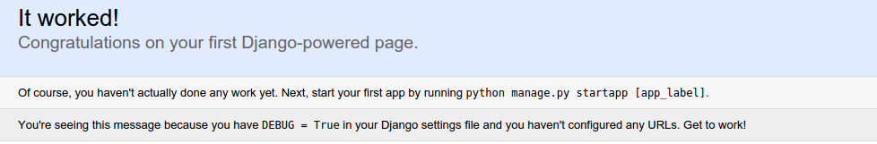
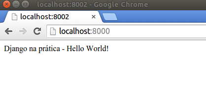

Django na prática - Hello World
#############################################

:date: 2015-09-09 18:55
:tags: python, django, django-na-pratica
:category: Python
:slug: django-na-pratica-aula-01
:author: Lucas Magnum
:email:  lucasmagnumlopes@gmail.com
:github: lucasmagnum
:linkedin: lucasmagnum

Esse é o primeiro post do Curso **django na prática** onde você aprenderá tudo que precisa para criar um sistema web :D

Utilizaremos a versão 1.8 do Django com Python 3!

==========
Requisitos
==========

* Python 3.X
* Virtualenv
* pip

Se precisar de ajuda para instalar o pip, você pode utilizar esse `tutorial <http://stackoverflow.com/questions/6587507/how-to-install-pip-with-python-3>`_.

----------------
Convenções
----------------

.. code-block:: bash

    $ indica que comando deve ser executado no terminal do Linux
    >>> indica que comando deve ser executado pelo interpretador Python em modo interativo

===========
Instalação
===========

Ative seu virtualenv e instale o Django na versão 1.8:

.. code-block:: bash

    $ pip install django==1.8

Se tiver alguma duvida, você pode olhar na `documentação <https://docs.djangoproject.com/en/1.8/intro/install/>`_ como instalar o framework.

Para verificar se está tudo certo, abra o interpretador python e verifique a versão do Django:

.. code-block:: python

    >>> import django
    >>> print(django.get_version())
    1.8

Isso é tudo que precisamos para começar =)

===============
django-admin.py
===============

o ``django-admin.py`` é um script de linha de comando do Django que nos oferece vários comandos administrativos.

Existem várias opções, para visualizar todas basta executar:

.. code-block:: bash

    $ django-admin.py help

Alguns parâmetros importantes são ``--pythonpath`` e ``--settings``.

    * Como vamos criar nosso projeto do zero, precisamos informar onde nossos módulos estarão localizados e para isso utilizaremos o parâmetro ``--pythonpath``.
    * Precisamos informar ao Django onde encontrar nossas configurações e para isso utilizaremos o parâmetro ``--settings``.

=======================
Configurando o ambiente
=======================

Crie um arquivo chamado ``helloworld.py``:

.. code-block:: bash

    $ touch helloworld.py

Criamos nosso arquivo e agora vamos rodar o `ambiente de desenvolvimento <https://docs.djangoproject.com/en/1.8/ref/django-admin/#runserver-port-or-address-port>`_ do Django :D

.. code-block:: bash

    $ django-admin.py runserver --pythonpath=. --settings=helloworld

Dessa forma, estamos dizendo ao Django que nossos arquivos estão no diretório atual e que nossas configurações estão no arquivo ``heloworld`` (não devemos informar a extensão do arquivo no parâmetro).

**Puts**, ocorreu um erro!

.. code-block:: bash

    django.core.exceptions.ImproperlyConfigured: The SECRET_KEY setting must not be empty.

Atualmente o Django não inicia sem a `SECRET_KEY <https://docs.djangoproject.com/en/1.8/ref/settings/#secret-key>`_ configurada. Precisamos adiciona-la ao nosso arquivo.

Abra o arquivo ``helloworld.py`` e insira uma SECRET_KEY qualquer:

.. code-block:: python

    SECRET_KEY='helloworld'

Para ambiente de teste não existe nenhum problema em deixar nossa SECRET_KEY com esse valor, porém para o ambiente de produção é necessário que seja um valor randômico. A SECRET_KEY é utilizada em diversas partes da sua aplicação e você NÂO DEVE deixá-la pública para ambientes de produção.
Mais informações `aqui <https://docs.djangoproject.com/en/1.8/ref/settings/#secret-key>`_.

Executando novamente nosso ambiente, teremos o seguinte erro:

.. code-block:: bash

    $ django-admin.py runserver --pythonpath=. --settings=helloworld

    CommandError: You must set settings.ALLOWED_HOSTS if DEBUG is False.

Como estamos em ambiente de desenvolvimento, precisamos utilizar o ``DEBUG`` como ``True``, somente para produção que ele será desativado.

Nosso arquivo ``helloworld.py`` agora está assim:

.. code-block:: python

    SECRET_KEY='helloworld'
    DEBUG = True

Com isso já é possível subir o ambiente de desenvolvimento.

.. code-block:: bash

    $ django-admin.py runserver --pythonpath=. --settings=helloworld

    Performing system checks...

    System check identified some issues:

    WARNINGS:
    ?: (1_7.W001) MIDDLEWARE_CLASSES is not set.
        HINT: Django 1.7 changed the global defaults for the MIDDLEWARE_CLASSES. django.contrib.sessions.middleware.SessionMiddleware, django.contrib.auth.middleware.AuthenticationMiddleware, and django.contrib.messages.middleware.MessageMiddleware were removed from the defaults. If your project needs these middleware then you should configure this setting.

    System check identified 1 issue (0 silenced).
    September 10, 2015 - 15:50:09
    Django version 1.8.4, using settings 'helloworld'
    Starting development server at http://127.0.0.1:8000/
    Quit the server with CONTROL-C.

Pronto! Nosso ambiente já está rodando na porta 8000, abra seu navegador e digite ``http://127.0.0.1:8000/``.

============
Hello World
============

Ok, nosso ambiente está rodando, porém ainda temos erros. O que aconteceu?

Se você visualizar no terminal onde o ambiente está sendo executado, verá a seguinte mensagem:

.. code-block:: bash

    AttributeError: 'Settings' object has no attribute 'ROOT_URLCONF'

Para encontrar as views* que serão renderizadas no projeto, o Django procura primeiro as configurações no
arquivo apontado pelo ``ROOT_URLCONF``.

* uma view é uma função responsável por retornar algo para ser renderizado no browser, pode ser um html, um arquivo, um json e etc. *

Como toda nossa aplicação ficará por enquanto no arquivo ``helloworld.py``, vamos apontar nosso ``ROOT_URLCONF`` para ele.

Abra o arquivo ``helloworld.py`` e insira o seguinte código:

.. code-block:: python

    SECRET_KEY = 'helloworld'
    DEBUG = True
    ROOT_URLCONF = __name__

Estamos dizendo ao Django que nossas `urls` estão nesse arquivo, para reconhecer as urls, o django procura
pela variável ``urlpatterns``.

Logo, nosso arquivo deve ficar assim:

.. code-block:: python

    SECRET_KEY = 'helloworld'
    DEBUG = True
    ROOT_URLCONF = __name__

    urlpatterns = []

Agora, se abrirmos nosso navegador no endereço ``http://127.0.0.1:8000/`` já recebemos a página de bem vindo do Django =DDD

---------------------
Nossa primeira view
---------------------

Agora sim, tudo está pronto para criarmos nossa primeira view!

Vamos criar nossa view chamada ``hello_world``, toda view recebe como primeiro o ``request``,
e precisa retornar alguma resposta para o navegador, vamos retornar um ``HttpResponse`` com o texto
*Django na prática - Hello World!*

Modifique seu ``helloworld.py`` para que fique assim:

.. code-block:: python

    from django.http import HttpResponse

    SECRET_KEY = 'helloworld'
    DEBUG = True
    ROOT_URLCONF = __name__

    def hello_world(request):
        return HttpResponse('Django na prática - Hello World!')

    urlpatterns = []

Pronto! Temos nossa view criada, porém ainda não conseguimos acessá-la.
Precisamos dizer ao framework como essa view pode ser encontrada e para qual ``url`` ela deve responder.

Façamos dessa forma:

.. code-block:: python

    from django.conf.urls import url
    from django.http import HttpResponse

    SECRET_KEY = 'helloworld'
    DEBUG = True
    ROOT_URLCONF = __name__

    def hello_world(request):
        return HttpResponse('Django na prática - Hello World!')

    urlpatterns = [
        url(r'^$', hello_world)
    ]

Dentro do ``urlpatterns`` nós informamos quais são as urls disponíveis no nosso projeto.
Fazemos isso usando utilizado uma expressão regular associada à uma função, que no nosso caso é o ``hello_world``.

Agora, se abrirmos o navegador, iremos nos deparar com o seguinte resultado:

Por hoje é isso!!! Guarde o arquivo criado hoje, pois ele será utilizado nas próximas aulas!

Até a próxima =)
