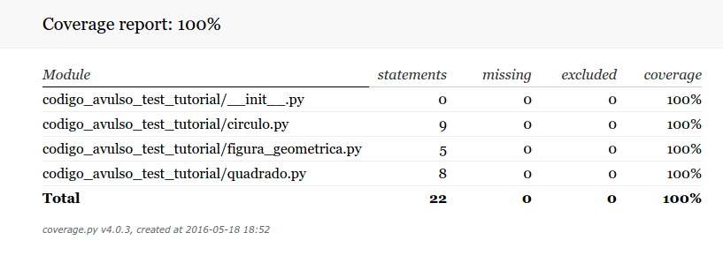
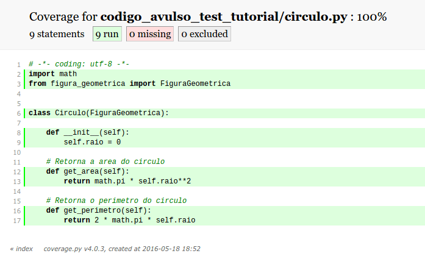
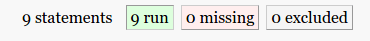

Title: Relatórios de testes com Coveralls
Slug: gerando-relatorios-de-testes-com-coveralls
Date: 2016-06-03 11:28:55
Category: Python
Tags: python, coveralls, coverage, relatório, test
Author: Michell Stuttgart
Email: michellstut@gmail.com
Github: mstuttgart
Linkedin: mstuttgart
Site: https://mstuttgart.github.io/

Na [terceira parte](http://codigoavulso.com.br/python-com-unittest-travis-ci-coveralls-e-landscape-parte-3-de-4.html) do tutorial sobre *unittest*, vimos como utilizar o serviço [Coveralls](https://coveralls.io/) para gerar relatórios sobre o testes do nosso projeto. Entretanto, uma "desvantagem" do serviço é que o processo de análise é iniciado apenas quando executarmos um *push* ou um *pull request*. Sendo assim, não seria interessante termos a liberdade de executar esses testes localmente?

Felizmente, os desenvolvedores do [Coveralls](https://coveralls.io/) pensaram nisso e criaram um conjunto de comandos que nos permite executá-lo pelo terminal.

### Instalação

Então, antes de iniciarmos, vamos a instalação do módulo, que pode ser feito pelo comando a seguir:

```bash
pip install coveralls
```

Quando você instala o módulo, um *script* de linha de comando chamado `coverage` é adicionado ao diretório de *scripts* python no seu sistema. Para suportar diferentes versões do Python, o módulo vem com um conjunto de *scripts*. Então, para a versão 2.7 do Python, você pode utilizar o comando `coverage` ou `coverage2`. Para a versão 3, utilize `coverage3`.

### Gerando relatórios

O comando usado para obtermos um relatório sobre os testes do nosso projeto é simples. No diretório do projeto, basta executar:

```bash
coverage run --source=nomedopacote setup.py test
```
o comando `run` irá coletar dados sobre nosso código fonte. No nosso caso, usaremos o repositorio que criamos para o tutorial anterior: [codigo-avulso-test-tutorial](https://github.com/mstuttgart/codigo-avulso-test-tutorial). Assim, o comando seria:

```bash
coverage run --source=codigo_avulso_test_tutorial setup.py test
```

Se você executar o comando `ls -la` no terminal, verá que um arquivo chamando `.coverage` foi criado. Esse arquivo contém algumas informações sobre o seu código. Vale alertar que para gerar os relatórios precisamos, obrigatoriamente, executar o comando acima, quando formos gerar o relatórios pela primeira vez ou quando o código sofrer alguma modificação.

Uma vez que o arquivo `.coverage` foi gerado, execute o seguinte comando:

```bash
coverage report
```

Um relatório com a porcentagem de cobertura de testes (entre outras informações) de cada arquivo de código fonte será exibido no terminal.

```bash
Name                                               Stmts   Miss  Cover
----------------------------------------------------------------------
codigo_avulso_test_tutorial/__init__.py                0      0   100%
codigo_avulso_test_tutorial/circulo.py                 9      0   100%
codigo_avulso_test_tutorial/figura_geometrica.py       5      0   100%
codigo_avulso_test_tutorial/quadrado.py                8      0   100%
----------------------------------------------------------------------
TOTAL                                                 22      0   100%
```

As colunas exibidas no relatório possuem informações interessantes. São elas:

* Stmts: indica o total de trechos do código que, segundo o Coveralls, devem ser testados.
* Miss: coluna que indica quantos trechos do código ainda não estão sob testes.
* Cover: talvez a coluna mais importante, ela indica a porcentagem de cobertura de testes do arquivo fonte.

Em `TOTAL` temos a cobertura total de testes do nosso projeto. Nesse projeto em especial, temos 100% porque o mesmo possui pouco código e os códigos existentes são simples de testar. Entretanto, em projeto mais complexos, nem sempre é possível chegar nessa porcentagem, então vale a pena se focar em escrever testes para as partes mais críticas do seu código e conseguir uma porcentagem perto dos 80%, considerado pelo `Coveralls` como satisfatório.

#### Gerando relatório em HTML

Uma opção interessante é gerar o relatório em formato `html` com o comando:

```bash
coverage html
```

Um diretório chamado `htmlcov` será criado no diretório do projeto. Dentro desse diretório existe um arquivo de nome `index.html`, que pode ser aberto no navegador.

Para o Google Chrome, usamos:

```bash
google-chrome htmlcov/index.html
```
ou com o Firefox

```bash
firefox htmlcov/index.html
```

Abaixo temos o `index.html` aberto. Nele podemos ver a lista dos arquivos que estão cobertos pelo `Coveralls`.

<center>

</center>

Vamos analisar os dados do arquivo `circulo.py`. Assim, temos as seguintes colunas:

* `statements`: indica o total de trechos do código que, segundo o Coveralls, devem ser testadas. No caso do arquivo `circulo.py`,  o valor da coluna é 9, indicando que existem 9 trechos do código quem devem estar sob teste.
* `missing`: coluna que indica quantos trechos do código ainda não estão sob testes.
* `excluded`: coluna que indica quantos trechos do código foram ignorados pelo Coveralls. Algumas vezes pode ser necessário excluir alguns trechos de código do relatório devido ao tipo de código nele contido ou porque você simplesmente não deseja que aquele trecho seja incluido no relatorio. Isso é feito através de um arquivo de configuração, visto mais adiante.
* `coverage`: indica a porcentagem de cobertura de testes do nosso código.

Na imagem abaixo, logo após clicarmos em `codigo_avulso_test_tutorial/circulo.py`, podemos ver os pontos do código que devem ser testados.

<center>

</center>

Ao clicarmos nos três botões no cabeçalho da página:

<center>

</center>

A página irá destacar, respectivamente, os trechos cobertos por testes, trechos sem testes ou que foram excluídos do `Coveralls`.

#### Gerando relatório em XML
Os relatórios em XML podem ser facilmente gerados por:

```bash
coverage xml
```
Um arquivo chamado `coverage.xml` será criado.

#### Criando o arquivo coveragerc

O arquivo `.coveragesrc` é usado para determinar parâmetros de funcionamento do comando `coverage`. Nele podemos incluir e excluir aquivos da analise do `Coveralls` entre outras configurações. Abaixo temos um exemplo de arquivo de configuração.

```
[run]
source = codigo_avulso_test_tutorial
omit =
    codigo_avulso_test_tutorial/__init__.py
    codigo_avulso_test_tutorial/main.py
```

Na configuração acima, vamos omitir da análise o arquivo `__init__.py` e um arquivo `main.py`. Indicamos o *source* que é onde o `Coveralls` deve executar a análise.

O arquivo de configuração ainda pode receber várias informações. Você pode ver mais delas [aqui](http://coverage.readthedocs.io/en/latest/source.html#source).

### Conclusão

Neste tutorial vimos um pouco mais sobre o `Coveralls`. Evitei colocar as informações deste tutorial nos tutoriais anteriores a fim de simplificá-los. Você pode aprender mais sobre o módulo consultando sua documentação [aqui](http://coverage.readthedocs.io/en/latest/index.html).

É isso pessoal, obrigado pela leitura e até o próximo tutorial.

**Publicado originalmente:** [gerando-relatorios-de-testes-com-coveralls](http://codigoavulso.com.br/gerando-relatorios-de-testes-com-coveralls.html)
