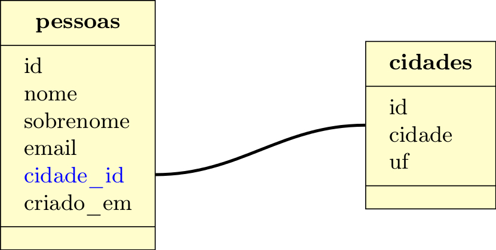

Gerenciando banco de dados SQLite3 com Python - Parte 2
=======================================================

:date: 2014-11-23 23:59
:tags: Python, Banco de dados
:category: Python, Banco de dados
:slug: gerenciando-banco-dados-sqlite3-python-parte2
:author: Regis da Silva
:email: regis.santos.100@gmail.com
:github: rg3915
:summary: Esta é a continuação do artigo Gerenciando banco de dados SQLite3 com Python - Parte 1.

Esta é a continuação do artigo `Gerenciando banco de dados SQLite3 com Python - Parte 1 <http://pythonclub.com.br/gerenciando-banco-dados-sqlite3-python-parte1.html>`_. Na 1ª parte nós vimos como realizar o CRUD num banco de dados SQLite3 usando o Python, mas cada tarefa foi feita num arquivo ``.py`` separado. A intenção agora é utilizar um **único arquivo** e, usando classes e métodos realizar as mesmas tarefas, só que de uma forma mais sofisticada.

	PS: *Considere a sintaxe para Python 3*. Mas o programa roda em python2 também.

Vou repetir a tabela ``clientes`` apenas por comodidade:

+-----------+-----------------+-----------+
| Campo     | Tipo            | Requerido |
+===========+=================+===========+
| id        | inteiro         | sim       |
+-----------+-----------------+-----------+
| nome      | texto           | sim       |
+-----------+-----------------+-----------+
| idade     | inteiro         | não       |
+-----------+-----------------+-----------+
| cpf       | texto (11)      | sim       |
+-----------+-----------------+-----------+
| email     | texto           | sim       |
+-----------+-----------------+-----------+
| fone      | texto           | não       |
+-----------+-----------------+-----------+
| cidade    | texto           | não       |
+-----------+-----------------+-----------+
| uf        | texto (2)       | sim       |
+-----------+-----------------+-----------+
| criado_em | data            | sim       |
+-----------+-----------------+-----------+
| bloqueado | boleano         | não       |
+-----------+-----------------+-----------+

Obs: O campo ``bloqueado`` nós vamos inserir depois com o comando ``ALTER TABLE``.

.. Assista os videos no `youtube <http://>`_ .

Veja os exemplos em `github <https://github.com/rg3915/python-sqlite>`_.

`Preparando o terreno`_

`Configurando um VirtualEnv para Python 3`_

`Criando valores randômicos`_

`Conectando e desconectando do banco`_

`Modo interativo`_

`Criando um banco de dados`_

`Criando uma tabela`_

`Create - Inserindo um registro com comando SQL`_

`Inserindo n registros com uma lista de dados`_

`Inserindo registros de um arquivo externo`_

`Importando dados de um arquivo csv`_

`Inserindo um registro com parâmetros de entrada definido pelo usuário`_

`Inserindo valores randômicos`_

`Read - Lendo os dados`_

`Mais SELECT`_ 

`SELECT personalizado`_ 

`Update - Alterando os dados`_

`Delete - Deletando os dados`_

`Adicionando uma nova coluna`_

`Lendo as informações do banco de dados`_

`Fazendo backup do banco de dados (exportando dados)`_

`Recuperando o banco de dados (importando dados)`_

`Conectando-se a outro banco`_ 

`Exemplos`_

`Referências`_

Preparando o terreno
--------------------

Neste artigo eu usei os pacotes `names <https://github.com/treyhunner/names>`_ e `rstr <https://pypi.python.org/pypi/rstr/2.1.3>`_ , o primeiro gera nomes randômicos e o segundo gera string e números randômicos. No meu SO estou usando o Python 3.4, mas para não ter problemas com os pacotes eu criei um ambiente virtual.

**Obs**: *Se você estiver usando Python 3 ou Python 2x não é obrigado a usar virtualenv mas mesmo assim precisará instalar os pacotes names e rstr.*

Configurando um VirtualEnv para Python 3
----------------------------------------

Não é obrigatório, mas como eu tenho no meu SO o Python 3.4, tive que criar um virtualenv, que se configura da seguinte forma:

Faça um clone deste repositório

.. code-block:: bash

	$ git clone git@github.com:rg3915/python-sqlite.git

Crie o virtualenv com o nome **python-sqlite**

.. code-block:: bash

    $ virtualenv python-sqlite

Habilite o python3

.. code-block:: bash

    $ virtualenv -p /usr/bin/python3 python-sqlite

Vá para a pasta

.. code-block:: bash

    $ cd python-sqlite

Ative o ambiente

.. code-block:: bash

    $ source bin/activate

Seu prompt ficará assim (ou parecido)

.. code-block:: bash

    (python-sqlite)~/git/python-sqlite$ 

Instale as dependências

.. code-block:: bash

    $ pip install -r requirements.txt

Entre na pasta

.. code-block:: bash

    $ cd intermediario

Agora vamos diminuir o caminho do prompt

.. code-block:: bash

    PS1="(`basename \"$VIRTUAL_ENV\"`):/\W$ "

O prompt vai ficar assim:

.. code-block:: bash

    (python-sqlite):/intermediario$ 

Pronto! Agora vai começar a brincadeira.

Criando valores randômicos
--------------------------

Antes de mexer no banco de fato vamos criar uns valores randômicos para popular o banco futuramente.

O arquivo `gen_random_values.py <https://github.com/rg3915/python-sqlite/blob/master/intermediario/gen_random_values_.py>`_  gera idade, cpf, telefone, data e cidade aleatoriamente. Para isso vamos importar algumas bibliotecas.

.. code-block:: python
	
	# gen_random_values.py
	import random
	import rstr
	import datetime

Vamos criar uma função ``gen_age()`` para gerar um número inteiro entre 15 e 99 usando o comando `random.randint(a,b) <https://docs.python.org/2/library/random.html#random.randint>`_ .

.. code-block:: python

    def gen_age():
    	return random.randint(15, 99)

A função ``gen_cpf()`` gera uma string com 11 caracteres numéricos. No caso, o primeiro parâmetro são os caracteres que serão sorteados e o segundo é o tamanho da string.

.. code-block:: python

    def gen_cpf():
    	return rstr.rstr('1234567890', 11)

Agora vamos gerar um telefone com a função ``gen_phone()`` no formato (xx) xxxx-xxxx

.. code-block:: python

    def gen_phone():
	return '({0}) {1}-{2}'.format(
	    rstr.rstr('1234567890', 2),
	    rstr.rstr('1234567890', 4),
	    rstr.rstr('1234567890', 4))

A função ``gen_timestamp()`` gera um *datetime* no formato ``yyyy-mm-dd hh:mm:ss.000000``. Repare no uso do ``random.randint(a,b)`` com um intervalo definido para cada parâmetro.

Quando usamos o comando `datetime.datetime.now().isoformat() <https://docs.python.org/2/library/datetime.html#datetime.datetime.isoformat>`_  ele retorna a data e hora atual no formato ``yyyy-mm-ddThh:mm:ss.000000``. Para suprimir a letra T usamos o comando ``.isoformat(" ")`` que insere um espaço no lugar da letra T.

.. code-block:: python

    def gen_timestamp():
	year = random.randint(1980, 2015)
	month = random.randint(1, 12)
	day = random.randint(1, 28)
	hour = random.randint(1, 23)
	minute = random.randint(1, 59)
	second = random.randint(1, 59)
	microsecond = random.randint(1, 999999)
	date = datetime.datetime(
	    year, month, day, hour, minute, second, microsecond).isoformat(" ")
	return date

A função ``gen_city()`` escolhe uma cidade numa lista com o comando `random.choice(seq) <https://docs.python.org/2/library/random.html#random.choice>`_  (suprimi alguns valores).

.. code-block:: python

    def gen_city():
        list_city = [
            [u'São Paulo', 'SP'],
            [u'Rio de Janeiro', 'RJ'],
            [u'Porto Alegre', 'RS'],
            [u'Campo Grande', 'MS']]
        return random.choice(list_city)

Conectando e desconectando do banco
-----------------------------------

Como mencionado antes, a intenção é criar um único arquivo. Mas, inicialmente, vamos usar um arquivo exclusivo para conexão o qual chamaremos de `connect_db.py <https://github.com/rg3915/python-sqlite/blob/master/intermediario/connect_db.py>`_ , assim teremos um arquivo que pode ser usado para vários testes de conexão com o banco de dados.

.. code-block:: python

    # connect_db.py
    import sqlite3

    class Connect(object):

        def __init__(self, db_name):
            try:
                # conectando...
                self.conn = sqlite3.connect(db_name)
                self.cursor = self.conn.cursor()
                # imprimindo nome do banco
                print("Banco:", db_name)
                # lendo a versão do SQLite
                self.cursor.execute('SELECT SQLITE_VERSION()')
                self.data = self.cursor.fetchone()
                # imprimindo a versão do SQLite
                print("SQLite version: %s" % self.data)
            except sqlite3.Error:
                print("Erro ao abrir banco.")
                return False

Aqui usamos o básico já visto na `parte 1 <http://pythonclub.com.br/gerenciando-banco-dados-sqlite3-python-parte1.html>`_ que são os comandos ``sqlite3.connect()`` e ``cursor()``. Criamos uma classe "genérica" chamada ``Connect()`` que representa o banco de dados. E no inicializador da classe ``__init__`` fazemos a conexão com o banco e imprimimos a versão do SQLite, definido em ``self.cursor.execute('SELECT SQLITE_VERSION()')``.

O próximo passo é fechar a conexão com o banco:

.. code-block:: python

    def close_db(self):
        if self.conn:
            self.conn.close()
            print("Conexão fechada.")

Este método está dentro da classe ``Connect()``, portanto atente-se a **identação**.

Agora, criamos uma instância da classe acima e chamamos de ``ClientesDb()``, representando um banco chamado *clientes.db*.

.. code-block:: python

	class ClientesDb(object):

	    def __init__(self):
	        self.db = Connect('clientes.db')

	    def close_connection(self):
	        self.db.close_db()

Fazendo desta forma é possível instanciar outras classes, uma para cada banco, como ``PessoasDb()`` que veremos mais pra frente.

Finalmente, para rodar o programa podemos escrever o código abaixo...

.. code-block:: python

	if __name__ == '__main__':
	    cliente = ClientesDb()
	    cliente.close_connection()

salvar... e no terminal digitar:

.. code-block:: bash

    $ python3 connect_db.py
    $ ls *.db

Pronto, o banco *clientes.db* está criado.

Modo interativo
---------------

Legal mesmo é quando usamos o modo interativo para rodar os comandos do python, para isso podemos usar o python3 ou `ipython3 <http://ipython.org/install.html>`_. No terminal basta digitar python3 ``ENTER`` que vai aparecer o prompt abaixo (*na mesma pasta do projeto, tá?*)

.. code-block:: bash

    $ python3
    Python 3.4.0 (default, Apr 11 2014, 13:05:18) 
    [GCC 4.8.2] on linux
    Type "help", "copyright", "credits" or "license" for more information.
    >>> 

Agora vamos digitar os seguintes comandos, e depois eu explico tudo.

.. code-block:: python

    >>> from connect_db import Connect
    >>> dir(Connect)
    >>> db = Connect('clientes.db')
    >>> dir(db)
    >>> db.close_db()
    >>> exit()

A primeira linha importa a classe ``Connect`` do arquivo *connect_db.py*.

O comando ``dir(Connect)`` lista todos os métodos da classe ``Connect()``, inclusive ``__init__`` e ``close_db()``.

``db = Connect('clientes.db')`` cria uma instância da classe ``Connect()`` e usa o argumento ``'clientes.db'`` para criar o banco com o nome especificado.

o comando ``dir(db)`` lista os métodos da instância.

E ``db.close_db()`` fecha a conexão com o banco.

Criando um banco de dados
-------------------------

Nosso arquivo principal se chamará `manager_db.py <https://github.com/rg3915/python-sqlite/blob/master/intermediario/manager_db_.py>`_  e iremos incrementá-lo aos poucos. Na verdade quando usamos o comando ``c = ClientesDb()`` já criamos o banco de dados com o nome especificado, e instanciamos uma classe chamada ``ClientesDb``. Portanto esta fase já está concluida.

Mas vou repetir o código inicial para criar e conectar o banco de dados:

.. code-block:: python

    # manager_db.py
    import os
    import sqlite3
    import io
    import datetime
    import names
    import csv
    from gen_random_values import *
    
    
    class Connect(object):
    
        def __init__(self, db_name):
            try:
                # conectando...
                self.conn = sqlite3.connect(db_name)
                self.cursor = self.conn.cursor()
                print("Banco:", db_name)
                self.cursor.execute('SELECT SQLITE_VERSION()')
                self.data = self.cursor.fetchone()
                print("SQLite version: %s" % self.data)
            except sqlite3.Error:
                print("Erro ao abrir banco.")
                return False
    
        def commit_db(self):
            if self.conn:
                self.conn.commit()
    
        def close_db(self):
            if self.conn:
                self.conn.close()
                print("Conexão fechada.")

    class ClientesDb(object):
    
        tb_name = 'clientes'
    
        def __init__(self):
            self.db = Connect('clientes.db')
            self.tb_name
    
        def fechar_conexao(self):
            self.db.close_db()
    
    if __name__ == '__main__':
        c = ClientesDb()

Rodando no **terminal**...

.. code-block:: bash

    $ python3 manager_db.py
    $ ls *.db

O banco ``clientes.db`` está criado.

Ou no **modo interativo**...

.. code-block:: python

    $ python3
    >>> from manager_db import *
    >>> c = ClientesDb()
    Banco: clientes.db
    SQLite version: 3.8.2
    >>> exit()

Criando uma tabela
------------------

Agora é tudo continuação do arquivo `manager_db.py <https://github.com/rg3915/python-sqlite/blob/master/intermediario/manager_db_.py>`_ ...

.. code-block:: python

    def criar_schema(self, schema_name='sql/clientes_schema.sql'):
        print("Criando tabela %s ..." % self.tb_name)

        try:
            with open(schema_name, 'rt') as f:
                schema = f.read()
                self.db.cursor.executescript(schema)
        except sqlite3.Error:
            print("Aviso: A tabela %s já existe." % self.tb_name)
            return False

        print("Tabela %s criada com sucesso." % self.tb_name)

        ...

    if __name__ == '__main__':
        c = ClientesDb()
        c.criar_schema()

Aqui nós criamos a função ``criar_schema(self, schema_name)`` dentro da classe ``ClientesDb()``.

Com ``with open(name)`` abrimos o arquivo `clientes_schema.sql <https://raw.githubusercontent.com/rg3915/python-sqlite/master/intermediario/sql/clientes_schema_.sql>`_ .

Com ``f.read()`` lemos as linhas do arquivo.

E com `cursor.executescript() <https://docs.python.org/2/library/sqlite3.html#sqlite3.Connection.executescript>`_  executamos a instrução sql que está dentro do arquivo.

**Modo interativo**...

.. code-block:: python

    $ python3
    >>> from manager_db import *
    >>> c = ClientesDb()
    >>> c.criar_schema()
    Criando tabela clientes ...
    Tabela clientes criada com sucesso.

Se você digitar no terminal...

.. code-block:: bash

    $ sqlite3 clientes.db .tables

Você verá que a tabela foi criada com sucesso.

Create - Inserindo um registro com comando SQL
----------------------------------------------

A função a seguir insere um registro na tabela. Repare no uso do comando ``self.db.commit_db()`` que grava de fato os dados.

.. code-block:: python

    def inserir_um_registro(self):
        try:
            self.db.cursor.execute("""
            INSERT INTO clientes (nome, idade, cpf, email, fone, cidade, uf, criado_em)
            VALUES ('Regis da Silva', 35, '12345678901', 'regis@email.com', '(11) 9876-5342',
            'São Paulo', 'SP', '2014-07-30 11:23:00.199000')
            """)
            # gravando no bd
            self.db.commit_db()
            print("Um registro inserido com sucesso.")
        except sqlite3.IntegrityError:
            print("Aviso: O email deve ser único.")
            return False

        ...

    if __name__ == '__main__':
        c = ClientesDb()
        c.criar_schema()
        c.inserir_um_registro()

Inserindo n registros com uma lista de dados
--------------------------------------------

A função a seguir insere vários registros a partir de uma lista. Repare no uso do comando `executemany(sql, [parâmetros]) <https://docs.python.org/2/library/sqlite3.html#sqlite3.Connection.executemany>`_ 

.. code-block:: python

    self.db.cursor.executemany("""INSERT INTO tabela (campos) VALUES (?)""", lista)

que executa a instrução sql várias vezes. Note também, pela sintaxe, que a quantidade de ``?`` deve ser igual a quantidade de campos, e o parâmetro, no caso está sendo a lista criada.

.. code-block:: python

    def inserir_com_lista(self):
        # criando uma lista de dados
        lista = [('Agenor de Sousa', 23, '12345678901', 'agenor@email.com',
                  '(10) 8300-0000', 'Salvador', 'BA', '2014-07-29 11:23:01.199001'),
                 ('Bianca Antunes', 21, '12345678902', 'bianca@email.com',
                  '(10) 8350-0001', 'Fortaleza', 'CE', '2014-07-28 11:23:02.199002'),
                 ('Carla Ribeiro', 30, '12345678903', 'carla@email.com',
                  '(10) 8377-0002', 'Campinas', 'SP', '2014-07-28 11:23:03.199003'),
                 ('Fabiana de Almeida', 25, '12345678904', 'fabiana@email.com',
                  '(10) 8388-0003', 'São Paulo', 'SP', '2014-07-29 11:23:04.199004'),
                 ]
        try:
            self.db.cursor.executemany("""
            INSERT INTO clientes (nome, idade, cpf, email, fone, cidade, uf, criado_em)
            VALUES (?,?,?,?,?,?,?,?)
            """, lista)
            # gravando no bd
            self.db.commit_db()
            print("Dados inseridos da lista com sucesso: %s registros." %
                  len(lista))
        except sqlite3.IntegrityError:
            print("Aviso: O email deve ser único.")
            return False

Inserindo registros de um arquivo externo
-----------------------------------------

Também podemos escrever as instruções sql num arquivo externo (`clientes_dados.sql <https://raw.githubusercontent.com/rg3915/python-sqlite/master/intermediario/sql/clientes_dados.sql>`_) e executá-lo com o comando ``executescript(sql_script)``. Note que as instruções a seguir já foram vistas anteriormente.

.. code-block:: python

    def inserir_de_arquivo(self):
        try:
            with open('sql/clientes_dados.sql', 'rt') as f:
                dados = f.read()
                self.db.cursor.executescript(dados)
                # gravando no bd
                self.db.commit_db()
                print("Dados inseridos do arquivo com sucesso.")
        except sqlite3.IntegrityError:
            print("Aviso: O email deve ser único.")
            return False

Importando dados de um arquivo csv
----------------------------------

Agora vamos importar os dados de `clientes.csv <https://github.com/rg3915/python-sqlite/blob/master/intermediario/csv/clientes.csv>`_ . A única novidade é o comando `csv.reader() <https://docs.python.org/2/library/csv.html#csv.reader>`_ .

.. code-block:: python

    import csv
    ...

    def inserir_de_csv(self, file_name='csv/clientes.csv'):
        try:
            reader = csv.reader(
                open(file_name, 'rt'), delimiter=',')
            linha = (reader,)
            for linha in reader:
                self.db.cursor.execute("""
                INSERT INTO clientes (nome, idade, cpf, email, fone, cidade, uf, criado_em)
                VALUES (?,?,?,?,?,?,?,?)
                """, linha)
            # gravando no bd
            self.db.commit_db()
            print("Dados importados do csv com sucesso.")
        except sqlite3.IntegrityError:
            print("Aviso: O email deve ser único.")
            return False

**Obs**: Veja em `gen_csv.py <https://github.com/rg3915/python-sqlite/blob/master/intermediario/gen_csv.py>`_ como podemos gerar dados randômicos para criar um novo `clientes.csv <https://github.com/rg3915/python-sqlite/blob/master/intermediario/csv/clientes.csv>`_.

Inserindo um registro com parâmetros de entrada definido pelo usuário
---------------------------------------------------------------------

Agora está começando a ficar mais interessante. Quando falamos *parâmetros de entrada* significa interação direta do usuário na aplicação. Ou seja, vamos inserir os dados diretamente pelo terminal em tempo de execução. Para isso nós usamos o comando ``input()`` para Python 3 ou ``raw_input()`` para Python 2.

.. code-block:: python

    def inserir_com_parametros(self):
        # solicitando os dados ao usuário
        self.nome = input('Nome: ')
        self.idade = input('Idade: ')
        self.cpf = input('CPF: ')
        self.email = input('Email: ')
        self.fone = input('Fone: ')
        self.cidade = input('Cidade: ')
        self.uf = input('UF: ') or 'SP'
        date = datetime.datetime.now().isoformat(" ")
        self.criado_em = input('Criado em (%s): ' % date) or date

        try:
            self.db.cursor.execute("""
            INSERT INTO clientes (nome, idade, cpf, email, fone, cidade, uf, criado_em)
            VALUES (?,?,?,?,?,?,?,?)
            """, (self.nome, self.idade, self.cpf, self.email, self.fone,
                  self.cidade, self.uf, self.criado_em))
            # gravando no bd
            self.db.commit_db()
            print("Dados inseridos com sucesso.")
        except sqlite3.IntegrityError:
            print("Aviso: O email deve ser único.")
            return False

Note que, em ``criado_em`` se você não informar uma data ele insere a data atual. E os parâmetros informados são passados no final do comando ``execute()``.

Veja a interação:

.. code-block:: python

    $ python3
    >>> from manager_db import *
    >>> c = ClientesDb()
    >>> c.criar_schema()
    >>> c.inserir_com_parametros()
    Nome: Regis
    Idade: 35
    CPF: 11100011100
    Email: regis@email.com
    Fone: (11) 1111-1111
    Cidade: São Paulo
    UF: SP
    Criado em (2014-10-07 01:40:48.836683): 
    Dados inseridos com sucesso.

Inserindo valores randômicos
----------------------------

Se lembra de `gen_random_values.py <https://github.com/rg3915/python-sqlite/blob/master/intermediario/gen_random_values_.py>`_? Agora vamos usar ele.

Para preencher *criado_em* usamos a data atual ``.now()``.

Para gerar o *nome* usamos a função ``names.get_first_name()`` e ``names.get_last_name()``.

Para o *email* pegamos a primeira letra do nome e o sobrenome + ``@email.com``, ou seja, o formato r.silva@email.com, por exemplo.

Para a *cidade*	e *uf* usamos a função ``gen_city()`` retornando os dois elementos de ``list_city``.

O ``repeat`` é 10 por padrão, mas você pode mudar, exemplo ``inserir_randomico(15)`` na chamada da função.

.. code-block:: python

    def inserir_randomico(self, repeat=10):
        ''' Inserir registros com valores randomicos names '''
        lista = []
        for _ in range(repeat):
            date = datetime.datetime.now().isoformat(" ")
            fname = names.get_first_name()
            lname = names.get_last_name()
            name = fname + ' ' + lname
            email = fname[0].lower() + '.' + lname.lower() + '@email.com'
            c = gen_city()
            city = c[0]
            uf = c[1]
            lista.append((name, gen_age(), gen_cpf(),
                         email, gen_phone(),
                         city, uf, date))
        try:
            self.db.cursor.executemany("""
            INSERT INTO clientes (nome, idade, cpf, email, fone, cidade, uf, criado_em)
            VALUES (?,?,?,?,?,?,?,?)
            """, lista)
            self.db.commit_db()
            print("Inserindo %s registros na tabela..." % repeat)
            print("Registros criados com sucesso.")
        except sqlite3.IntegrityError:
            print("Aviso: O email deve ser único.")
            return False

Read - Lendo os dados
---------------------

Eu preferi fazer duas funções ``ler_todos_clientes()`` e ``imprimir_todos_clientes()``. A primeira apenas retorna os valores com o comando ``fetchall()``, pois eu irei usá-lo mais vezes. E a segunda imprime os valores na tela. No caso, eu usei uma tabulação mais bonitinha...

.. code-block:: python

    def ler_todos_clientes(self):
        sql = 'SELECT * FROM clientes ORDER BY nome'
        r = self.db.cursor.execute(sql)
        return r.fetchall()

    def imprimir_todos_clientes(self):
        lista = self.ler_todos_clientes()
        print('{:>3s} {:20s} {:<5s} {:15s} {:21s} {:14s} {:15s} {:s} {:s}'.format(
            'id', 'nome', 'idade', 'cpf', 'email', 'fone', 'cidade', 'uf', 'criado_em'))
        for c in lista:
            print('{:3d} {:23s} {:2d} {:s} {:>25s} {:s} {:15s} {:s} {:s}'.format(
                c[0], c[1], c[2],
                c[3], c[4], c[5],
                c[6], c[7], c[8]))

mas se quiser você pode usar simplesmente

.. code-block:: python

    def imprimir_todos_clientes(self):
        lista = self.ler_todos_clientes()
        for c in lista:
            print(c)

Mais SELECT
-----------

**Exemplo**: Vamos explorar um pouco mais o ``SELECT``. Veja a seguir como localizar um cliente pelo ``id``. Uma *sutileza* é a vírgula logo depois do ``id``, isto é necessário porque quando usamos a ``?`` é esperado que os parâmetros sejam uma tupla.

.. code-block:: python

    def localizar_cliente(self, id):
        r = self.db.cursor.execute(
            'SELECT * FROM clientes WHERE id = ?', (id,))
        return r.fetchone()

    def imprimir_cliente(self, id):
        if self.localizar_cliente(id) == None:
            print('Não existe cliente com o id informado.')
        else:
            print(self.localizar_cliente(id))

O ``fetchone()`` retorna apenas uma linha de registro.

**Exemplo**: Veja um exemplo de como contar os registros.

.. code-block:: python

    def contar_cliente(self):
        r = self.db.cursor.execute(
            'SELECT COUNT(*) FROM clientes')
        print("Total de clientes:", r.fetchone()[0])

**Exemplo**: Contar os clientes maiores que 50 anos de idade. Veja novamente a necessidade da vírgula em ``(t,)``.

.. code-block:: python

    def contar_cliente_por_idade(self, t=50):
        r = self.db.cursor.execute(
            'SELECT COUNT(*) FROM clientes WHERE idade > ?', (t,))
        print("Clientes maiores que", t, "anos:", r.fetchone()[0])

Caso queira outra idade mude o valor ao chamar a função:

.. code-block:: python

    c.contar_cliente_por_idade(18)

**Exemplo**: Localizar clientes por idade.

.. code-block:: python

    def localizar_cliente_por_idade(self, t=50):
        resultado = self.db.cursor.execute(
            'SELECT * FROM clientes WHERE idade > ?', (t,))
        print("Clientes maiores que", t, "anos:")
        for cliente in resultado.fetchall():
            print(cliente)

**Exemplo**: Localizar clientes por uf.

.. code-block:: python

    def localizar_cliente_por_uf(self, t='SP'):
        resultado = self.db.cursor.execute(
            'SELECT * FROM clientes WHERE uf = ?', (t,))
        print("Clientes do estado de", t, ":")
        for cliente in resultado.fetchall():
            print(cliente)

SELECT personalizado
--------------------

**Exemplo**: Vejamos agora como fazer nosso próprio ``SELECT``.

.. code-block:: python

    def meu_select(self, sql="SELECT * FROM clientes WHERE uf='RJ';"):
        r = self.db.cursor.execute(sql)
        # gravando no bd
        self.db.commit_db()
        for cliente in r.fetchall():
            print(cliente)

Assim, podemos escrever qualquer ``SELECT`` direto na chamada da função:

.. code-block:: python

    c.meu_select("SELECT * FROM clientes WHERE uf='MG' ORDER BY nome;")

Acabamos de mudar a função original. Eu coloquei o ``commit_db()`` porque se quiser você pode escrever uma instrução SQL com ``INSERT`` ou ``UPDATE``, por exemplo.

**Exemplo**: Lendo instruções de arquivos externos

No arquivo `clientes_sp.sql <https://raw.githubusercontent.com/rg3915/python-sqlite/master/intermediario/sql/clientes_sp.sql>`_ eu escrevi várias instruções SQL.

.. code-block:: sql

    SELECT * FROM clientes WHERE uf='SP';
    SELECT COUNT(*) FROM clientes WHERE uf='SP';
    SELECT * FROM clientes WHERE uf='RJ';
    SELECT COUNT(*) FROM clientes WHERE uf='RJ';

Para que todas as instruções sejam lidas e retorne valores é necessário que usemos os comandos ``split(';')`` para informar ao interpretador qual é o final de cada linha. E o comando ``execute()`` dentro de um ``for``, assim ele lê e executa todas as instruções SQL do arquivo.

.. code-block:: python

    def ler_arquivo(self, file_name='sql/clientes_sp.sql'):
        with open(file_name, 'rt') as f:
            dados = f.read()
            sqlcomandos = dados.split(';')
            print("Consulta feita a partir de arquivo externo.")
            for comando in sqlcomandos:
                r = self.db.cursor.execute(comando)
                for c in r.fetchall():
                    print(c)
        # gravando no bd
        self.db.commit_db()

Novamente você pode usar qualquer instrução SQL porque o ``commit_db()`` já está ai.

.. code-block:: python

    c.ler_arquivo('sql/clientes_maior60.sql')

Update - Alterando os dados
---------------------------

Nenhuma novidade, todos os comandos já foram vistos antes. No caso, informamos o ``id`` do cliente. Veja que aqui usamos novamente a função ``localizar_cliente(id)`` para localizar o cliente.

.. code-block:: python

    def atualizar(self, id):
        try:
            c = self.localizar_cliente(id)
            if c:
                # solicitando os dados ao usuário
                # se for no python2.x digite entre aspas simples
                self.novo_fone = input('Fone: ')
                self.db.cursor.execute("""
                UPDATE clientes
                SET fone = ?
                WHERE id = ?
                """, (self.novo_fone, id,))
                # gravando no bd
                self.db.commit_db()
                print("Dados atualizados com sucesso.")
            else:
                print('Não existe cliente com o id informado.')
        except e:
            raise e

Chamando a função:

.. code-block:: python

    c.atualizar(10)

Delete - Deletando os dados
---------------------------

Novamente vamos localizar o cliente para depois deletá-lo.

.. code-block:: python

    def deletar(self, id):
        try:
            c = self.localizar_cliente(id)
            # verificando se existe cliente com o ID passado, caso exista
            if c:
                self.db.cursor.execute("""
                DELETE FROM clientes WHERE id = ?
                """, (id,))
                # gravando no bd
                self.db.commit_db()
                print("Registro %d excluído com sucesso." % id)
            else:
                print('Não existe cliente com o código informado.')
        except e:
            raise e

Chamando a função:

.. code-block:: python

    c.deletar(10)

Adicionando uma nova coluna
---------------------------

Para adicionar uma nova coluna é bem simples.

.. code-block:: python

    def alterar_tabela(self):
        try:
            self.db.cursor.execute("""
            ALTER TABLE clientes
            ADD COLUMN bloqueado BOOLEAN;
            """)
            # gravando no bd
            self.db.commit_db()
            print("Novo campo adicionado com sucesso.")
        except sqlite3.OperationalError:
            print("Aviso: O campo 'bloqueado' já existe.")
            return False

Lendo as informações do banco de dados
--------------------------------------

Obtendo informações da tabela

.. code-block:: python

    def table_info(self):
        t = self.db.cursor.execute(
            'PRAGMA table_info({})'.format(self.tb_name))
        colunas = [tupla[1] for tupla in t.fetchall()]
        print('Colunas:', colunas)

Chamando e vendo o resultado:

.. code-block:: bash

    >>> c.table_info()
    Colunas: ['id', 'nome', 'idade', 'cpf', 'email', 'fone', 'cidade', 'uf', 'criado_em']

Listando as tabelas do bd

.. code-block:: python

    def table_list(self):
        l = self.db.cursor.execute("""
        SELECT name FROM sqlite_master WHERE type='table' ORDER BY name
        """)
        print('Tabelas:')
        for tabela in l.fetchall():
            print("%s" % (tabela))

Chamando e vendo o resultado:

.. code-block:: bash

    >>> c.table_list()
    Tabelas:
    clientes
    sqlite_sequence

Obtendo o schema da tabela

.. code-block:: python

    def table_schema(self):
        s = self.db.cursor.execute("""
        SELECT sql FROM sqlite_master WHERE type='table' AND name=?
        """, (self.tb_name,))

        print('Schema:')
        for schema in s.fetchall():
            print("%s" % (schema))

Chamando e vendo o resultado:

.. code-block:: sql

    >>> c.table_schema()
    Schema:
    CREATE TABLE clientes (
        id INTEGER PRIMARY KEY AUTOINCREMENT,
        nome TEXT NOT NULL,
        idade INTEGER,
        cpf VARCHAR(11) NOT NULL,
        email TEXT NOT NULL UNIQUE,
        fone TEXT,
        cidade TEXT,
        uf VARCHAR(2) NOT NULL,
        criado_em DATETIME NOT NULL
    )

Fazendo backup do banco de dados (exportando dados)
---------------------------------------------------

.. code-block:: python

    import io
    ...
    def backup(self, file_name='sql/clientes_bkp.sql'):
        with io.open(file_name, 'w') as f:
            for linha in self.db.conn.iterdump():
                f.write('%s\n' % linha)

        print('Backup realizado com sucesso.')
        print('Salvo como %s' % file_name)

Se quiser pode salvar com outro nome.

.. code-block:: python

    c.backup('sql/clientes_backup.sql')

Recuperando o banco de dados (importando dados)
-----------------------------------------------

Aqui nós usamos dois parâmetros: ``db_name`` para o banco de dados recuperado (no caso, um banco novo) e ``file_name`` para o nome do arquivo de backup com as instruções SQL salvas.

.. code-block:: python

    def importar_dados(self, db_name='clientes_recovery.db', file_name='sql/clientes_bkp.sql'):
        try:
            self.db = Connect(db_name)
            f = io.open(file_name, 'r')
            sql = f.read()
            self.db.cursor.executescript(sql)
            print('Banco de dados recuperado com sucesso.')
            print('Salvo como %s' % db_name)
        except sqlite3.OperationalError:
            print(
                "Aviso: O banco de dados %s já existe. Exclua-o e faça novamente." %
                db_name)
            return False

Fechando conexão:

.. code-block:: python

    def fechar_conexao(self):
        self.db.close_db()

Conectando-se a outro banco
---------------------------

Agora, no mesmo arquivo `manager_db.py <https://github.com/rg3915/python-sqlite/blob/master/intermediario/manager_db_.py>`_ vamos criar uma outra instância chamada ``PessoasDb()``. Neste exemplo vamos relacionar duas tabelas: ``pessoas`` e ``cidades``.

Veja na figura a seguir como as tabelas se relacionam.

Agora os códigos:

.. code-block:: python

    class PessoasDb(object):
    
        tb_name = 'pessoas'
    
        def __init__(self):
            self.db = Connect('pessoas.db')
            self.tb_name

Criando o *schema* a partir de `pessoas_schema.sql <https://raw.githubusercontent.com/rg3915/python-sqlite/master/intermediario/sql/pessoas_schema_.sql>`_.

.. code-block:: python

    def criar_schema(self, schema_name='sql/pessoas_schema.sql'):
        print("Criando tabela %s ..." % self.tb_name)

        try:
            with open(schema_name, 'rt') as f:
                schema = f.read()
                self.db.cursor.executescript(schema)
        except sqlite3.Error:
            print("Aviso: A tabela %s já existe." % self.tb_name)
            return False

        print("Tabela %s criada com sucesso." % self.tb_name)

Inserindo as cidades a partir de `cidades.csv <https://github.com/rg3915/python-sqlite/blob/master/intermediario/csv/cidades.csv>`_.

.. code-block:: python

    def inserir_de_csv(self, file_name='csv/cidades.csv'):
        try:
            c = csv.reader(
                open(file_name, 'rt'), delimiter=',')
            t = (c,)
            for t in c:
                self.db.cursor.execute("""
                INSERT INTO cidades (cidade, uf)
                VALUES (?,?)
                """, t)
            # gravando no bd
            self.db.commit_db()
            print("Dados importados do csv com sucesso.")
        except sqlite3.IntegrityError:
            print("Aviso: A cidade deve ser única.")
            return False

Agora vamos contar quantas cidades temos na tabela...

.. code-block:: python

    def gen_cidade(self):
        ''' conta quantas cidades estão cadastradas e escolhe uma delas pelo id. '''
        sql = 'SELECT COUNT(*) FROM cidades'
        q = self.db.cursor.execute(sql)
        return q.fetchone()[0]

para a partir dai gerar valores randômicos apenas com as cidades existentes.

.. code-block:: python

    def inserir_randomico(self, repeat=10):
        lista = []
        for _ in range(repeat):
            fname = names.get_first_name()
            lname = names.get_last_name()
            email = fname[0].lower() + '.' + lname.lower() + '@email.com'
            cidade_id = random.randint(1, self.gen_cidade())
            lista.append((fname, lname, email, cidade_id))
        try:
            self.db.cursor.executemany("""
            INSERT INTO pessoas (nome, sobrenome, email, cidade_id)
            VALUES (?,?,?,?)
            """, lista)
            self.db.commit_db()
            print("Inserindo %s registros na tabela..." % repeat)
            print("Registros criados com sucesso.")
        except sqlite3.IntegrityError:
            print("Aviso: O email deve ser único.")
            return False

Agora é só alegria!

.. code-block:: python

    def ler_todas_pessoas(self):
        sql = 'SELECT * FROM pessoas INNER JOIN cidades ON pessoas.cidade_id = cidades.id'
        r = self.db.cursor.execute(sql)
        return r.fetchall()

    def imprimir_todas_pessoas(self):
        lista = self.ler_todas_pessoas()
        for c in lista:
            print(c)

    # myselect, imprime todos os nomes que começam com R
    def meu_select(self, sql="SELECT * FROM pessoas WHERE nome LIKE 'R%' ORDER BY nome;"):
        r = self.db.cursor.execute(sql)
        self.db.commit_db()
        print('Nomes que começam com R:')
        for c in r.fetchall():
            print(c)

    def table_list(self):
        # listando as tabelas do bd
        l = self.db.cursor.execute("""
        SELECT name FROM sqlite_master WHERE type='table' ORDER BY name
        """)
        print('Tabelas:')
        for tabela in l.fetchall():
            print("%s" % (tabela))

    def fechar_conexao(self):
        self.db.close_db()

Chamando tudo no **modo interativo**

.. code-block:: python

    >>> from manager_db import *
    >>> p = PessoasDb()
    >>> p.criar_schema()
    >>> p.inserir_de_csv()
    >>> p.gen_cidade()
    >>> p.inserir_randomico(100)
    >>> p.imprimir_todas_pessoas()
    >>> p.meu_select()
    >>> p.table_list()
    >>> p.fechar_conexao()

Exemplos
--------

.. Assista os videos no `youtube <http://>`_ .

Veja os exemplos no `github <https://github.com/rg3915/python-sqlite>`_.

Referências
-----------

`sqlite3 — DB-API 2.0 interface for SQLite databases <https://docs.python.org/3/library/sqlite3.html>`_
`sqlite3 Embedded Relational Database <http://pymotw.com/2/sqlite3/index.html>`_
`Lets Talk to a SQLite Database with Python <http://codecr.am/blog/post/3/>`_
`Advanced SQLite Usage in Python <http://www.pythoncentral.io/advanced-sqlite-usage-in-python/>`_
`Python A Simple Step by Step SQLite Tutorial <http://www.blog.pythonlibrary.org/2012/07/18/python-a-simple-step-by-step-sqlite-tutorial/>`_