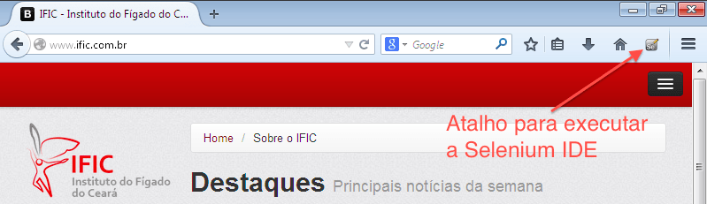
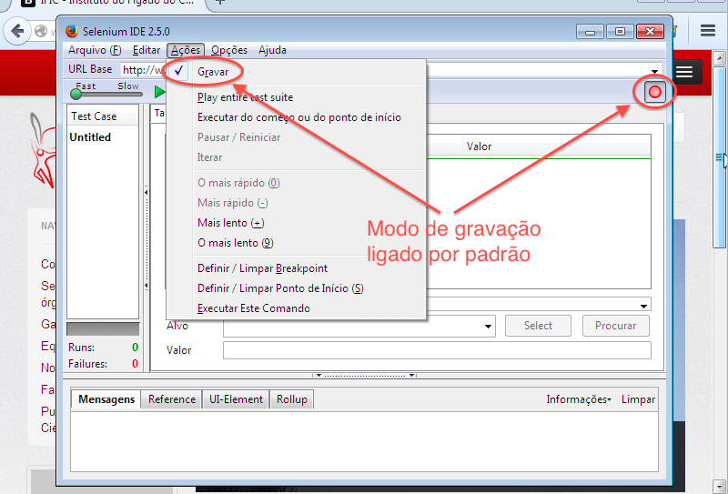
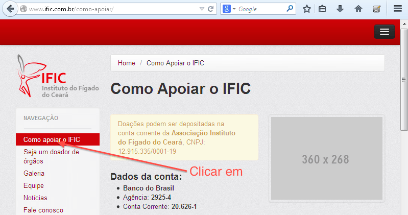
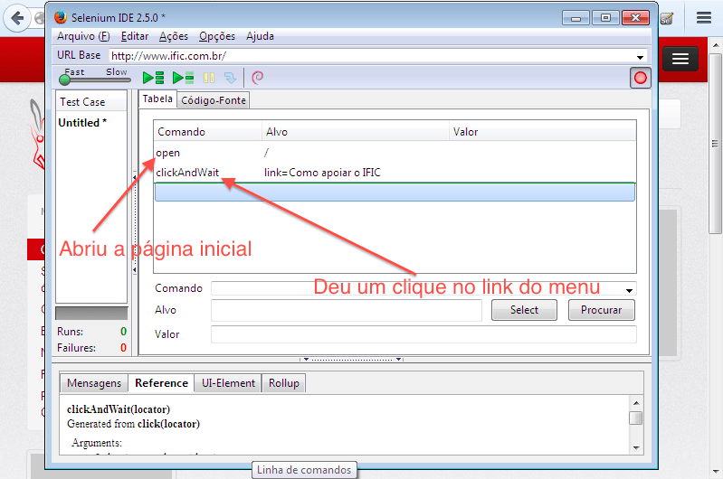
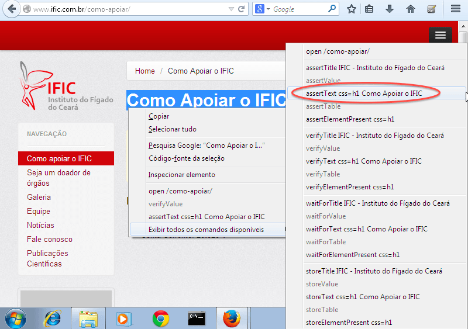
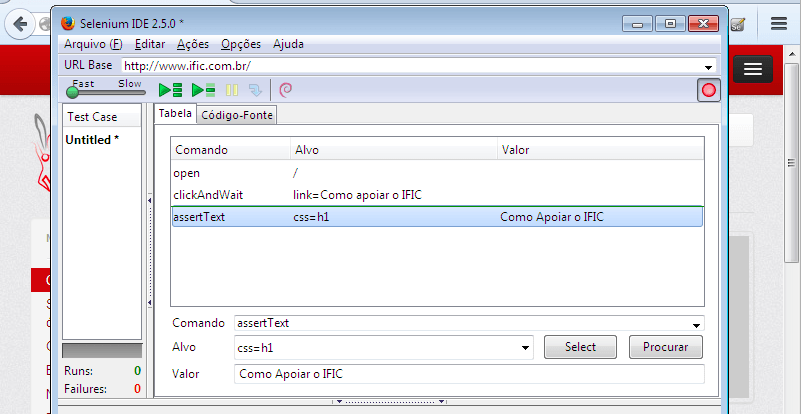
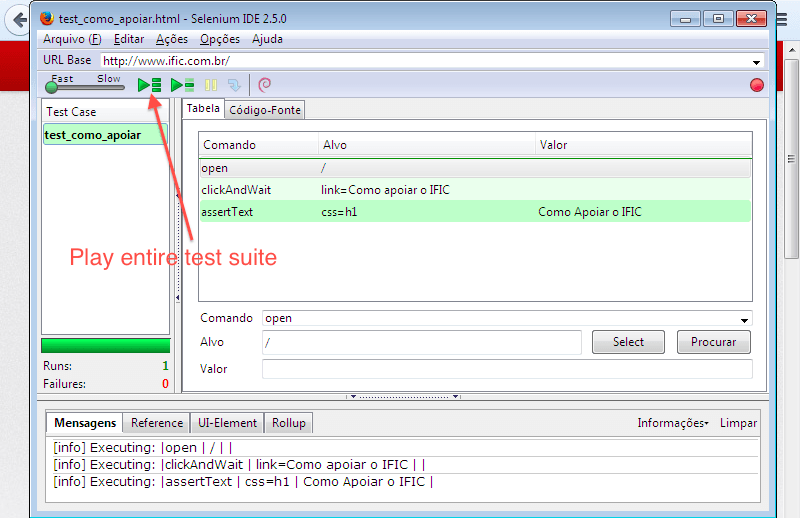
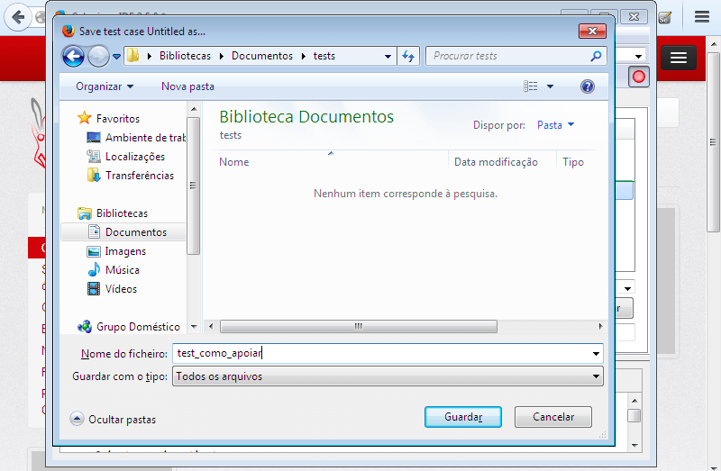
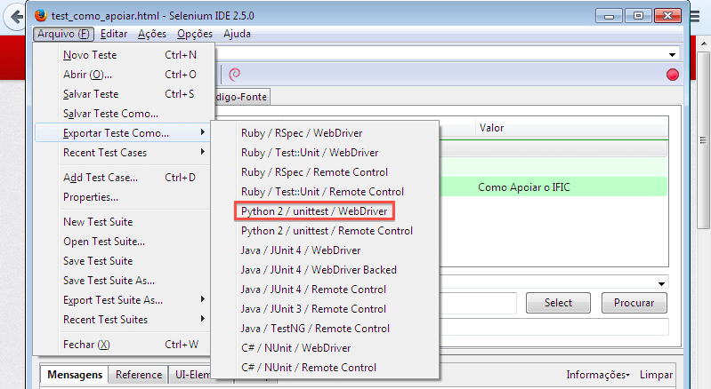
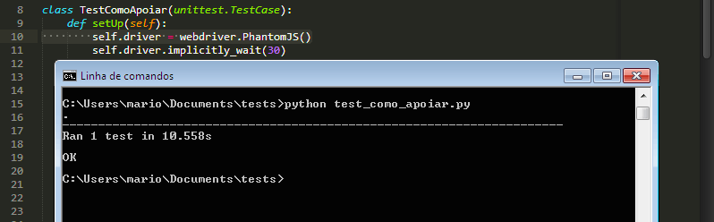

Introdução a testes funcionais com Selenium e Python
####################################################

:date: 2014-05-09 12:00
:tags: selenium, python, selenium-serie, testes-funcionais, testes
:category: Python
:slug: introducao-a-testes-funcionais-com-selenium-e-python
:author: Mário Chaves
:email:  macndesign@gmail.com

Nesse post darei apenas uma introdução básica focada em auxiliar testadores a usar a linguagem de programação Python
para executar e guardar seus scripts de teste.

=====================================================
Porquê usar a linguagem Python nos testes funcionais?
=====================================================

Como sabemos os testes funcionais são em sua grande parte desenvolvidos por Analistas de Testes e/ou Testadores.
Para que se tenha uma manutenção mais rápida e eficaz a medida que o código do projeto vai crescendo e ganhando mais funcionalidades, é interessante que os testes estejam coesos e de fácil entendimento. `IMHO <http://pt.wiktionary.org/wiki/IMHO>`_  Python é a linguagem que deixa seu código mais elegante, limpo e entendível.

  *"Python é uma linguagem de programação de alto nível , interpretada, imperativa, orientada a objetos, funcional, 
  de tipagem dinâmica e forte."* `Wikipedia <http://pt.wikipedia.org/wiki/Python>`_

Em uma rápida comparação de verbosidade entre Python e Java com o tão criticado "Hello, World!", podemos notar o 
que quero dizer quando citei *"IMHO Python é a linguagem que deixa seu código mais elegante, limpo e entendível"*.

Exemplo em Java:

.. code-block:: java

    public class HelloWorld {
        public static void main (String[] args) {
            System.out.println("Hello, world!");
        }
    }

Exemplo em Python 2.x

.. code-block:: python

    print 'Hello, world!'

Isso mesmo, os dois exemplos fazem a mesma coisa, porém, o exemplo em Java tem 104 caracteres enquanto o exemplo 
em Python possui apenas 21 caracteres.

Mas, voltando ao que interessa, vamos ao passo-a-passo de como configurar seu ambiente e depois testar executando algo como exemplo.

===================
Montando o ambiente
===================

Supondo que você usa Windows e não tem nada do que vamos precisar instalado, faça o download dos 
seguintes itens:

  Python 2.7.6 - https://www.python.org/downloads/
    *Linguagem de programação de alto nível*

  Pip - https://bootstrap.pypa.io/get-pip.py
    *Gerenciador de bibliotecas geralmente usado para instalar e remover libs*

  Mozilla Firefox - http://www.mozilla.org/pt-BR/firefox/new/
    *Navegador Web mais recomendado para o uso do Selenium e onde será instalado o plugin SeleniumIDE*

  PhantomJS v1.9 - https://bitbucket.org/ariya/phantomjs/downloads/phantomjs-1.9.7-windows.zip
    *Navegador Headless que possibilita a execução dos testes em background, sem a necessidade de executar 
    toda a interface gráfica do navegador*

Passos para a instalação do Python no Windows
---------------------------------------------

Nota: ele já vem instalado no Mac e Linux

  1. Executar o instalador e instalar com passos simples (Avançar, Avançar, Concluir)
  2. Entre no CMD (Terminal) e digite python, se entrar no interpretador então já está instalado, se não, vá para o passo 3
  3. Feche o Terminal, vá em Iniciar e clique com o botão direito sobre o “Computador” e selecione “Propriedades”
  4. No menu lateral clique em “Definições avançadas de sistema” e selecione “Variáveis de ambiente”
  5. Na caixa “Variáveis do sistema” selecione com um duplo clique o item “Path”
  6. Ao final da linha “Valor da variável” insira “;C:\Python27\Scripts\” então dê Ok, Ok e Ok novamente
  7. Abra o CMD (Terminal) novamente, digite `python`, e dê enter. Dessa vez vai entrar no interpretador!

Pip (Gerênciador de pacotes do Python) no Windows
-------------------------------------------------

  1. Através do Terminal vá até a pasta onde você fez download do arquivo get-pip.py, provavelmente em C:\Users\SeuUsuario\Downloads
  2. Ao entrar na pasta Downloads (Se o get-pip.py estiver nela) execute: python get-pip.py (Ele fará toda a instalação do Pip)

Sei que não tem necessidade, mas: Mozilla Firefox (Navegador Web)
-----------------------------------------------------------------

  1. Executar o instalador e instalar com passos simples (Avançar, Avançar, Concluir)

PhantomJS no Windows
--------------------

  1. Descompactar o arquivo e colocar a pasta “phantomjs-1.9.7-windows” dentro de C: (Veja se logo dentro dessa pasta existe um arquivo chamado phantomjs, que é um arquivo executável com o ícone de um Fantasminha) se tem, está certo, se não tem, então você tem que colocar a pasta “phantomjs-1.9.7-windows” que está dentro de “phantomjs-1.9.7-windows” em C: as vezes ao descompactar um arquivo no Windows ele descompacta em uma pasta com o mesmo nome
  2. Vá em Iniciar e clique com o botão direito sobre o “Computador” e selecione “Propriedades”
  3. No menu lateral clique em “Definições avançadas de sistema” e selecione “Variáveis de ambiente”
  4. Na caixa “Variáveis do sistema” selecione com um duplo clique o item “Path”
  5. Ao final da linha “Valor da variável” insira “;C:\phantomjs-1.9.7-windows\” então dê Ok, Ok e Ok novamente
  6. Abra o CMD (Terminal) e digite `phantomjs` e dê enter, se entrar no interpretador é porquê deu certo, Ctrl+c pra sair e então feche o terminal

Selenium IDE (IDE para facilitar a criação de testes com o Selenium) no Firefox
-------------------------------------------------------------------------------

  1. Execute o Mozilla Firefox
  2. Abra a seguinte URL: http://release.seleniumhq.org/selenium-ide/2.5.0/selenium-ide-2.5.0.xpi e a instalação já é feita de forma automática

Biblioteca Selenium para o Python
---------------------------------

  1. Abra o Terminal, digite "`pip install -U selenium`" e dê enter, a instalação é feita de forma automática

  Levando em conta que o público alvo do artigo são testadores, não estenderei ao uso de ferramentas muito interessantes também para esse fim, porém mais utilizadas por desenvolvedores, como: `Virtualenv <https://virtualenv.pypa.io>`_, `Fabric <http://www.fabfile.org>`_, `Sphinx <http://sphinx-doc.org>`_ e etc.

======================================================
Criando um teste simples com a famosa Selenium IDE lo/
======================================================

Após instalar a Selenium IDE dentro do Firefox e reiniciar o navegador, clique no ícone da ferramenta que está no 
canto superior direito do Navegador.

Note que na Selenium IDE, a opção de gravar já vem selecionada por padrão.

E para nossa alegria, a URL do site atual que está em nosso Firefox, já está definida no campo "URL Base" da Selenium IDE.

Cliquei no link "Como apoiar o IFIC" e acessei a seguinte página.

Ao ver o que está acontecendo na Selenium IDE, notamos que ela está gravando tudo o que está acontecendo no navegador.

Retorno ao navegador e faço um simples assert para ver se ao entrar na página o título H1 está correto.

Veja como é simples ver as propriedades que podem ser usadas para certificar que você realmente está na tela correta e 
verificar se os textos estão corretamente aplicados em seus devidos lugares.

Nesse exemplo eu verifico se o título H1 da página contém "Como Apoiar o IFIC", para isso foi necessário:

  1. Selecionar o texto na página
  2. Clicar com o botão direito do mouse sobre a seleção
  3. Selecionar "Exibir todos os comandos disponíveis", note que ele já me dar como opção na primeira tela do menu suspenso esse item que selecionei na segunda, mas preferi correr até lá apenas para ilustrar as outras opções disponíveis que existem na segunda tela do menu suspenso
  4. Clicar em "assertText css=h1 Como Apoiar o IFIC"

Agora veja o que a Selenium IDE gravou:

Como era de se esperar, apenas o que você fez no navegador ;)

  *Note que se você já for um usuário experiente da Selenium IDE, souber usar os seletores e conhecer bem o código HTML 
  da página, você poderá escrever todo o seu código na própria Selenium IDE e depois executar.*

Para executar o teste criado, basta clicar no botão "Play entire test suite" como na imagem abaixo:

Note que o teste foi executado com sucesso, pois está tudo verdinho :) . Logo abaixo existem algumas mensagens 
na sequência que foram executadas.

==========================================
Salvando/Exportando e executando os testes
==========================================

Selenium IDE
------------

Ao concluir seu teste você tem a opção de salvar e então executar futuramente para verificar 
se o sistema continua funcionando como deveria.

Para salvar é muito simples, se estiver no Windows ou Linux, basta dar um Ctrl+S e no Mac Command+S, escolher
uma pasta e clicar em Salvar.

Sinceramente, se você sempre quiser executar seus testes usando o Mozilla Firefox eu aconselho usar a própria 
Selenium IDE para esse propósito, pois com ela você salva seus testes em HTML e os executa tranquilamente com 
opção de rodar todo um Test Case de uma vez. Observe que após salvar o teste ele fica disponível na coluna 
"Test Case" da Selenium IDE e você pode ir adicionando os demais testes a essa coluna para que sejam todos executados.

Exportando para uma linguagem de programação
--------------------------------------------

Na Selenium IDE existe a opção de exportar seu teste para várias linguagens de programação como: Ruby, Python, 
Java e C#.

Exportar seu teste para uma linguagem de programação pode ser bem útil para o caso de integrar seu teste 
ao código de teste desenvolvido pelos programadores já que os testes exportados pela Selenium IDE são 
codificados utilizando a lib unittest, ou seja, na forma de testes unitários.

A imagem abaixo mostra como exportar o teste para uma das linguagens disponíveis:

No caso, Python 2 / unittest / Webdriver, mas o teste poderia ser exportado para qualquer outra linguagem disponível.
Clique nesse item e salve na pasta que desejar com um nome sucinto e seguido da extensão .py (por exemplo: test_como_apoiar.py)

Veja abaixo o código gerado pela exportação do teste para Python (48 linhas):

.. code-block:: python

  from selenium import webdriver
  from selenium.webdriver.common.by import By
  from selenium.webdriver.common.keys import Keys
  from selenium.webdriver.support.ui import Select
  from selenium.common.exceptions import NoSuchElementException
  import unittest, time, re

  class TestComoApoiar(unittest.TestCase):
      def setUp(self):
          self.driver = webdriver.Firefox()
          self.driver.implicitly_wait(30)
          self.base_url = "http://www.ific.com.br/"
          self.verificationErrors = []
          self.accept_next_alert = True
      
      def test_como_apoiar(self):
          driver = self.driver
          driver.get(self.base_url + "/")
          driver.find_element_by_link_text("Como apoiar o IFIC").click()
          self.assertEqual("Como Apoiar o IFIC", driver.find_element_by_css_selector("h1").text)
      
      def is_element_present(self, how, what):
          try: self.driver.find_element(by=how, value=what)
          except NoSuchElementException, e: return False
          return True
      
      def is_alert_present(self):
          try: self.driver.switch_to_alert()
          except NoAlertPresentException, e: return False
          return True
      
      def close_alert_and_get_its_text(self):
          try:
              alert = self.driver.switch_to_alert()
              alert_text = alert.text
              if self.accept_next_alert:
                  alert.accept()
              else:
                  alert.dismiss()
              return alert_text
          finally: self.accept_next_alert = True
      
      def tearDown(self):
          self.driver.quit()
          self.assertEqual([], self.verificationErrors)

  if __name__ == "__main__":
      unittest.main()

Veja o mesmo código gerado pela exportação do teste para Java (73 linhas):

.. code-block:: java

  package com.example.tests;

  import java.util.regex.Pattern;
  import java.util.concurrent.TimeUnit;
  import org.junit.*;
  import static org.junit.Assert.*;
  import static org.hamcrest.CoreMatchers.*;
  import org.openqa.selenium.*;
  import org.openqa.selenium.firefox.FirefoxDriver;
  import org.openqa.selenium.support.ui.Select;

  public class TestComoApoiar {
    private WebDriver driver;
    private String baseUrl;
    private boolean acceptNextAlert = true;
    private StringBuffer verificationErrors = new StringBuffer();

    @Before
    public void setUp() throws Exception {
      driver = new FirefoxDriver();
      baseUrl = "http://www.ific.com.br/";
      driver.manage().timeouts().implicitlyWait(30, TimeUnit.SECONDS);
    }

    @Test
    public void testComoApoiar() throws Exception {
      driver.get(baseUrl + "/");
      driver.findElement(By.linkText("Como apoiar o IFIC")).click();
      assertEquals("Como Apoiar o IFIC", driver.findElement(By.cssSelector("h1")).getText());
    }

    @After
    public void tearDown() throws Exception {
      driver.quit();
      String verificationErrorString = verificationErrors.toString();
      if (!"".equals(verificationErrorString)) {
        fail(verificationErrorString);
      }
    }

    private boolean isElementPresent(By by) {
      try {
        driver.findElement(by);
        return true;
      } catch (NoSuchElementException e) {
        return false;
      }
    }

    private boolean isAlertPresent() {
      try {
        driver.switchTo().alert();
        return true;
      } catch (NoAlertPresentException e) {
        return false;
      }
    }

    private String closeAlertAndGetItsText() {
      try {
        Alert alert = driver.switchTo().alert();
        String alertText = alert.getText();
        if (acceptNextAlert) {
          alert.accept();
        } else {
          alert.dismiss();
        }
        return alertText;
      } finally {
        acceptNextAlert = true;
      }
    }
  }

Tendo a versão do teste escrita em Python posso simplesmente dar um clique duplo sobre o ícone do arquivo 
test_como_apoiar.py que instantaneamente é aberto o navegador (Mozilla Firefox) e executado todo teste 
ao vivo.

Mas como já disse, se for para rodar o teste no Firefox, é melhor executar pela própria Selenium IDE.

É por isso que agora vamos saber porquê instalamos o PhantomJS.

Com o PhantomJS temos a possibilidade de executar o browser em "Background", podemos chamar de modo "Headless", 
isso faz com que possamos executar toda a nossa suíte de testes sem precisar ligar o Mozilla Firefox e todo o 
peso de sua interface gráfica, para isso vamos alterar a primeira linha do método setUp() e trocar o webdriver Firefox para PhantomJS:

.. code-block:: python

  class TestComoApoiar(unittest.TestCase):
      def setUp(self):
          self.driver = webdriver.PhantomJS()

Então vamos abrir o terminal, console ou cmd, como queira chamar, e navegar até a pasta onde foi salvo o arquivo test_como_apoiar.py e executar o teste com o seguinte comando:

.. code-block:: bash

  python test_como_apoiar.py

O arquivo é executado como na imagem abaixo:

Bem amigos, a leitura foi uma breve descrição sobre os seguintes tópicos:

  * Porquê usar Python para guardar seus testes funcionais
  * Como montar o ambiente no Windows
  * Como criar um teste simples na Selenium IDE
  * Como salvar/exportar e executar com um browser Headless os testes que foram criados com a IDE

Para mais detalhes sobre o uso da biblioteca Selenium do Python acompanhe a série de artigos iniciados pelo `Lucas Magnum <http://pythonclub.com.br/author/lucas-magnum.html>`_

Qualquer dúvida pode entrar em contato:

  * Email macndesign@gmail.com
  * Twitter `@macndesign <https://twitter.com/macndesign>`_
  * Facebook `facebook.com/macndesign <https://www.facebook.com/macndesign>`_
  * Google + `plus.google.com/+MárioChaves81 <https://plus.google.com/+M%C3%A1rioChaves81>`_

Grande abraço!
