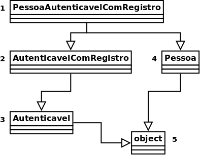

Title: Orientação a objetos de outra forma: Herança múltiplas e mixins
Slug: oo-de-outra-forma-4
Date: 2021-05-03 15:00
Category: Python
Tags: python, orientação a objetos
Author: Eduardo Klosowski
Email: eduardo_klosowski@yahoo.com
Github: eduardoklosowski
Twitter: eduklosowski
Site: https://dev.to/eduardoklosowski
About_author: Programador, formado em redes de computadores e estuda DevOps

No [texto anterior](https://dev.to/acaverna/orientacao-a-objetos-de-outra-forma-heranca-3dm7) foi apresentando o conceito de herança, que herda toda a estrutura e comportamento de uma classe, podendo estendê-la com outros atributos e comportamentos. Esse texto apresentará a ideia de [herança múltipla](https://pt.wikipedia.org/wiki/Heran%C3%A7a_m%C3%BAltipla), e uma forma para se aproveitar esse recurso, através de mixins.

## Herança múltiplas

Voltando ao sistema para lidar com dados das pessoas, onde algumas dessas pessoas possuem a possibilidade de acessar o sistema através de usuário e senha, também deseja-se permitir que outros sistemas autentiquem e tenham acesso os dados através de uma [API](https://pt.wikipedia.org/wiki/Interface_de_programa%C3%A7%C3%A3o_de_aplica%C3%A7%C3%B5es). Isso pode ser feito criando uma classe para representar os sistemas que terão permissão para acessar os dados. Exemplo:

```python
class Sistema:
    def __init__(self, usuario, senha):
        self.usuario = usuario
        self.senha = senha

    def autenticar(self, usuario, senha):
        return self.usuario == usuario and self.senha == senha
```

Porém, esse código repete a implementação feita para `PessoaAutenticavel`:

```python
class PessoaAutenticavel(Pessoa):
    def __init__(self, nome, sobrenome, idade, usuario, senha):
        super().__init__(nome, sobrenome, idade)
        self.usuario = usuario
        self.senha = senha

    def autenticar(self, usuario, senha):
        return self.usuario == usuario and self.senha == senha
```

Aproveitando que Python, diferente de outras linguagens, possui herança múltipla, é possível extrair essa lógica das classes, centralizando a implementação em uma outra classe e simplesmente herdá-la. Exemplo:

```python
class Autenticavel:
    def __init__(self, *args, usuario, senha, **kwargs):
        super().__init__(*args, **kwargs)
        self.usuario = usuario
        self.senha = senha

    def autenticar(self, usuario, senha):
        return self.usuario == usuario and self.senha == senha


class PessoaAutenticavel(Autenticavel, Pessoa):
    ...


class Sistema(Autenticavel):
    ...


p = PessoaAutenticavel(nome='João', sobrenome='da Silva', idade=20,
                       usuario='joao', senha='secreta')
```

A primeira coisa a ser observada são os argumentos `*args` e `**kwargs` no `__init__` da classe `Autenticavel`, eles são usados uma vez que não se sabe todos os argumentos que o `__init__` da classe que estenderá o `Autenticavel` espera receber, funcionando de forma dinâmica (mais sobre esse recurso pode ser visto na [documentação do Python](https://docs.python.org/pt-br/3/tutorial/controlflow.html#more-on-defining-functions)).

A segunda coisa a ser verificada é que para a classe `PessoaAutenticavel`, agora cria em seus objetos, a estrutura tanto da classe `Pessoa`, quanto `Autenticavel`. Algo similar a versão sem orientação a objetos a baixo:

```python
# Arquivo: pessoa_autenticavel.py

import autenticavel
import pessoa


def init(p, nome, sobrenome, idade, usuario, senha):
    pessoa.init(p, nome, sobrenome, idade)
    autenticavel.init(p, usuario, senha)
```

Também vale observar que as classes `PessoaAutenticavel` e `Sistema` não precisam definir nenhuma função, uma vez que elas cumprem seus papéis apenas herdando outras classes, porém seria possível implementar funções específicas dessas classes, assim como sobrescrever as funções definidas por outras classes.

## Ordem de resolução de métodos

Embora herança múltiplas sejam interessantes, existe um problema, se ambas as classes pai possuírem uma função com um mesmo nome, a classe filha deveria chamar qual das funções? A do primeiro pai? A do último? Para lidar com esse problema o Python usa o MRO (*method resolution order*, ordem de resolução do método), que consiste em uma tupla com a ordem de qual classe o Python usará para encontrar o método a ser chamado. Exemplo:

```python
print(PessoaAutenticavel.__mro__)
# (<class '__main__.PessoaAutenticavel'>, <class '__main__.Autenticavel'>, <class '__main__.Pessoa'>, <class 'object'>)
```

Por esse motivo que também foi possível chamar o `super().__init__` dentro de `Autenticavel`, que devido ao MRO, o Python chama o `__init__` da outra classe pai da classe que estendeu `Autenticavel`, em vez de precisar fazer um método `__init__` em `PessoaAutenticavel` chamando o `__init__` de todas as suas classes pais, como foi feito na versão sem orientação a objetos. E por isso a ordem `Autenticavel` e `Pessoa` na herança de `PessoaAutenticavel`, para fazer o MRO procurar os métodos primeiro em `Autenticavel` e depois em `Pessoa`.

Para tentar fugir da complexidade que pode ser herança múltipla, é possível escrever classes que tem por objetivo unicamente incluir alguma funcionalidade em outra, como o caso da classe `Autenticavel`, que pode ser herdada por qualquer outra classe do sistema para permitir o acesso ao sistema. Essas classes recebem o nome de mixins, e adiciona uma funcionalidade bem definida.

## Estendendo mixins

Imagine se além de permitir o acesso ao sistema, também gostaríamos de registrar algumas tentativas de acesso, informando quando houve a tentativa e se o acesso foi concedido ou não. Como `Autenticavel` é uma classe, é possível extendê-la para implementar essa funcionalidade na função `autenticar`. Exemplo:

```python
from datetime import datetime


class AutenticavelComRegistro(Autenticavel):
    @staticmethod
    def _get_data():
        return datetime.now().strftime('%d/%m/%Y %T')

    def autenticar(self, usuario, senha):
        print(f'{self._get_data()} Tentativa de acesso de {usuario}')
        acesso = super().autenticar(usuario, senha)
        if acesso:
            acesso_str = 'permitido'
        else:
            acesso_str = 'negado'
        print(f'{self._get_data()} Acesso de {usuario} {acesso_str}')
        return acesso


class PessoaAutenticavelComRegistro(AutenticavelComRegistro, Pessoa):
    ...


class SistemaAutenticavelComRegistro(AutenticavelComRegistro, Sistema):
    ...


p = PessoaAutenticavelComRegistro(
    nome='João', sobrenome='da Silva', idade=20,
    usuario='joao', senha='secreta',
)
p.autenticar('joao', 'secreta')
# Saída na tela:
# 23/04/2021 16:56:58 Tentativa de acesso de joao
# 23/04/2021 16:56:58 Acesso de joao permitido
```

Essa implementação utiliza-se do `super()` para acessar a função `autenticar` da classe `Autenticavel` para não precisar reimplementar a autenticação. Porém, antes de chamá-la, manipula seus argumentos para registrar quem tentou acessar o sistema, assim como também manipula o seu retorno para registrar se o acesso foi permitido ou não.

Essa classe também permite analisar melhor a ordem em que as classes são consultadas quando uma função é chamada:

```python
print(PessoaAutenticavelComRegistro.__mro__)
# (<class '__main__.PessoaAutenticavelComRegistro'>, <class '__main__.AutenticavelComRegistro'>, <class '__main__.Autenticavel'>, <class '__main__.Pessoa'>, <class 'object'>)
```

Que também pode ser visto na forma de um digrama de classes:



Onde é feito uma [busca em profundidade](https://pt.wikipedia.org/wiki/Busca_em_profundidade), como se a função fosse chamada no primeiro pai, e só se ela não for encontrada, busca-se no segundo pai e assim por diante. Também é possível observar a classe `object`, que sempre será a última classe, e é a classe pai de todas as outras classes do Python quando elas não possuirem um pai declarado explicitamente.

## Considerações

Herança múltipla pode dificultar bastante o entendimento do código, principalmente para encontrar onde determinada função está definida, porém pode facilitar bastante o código. Um exemplo que usa bastante herança e mixins são as *views* baseadas em classe do django ([*class-based views*](https://docs.djangoproject.com/pt-br/3.2/topics/class-based-views/)), porém para facilitar a visualização existe o site [Classy Class-Based Views](https://ccbv.co.uk/) que lista todas as classes, e os mixins utilizados em cada uma, como pode ser visto em "Ancestors" como na [UpdateView](https://ccbv.co.uk/projects/Django/3.1/django.views.generic.edit/UpdateView/), que é usado para criar uma página com formulário para editar um registro já existente no banco, assim ela usa mixins para pegar um objeto do banco (`SingleObjectMixin`), processar formulário baseado em uma tabela do banco (`ModelFormMixin`) e algumas outras funcionalidades necessárias para implementar essa página.

---

Esse artigo foi publicado originalmente no [meu blog](https://eduardoklosowski.github.io/blog/), passe por lá, ou siga-me no [DEV](https://dev.to/eduardoklosowski) para ver mais artigos que eu escrevi.
