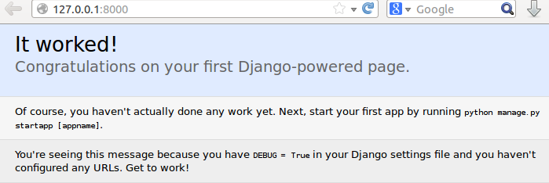
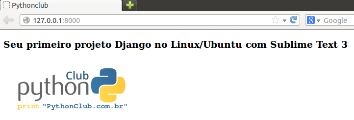
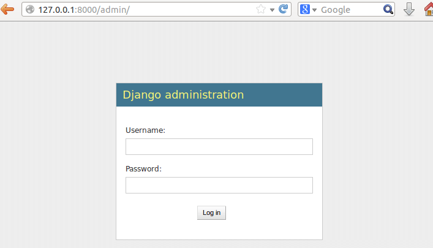

Seu primeiro projeto Django com Sublime Text no Linux
#####################################################

:date: 2014-05-11 02:00
:tags: python, django, vitualenv
:category: Django
:slug: primeiro-projeto-django-no-linux-com-sublime
:author: Fabiano Góes
:email:  fabianogoes@gmail.com
:summary: Primeiro projeto Django no Linux/Ubuntu com Sublime Text 3

========================
O objetivo deste artigo:
========================
* Instalar/Verificar python instalado no Sistema Operacional.
* Instalar gerenciador de pacotes python: pip.
* Instalar o virtualenv.
* Criar/Ativar o virtualenv do projeto.
* Instalar o Django dentro do virtualenv.
* Criar um projeto Django.
* Criar uma app Django dentro do projeto.
* Instalar Sublime Text.
* Criar uma classe Model.
* Criar uma rota: home.
* Criar a view: home.
* Configurar o Admin.
* Rodar o Projeto.

Ambiente usado durante a escrita deste artigo
=============================================
- Sistema Operacional: Linux Ubuntu 12.04 LTS
- Python 2.7.3
- Django 1.6 

---------------------------------------

No Linux/Ubuntu não precisamos instalar Python, porque já é nativo em sistemas operacionais baseados em Unix, mas para termos certeza basta executar o comando no terminal:

.. code-block:: bash

	$ python –version

o resultado será:

.. code-block:: bash

	Python 2.7.3

Vamos começar instalando os pacotes necessários no Sistema Operacional:

.. code-block:: bash

    $ sudo apt-get update
    $ sudo apt-get install python-dev python-setuptools
    $ sudo easy_install pip
    $ sudo pip install virtualenv
	
Para testarmos se o virtualenv está instalado corretamente executaremos no terminal:

.. code-block:: bash

	$ virtualenv --version	
	
Resultado:

.. code-block:: bash

	1.11.5

O pacote **python-setuptools** foi utilizado apenas para instalarmos o **easy_install** que usamos para instalar o **pip**.

A partir de agora, no ambiente virtual sempre usaremos o **pip** para instalar os pacotes.	

Muito bem, com o **virtualenv** instalado, o próximo passo será criar nosso **virtualenv** e instalarmos o **Django**.

Vamos criar nosso virtualenv chamado **pythonclub**:

.. code-block:: bash
	
	$ virtualenv pythonclub --no-site-packages 
	
**--no-site-packages** = esse parametro do virtualenv indica que o ambiente virtual será totalmente isolado do sistema operacional, que só enxergará os pacotes instalados dentro do virtualenv.

Agora vamos entrar dentro do ambiente virtual que criamos e vamos ativá-lo:

.. code-block:: bash
	
	$ cd pythonclub/
	$ source bin/activate
	
Neste momento temos o ambiente virtual criado e ativado, pronto para instalar o **django**:

.. code-block:: bash

	$ pip install django
	
Quando executamos o comando **pip install django** sem especificarmos a versão desejada, 
o pip instala a ultima versão disponivel. Se quizermos instalar uma versão específica devemos executar assim: 

.. code-block:: bash

	$ pip install django==1.5.4

Então podemos finalmente criar o projeto django executando o seguinte comando:

.. code-block:: bash

	$ django-admin.py startproject first_django_project
	
Com o projeto criado, devemos criar uma app chamada: **core**:

.. code-block:: bash

	$ cd first_django_project
	$ python manage.py startapp core

Alterar o arquivo settings.py para adicionar a app **core** em **INSTALLED_APPS**

.. code-block:: python

	INSTALLED_APPS = (
	    'django.contrib.admin',
	    'django.contrib.auth',
	    'django.contrib.contenttypes',
	    'django.contrib.sessions',
	    'django.contrib.messages',
	    'django.contrib.staticfiles',
	    'core',
	)
	
**OBS:** perceba que ao usar o **Django 1.6** a app admin já estará instalada.	

Até aqui a estrutura de diretórios está assim:

.. code-block:: bash

	../first_django_project/
	├── core
	│   ├── admin.py
	│   ├── __init__.py
	│   ├── models.py
	│   ├── tests.py
	│   └── views.py
	├── first_django_project
	│   ├── __init__.py
	│   ├── __init__.pyc
	│   ├── settings.py
	│   ├── settings.pyc
	│   ├── urls.py
	│   └── wsgi.py
	└── manage.py

	
	
OBS: Os diretórios bin/, include/ e lib/ são diretórios do virtualenv. O restante são diretórios do projeto.

Para rodar o projeto, digite o comando:
	
.. code-block:: bash

	$ python manage.py runserver
	Validating models...

	0 errors found
	May 11, 2014 - 03:30:48
	Django version 1.6.4, using settings 'first_django_project.settings'
	Starting development server at http://127.0.0.1:8000/
	Quit the server with CONTROL-C.
	[11/May/2014 03:30:59] "GET / HTTP/1.1" 200 1757

Chegou o momento de instalarmos o editor. No caso deste tutorial usaremos o **Sublime Text 3**
	
.. code-block:: bash

	$ sudo add-apt-repository ppa:webupd8team/sublime-text-3
	$ sudo apt-get update
	$ sudo apt-get install sublime-text-installer

Com o Sublime já instalado, quero dizer que existe inúmeros plugins disponíveis,
mas este assunto sai um pouco do escopo deste tutorial, mesmo assim quero indicar dentre estes inúmeros plugins, dois que não vivo sem: **Djaneiro** e **SublimeCodeIntel**

indico 2 sites para saber um pouco sobre os plugins:
`Sublime wbond <https://sublime.wbond.net/>`_
`Sublime Text Dicas <http://sublimetextdicas.com.br/>`_

Para abrirmos o diretório do projeto no Sublime, iremos ao menu **Project**::
	
	Project >> Add Forlder to Project...

		

O fluxo de um request em projetos django é o seguinte:
URL --> VIEW --> TEMPLATE

Então vamos começar criando uma url *home* para o projeto, no arquivo urls.py:

.. code-block:: python
	
	url(r'^$', 'core.views.home', name='home'),

Com a url criada e apontando para view **core.views.home** vamos criar a tal view **home**,
no arquivo core/views.py

.. code-block:: python

	from django.shortcuts import render	

	def home(request):
		context = {'texto': 'Seu primeiro projeto Django no Linux/Ubuntu com Sublime Text 3'}
		return render(request, 'index.html', context)

Agora resta criarmos o template **index.html**. 
Não me aprofundando muito, quero dizer que existe uma convenção no django que procura o template em um diretório: **app_name/templates**.
No caso ficará assim: **first_django_project/core/templates**.

OK, vamos criar este diretório e o template **index.html**,
estando no diretório root do projeto: **first_django_project**: 

.. code-block:: bash

	$ mkdir core/templates
	$ touch core/templates/index.html 

maravilha, o html do **index.html** é bem básico:

.. code-block:: html

	<!DOCTYPE html>
	<html lang="en">
		<head>
			<title>Pythonclub<title>
		</head>
	<body>
		<h1>{{ texto }}</h1>
		
	</body>

Na view **home** escrevemos no contexto uma variável chamada: **texto**, e agora no template
estou exibindo esta variável usando: **{{ texto }}**

Executando o projeto novamente o resultado será:
	
.. code-block:: bash

	$ python manage.py runserver
	Validating models...

	0 errors found
	May 11, 2014 - 03:30:48
	Django version 1.6.4, using settings 'first_django_project.settings'
	Starting development server at http://127.0.0.1:8000/
	Quit the server with CONTROL-C.
	[11/May/2014 03:30:59] "GET / HTTP/1.1" 200 1757

Para finalizarmos vamos criar uma classe model simples, apenas para ilustrar o uso do **Admin**

no arquivo core/models.py

.. code-block:: python

    from django.db import models

    class Pessoa(models.Model):
	    nome = models.CharField(max_length=100)
	    cpf = models.CharField(max_length=20)

	    def __unicode__(self):
		    return self.nome

Vamos rodar o comando **syncdb** para o dango criar as tabelas. 
Este comando vai perguntar se você deseja criar um super usuário, digite **yes**, crie o usuário **admin** e dê uma senha e um email.

.. code-block:: bash

	$ python manage.py syncdb

Agora vamos registar esta classe no admin, editando o arquivo core/admin.py(se o arquivo não existir crie):

.. code-block:: python

	from django.contrib import admin
	from core.models import Pessoa

	admin.site.register(Pessoa)

Rodando o projeto e acessando a url: **http://127.0.0.1:8000/admin/**
digite o super usuário e senha criado ao rodar o comando **syncdb**

Neste momento podemos selecionar Pessoa e cadastrar pessoas ao nosso sistema.

Bom pessoal, é isso, um tutorial simples apenas de meio longo.

espero que gostem, um abraço a todos!