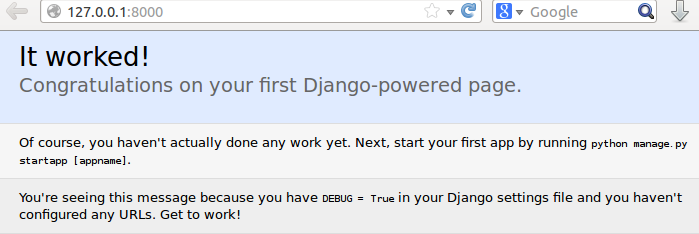
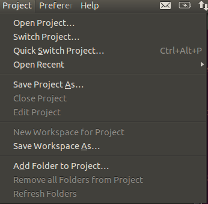

Seu primeiro projeto Django com Sublime Text no Linux
#####################################################

:date: 2014-05-11 02:00
:tags: python, django, vitualenv
:category: Django
:slug: primeiro-projeto-django-no-linux-com-sublime
:author: Fabiano Góes
:email:  fabianogoes@gmail.com
:summary: Primeiro projeto Django no Linux/Ubuntu com Sublime Text 3

========================
O objetivo deste artigo:
========================
* Instalar/Verificar python instalado no Sistema Operacional.
* Instalar gerenciador de pacotes python: pip.
* Instalar o virtualenv.
* Criar/Ativar o virtualenv do projeto.
* Instalar o Django dentro do virtualenv.
* Criar um projeto Django.
* Criar uma app Django dentro do projeto.
* Instalar Sublime Text.
* Criar uma classe Model.
* Criar uma rota: home.
* Criar a view: home.
* Configurar o Admin.
* Rodar o Projeto.

Ambiente usado durante a escrita deste artigo
=============================================
- Sistema Operacional: Linux Ubuntu 12.04 LTS
- Python 2.7.3
- Django 2.6 

---------------------------------------

No Linux/Ubuntu não precisamos instalar Python, isso porque já é nativo em sistemas operacionais baseados em Unix, 
mas pra ter certeza basta executar o comando no terminal:

.. code-block:: bash

	$ python –version

o resultado deve ser:

.. code-block:: bash

	Python 2.7.3

vamos começar instalando os pacotes necessários no Sistema Operacional:

.. code-block:: bash

    $ sudo apt-get update
    $ sudo apt-get install python-dev python-setuptools
    $ sudo easy_install pip
    $ sudo pip install virtualenv
	
pra testar se o virtualenv está instalado corretamente execute no terminal:

.. code-block:: bash

	$ virtualenv --version	
	
resultado:

.. code-block:: bash

	1.11.5

O pacote **python-setuptools** foi necessário apenas para instalar o **easy_install** que usamos para instalar o **pip**
A partir de agora dentro do ambiente virtual sempre usaremos o pip para instalar os pacotes necessários.	

muito bem, com o **virtualenv** instalado o próximo passo será criar um **virtualenv** e assim instalarmos o **Django**.

vamos criar nosso virtualenv chamado **pythonclub**:

.. code-block:: bash
	
	$ virtualenv pythonclub --no-site-packages 
	
**–no-site-packages** = esse parametro do virtualenv indica que meu ambiente virtual será totalmente isolado 
do meu sistema operacional, e só enxergara os pacotes instalados dentro do virtualenv.

agora vamos entrar dentro do ambiente virtual que criamos, e vamos ativar o virtualenv:

.. code-block:: bash
	
	$ cd pythonclub/
	$ source bin/activate
	
Neste momento temos nosso ambiente virtual criado e ativado, pronto para instalar o django, e é isso que vamos fazer:

.. code-block:: bash

	$ pip install django
	
Quando executamos o **pip install django** e não especificamos a versão, será instalado ultima versão disponivel, 
se quizermos instalar uma versão especifica podemos executar assim: **$ pip install django==1.5.4**

Então podemos finalmente criar nosso projeto django executando o comando:

.. code-block:: bash

	$ django-admin.py startproject first_django_project
	
Com nosso projeto criado podemos criar uma app para este projeto, e vamos criar uma app com o nome: **core**:

.. code-block:: bash

	$ cd first_django_project
	$ python manage.py startapp core

agora alterando o arquivo settings.py vou adicionar a app **core** em **INSTALLED_APPS**

.. code-block:: python

	INSTALLED_APPS = (
	    'django.contrib.admin',
	    'django.contrib.auth',
	    'django.contrib.contenttypes',
	    'django.contrib.sessions',
	    'django.contrib.messages',
	    'django.contrib.staticfiles',
	    'core',
	)
	
**OBS:** perceba que por estar usando o **Django 1.6** a app admin já está instalada.	
até aqui a estrutura de diretórios deve estar assim:

.. code-block:: bash

	../first_django_project/
	├── core
	│   ├── admin.py
	│   ├── __init__.py
	│   ├── models.py
	│   ├── tests.py
	│   └── views.py
	├── first_django_project
	│   ├── __init__.py
	│   ├── __init__.pyc
	│   ├── settings.py
	│   ├── settings.pyc
	│   ├── urls.py
	│   └── wsgi.py
	└── manage.py

	
	
OBS: Os diretórios bin/, include/ e lib/ são diretórios do virtualenv, o restante são diretórios do projeto.

vamos executar o projeto digitando o comando:
	
.. code-block:: bash

	$ python manage.py runserver
	Validating models...

	0 errors found
	May 11, 2014 - 03:30:48
	Django version 1.6.4, using settings 'first_django_project.settings'
	Starting development server at http://127.0.0.1:8000/
	Quit the server with CONTROL-C.
	[11/May/2014 03:30:59] "GET / HTTP/1.1" 200 1757

Chegou o momento de instalar no editor, no caso deste tutorial o **Sublime Text 3**
	
.. code-block:: bash

	$ sudo add-apt-repository ppa:webupd8team/sublime-text-3
	$ sudo apt-get update
	$ sudo apt-get install sublime-text-installer

Com o Sublime instalado, queria dizer que existe inumeros plugins para o sublime,
mas isso sai um pouco do escopo deste tutorial, mesmo assim quero indicar destre estes inumeros plugins
2 que não fico sem: **Djaneiro** e **SublimeCodeIntel**

indico 2 sites pra saber um pouco sobre os plugins:
`Sublime wbond <https://sublime.wbond.net/>`_
`Sublime Text Dicas <http://sublimetextdicas.com.br/>`_

vou abrir o diretório do projeto através do menu **Project**::
	
	Project >> Add Forlder to Project...

		

o fluxo de um request em projetos django é o seguinte:
URL --> VIEW --> TEMPLATE

Então vamos começar criando uma url *home* para o projeto, no arquivo urls.py:

.. code-block:: python
	
	url(r'^$', 'core.views.home', name='home'),

com a url criar e apontando para view **core.views.home** devemos criar esta view **home**,
no arquivo core/views.py

.. code-block:: python

	from django.shortcuts import render	

	def home(request):
		context = {'texto': 'Seu primeiro projeto Django no Linux/Ubuntu com Sublime Text 3'}
		return render(request, 'index.html', context)

E agora resta criar o template **index.html**, e aqui cabe uma observação.
Sem se aprofundar muito, existe uma convenção no django que procura o template em um diretório: **app_name/templates**
no nosso caso ficaria em: **first_django_project/core/templates**.

OK, vamos criar este diretório e o template **index.html**,
Estando no diretório root do nosso projeto: **first_django_project**: 

.. code-block:: bash

	$ mkdir core/templates
	$ touch core/templates/index.html 

maravilha, o html do **index.html** será bem básico:

.. code-block:: html

	<!DOCTYPE html>
	<html lang="en">
		<head>
			<title>Pythonclub<title>
		</head>
	<body>
		<h1>{{ texto }}</h1>
		
	</body>

La na view home escrevemos no contexto uma variavel chamada: **texto** e agora no template
exibimos esta varival usando: **{{ texto }}**

Executando o projeto novamente temos o resultado:
	
.. code-block:: bash

	$ python manage.py runserver
	Validating models...

	0 errors found
	May 11, 2014 - 03:30:48
	Django version 1.6.4, using settings 'first_django_project.settings'
	Starting development server at http://127.0.0.1:8000/
	Quit the server with CONTROL-C.
	[11/May/2014 03:30:59] "GET / HTTP/1.1" 200 1757

.. image:: images/runserv-index.png
   :alt: python logo

Pra finalizar vou criar uma classe model simples apenas para ilustrar o uso do **Admin**
no arquivo core/models.py

.. code-block:: python

    from django.db import models

    class Pessoa(models.Model):
	    nome = models.CharField(max_length=100)
	    cpf = models.CharField(max_length=20)

	    def __unicode__(self):
		    return self.nome

rodando o comando **syncdb** para criar as tabelas, este comando vai perguntar se deseja criar um super usuário, digite **yes** e crie o usuário **admin** e de uma senha e email.

.. code-block:: bash

	$ python manage.py syncdb

e agora vamos registar essa classe no admin, editando o arquivo core/admin.py se o arquivo não existir crie:

.. code-block:: python

	from django.contrib import admin
	from core.models import Pessoa

	admin.site.register(Pessoa)

agora rodando o projeto e acessando a url: **http://127.0.0.1:8000/admin/**
digite o super usuário e senha criado ao rodar o comando **syncdb**

neste momento podemos selecionar Pessoa e cadastrar pessoas ao nosso sistema.

Bom pessoal, é isso, um tutorial simples apenas de meio longo.

espero que gostei, um abraço a todos!

