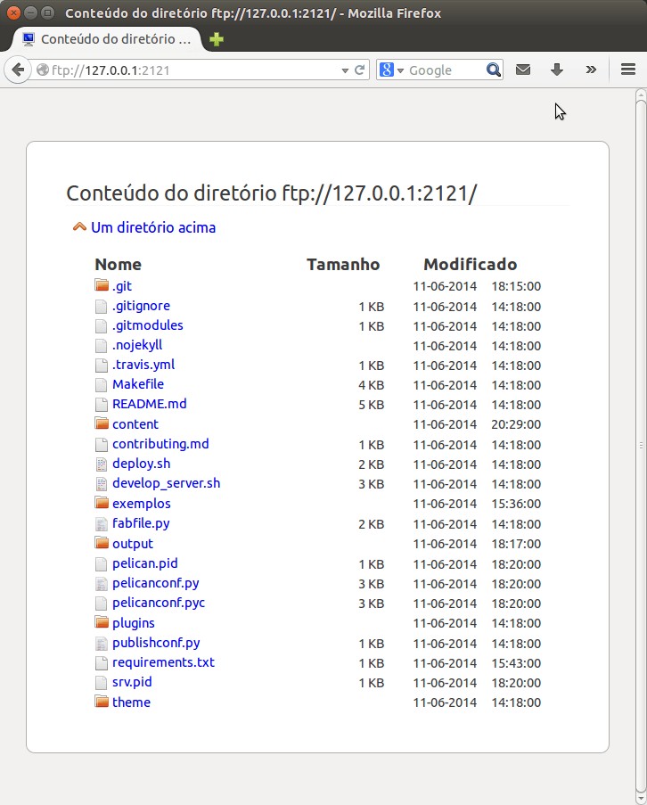

pyftpdlib - Criando um servidor FTP simples com python
######################################################

:date: 2014-06-11 18:00
:tags: python,ftp,tutorial,servidor-ftp
:category: Tutoriais
:slug: pyftpdlib-criando-um-servidor-ftp-simples-com-python
:author: Fábio C. Barrionuevo da Luz
:email:  bnafta@gmail.com
:github: luzfcb
:twitter: luzfcb
:linkedin: fabiocbarrionuevo
:facebook: fabiocbarrionuevo
:gittip: luzfcb

#################################################################################################
Criando um servidor FTP simples com python
#################################################################################################

O que é FTP?
-----------------

**FTP** é um acrônimo de **F**\ile **T**\ransfer **P**\rotocol. É um protocolo inventado
por `Abhay Bhushan`_ em abril de 1971 para resolver os problemas de transferências de dados na `ARPANET`_, 
rede precursora (pode-se dizer mãe) da Internet, sendo que ele é anterior ao TCP e IP.

Baseado no trabalho de `Abhay Bhushan`_ foi criada a `RFC114`_, que padronizou a primeira versão do protocolo.

Posteriormente o protocolo FTP foi modificado para trabalhar sobre o TCP.

O protocolo FTP está em constante evolução, sendo que a versão mais recente para IPv4 é o `RFC959`_, com melhorias
de segurança adicionada pelo `RFC2228`_ e pela adição na `RFC2428`_ de extensões para suporte a IPv6.

Como funciona?
-----------------

O protocolo FTP possui dois modos de funcionamento. O **modo Ativo** e o **modo Passivo**.

Em ambos os casos, o cliente cria uma *conexão de controle* TCP em uma porta não privilegiada aleatória *N* para a porta de comando do servidor FTP, ou seja, a porta 21 do servidor FTP. Essa conexão é chamada de **conexão de controle**.

No **modo Ativo**, o cliente começa a escutar *conexões de dados* recebidas na porta *N+1* a partir do servidor (o cliente envia o comando *FTP PORT N+1* para informar o servidor no qual a porta está ouvindo).

Em situações em que o cliente está atrás de um firewall e é incapaz de aceitar conexões TCP, o **modo Passivo** pode ser usado.

Neste modo, o cliente usa a *conexão de controle* para enviar o comando *PASV*  para o servidor, que em seguida responde ao cliente enviando o endereço IP e número da porta do servidor, o qual o cliente usa para abrir uma **conexão de dados** de uma porta arbitraria para o ip e porta
enviado pelo servidor.

pyftpdlib - O que é?
---------------------

pyftpdlib_ é uma biblioteca Python que implementa um servidor FTP, fornecendo uma interface de alto nivel para facilmente escrever servidores FTP muito eficientes, escaláveis e assíncronos. 

É a implementação do `RFC959`_ servidor de FTP mais completo disponível para a linguagem de programação Python e é usado em projetos como o Google Chromium e Bazaar e incluída por padrão nos repositórios de pacotes do Debian, Ubuntu, Fedora e FreeBSD.

Recursos
--------

* Extremamente leve, rápido e escalável (veja os `benchmarks`_ e o `porquê`_).
* Usa sendfile (2) (ver pysendfile) chamada de sistema para uploads. 
* Usa epoll() / kqueue() / select() para lidar com a concorrência de forma assíncrona, e opcionalmente, tambem suporta modelo 
  de multiplas threads/processos.
* É portavel: inteiramente escrito em Python puro; trabalha com Python 2.4 à 3.4 (usando uma única base de código). 
* Suporta SFTP (`RFC4217`_), IPv6 (`RFC2428`_), os nomes de arquivo Unicode (`RFC2640`_), comando MLSD/MLST (`RFC3659`_).
* Suporta usuários virtuais e sistemas de arquivos virtuais.
* Sistema extremamente flexível de "autorizadores", capaz de gerenciar usuários "virtuais" e usuários "reais" em tanto UNIX e Windows. 
* Cobertura de teste perto de 100%.

Instalando no Ubuntu 14.04 64bits
----------------------------------

Para instalar é relativamente simples.
Você possui duas opções de como instalar.

**Opção 1** - Instalar diretametente à partir do repositorio do Ubuntu. :

Abra um terminal e execute:

.. code-block:: bash

   sudo apt-get install python-pyftpdlib

Obs: O repositorio do ubuntu possui uma versão muito desatualizada (1.2) do pyftpdlib, que atualmente está na versão 1.4.
Recomendo usar a opção 2.

**Opção 2** - Instalar utilizando o *pip*:

Supondo que você já possua o *pip* instalado.

Abra um terminal e execute:

.. code-block:: bash

   sudo pip install pyftpdlib

Se não possuir o *pip* instalado.

.. code-block:: bash

   sudo apt-get install python-setuptools
   sudo easy_install pip
   sudo pip install pyftpdlib

Modo standalone
----------------

Com o modo standalone, você pode criar rápidamente um servidor FTP anonimo somente leitura, disponibilizar os arquivos do diretorio atual simplesmente executando:

.. code-block:: bash

   python -m pyftpdlib
   

Após executar o comando acima, você obterá uma saida similar a esta:

.. code-block:: bash

	fabio@luzfcb:~$ python -m pyftpdlib
	[I 14-06-11 13:17:38] >>> starting FTP server on 0.0.0.0:2121, pid=21884 <<<
	[I 14-06-11 13:17:38] poller: <class 'pyftpdlib.ioloop.Epoll'>
	[I 14-06-11 13:17:38] masquerade (NAT) address: None
	[I 14-06-11 13:17:38] passive ports: None
	[I 14-06-11 13:17:38] use sendfile(2): False

Para visualizar localmente, abra o navegador e acesse o endereço ``ftp://127.0.0.1:2121`` ou ``ftp://endereço_ip_ou_hostname_atual_do_seu_servidor:2121``

Você vai obter algo como:

No terminal, você poderá visualizar o log:

.. code-block:: bash

	fabio@luzfcb:~$ python -m pyftpdlib
	[I 14-06-11 13:17:38] >>> starting FTP server on 0.0.0.0:2121, pid=21884 <<<
	[I 14-06-11 13:17:38] poller: <class 'pyftpdlib.ioloop.Epoll'>
	[I 14-06-11 13:17:38] masquerade (NAT) address: None
	[I 14-06-11 13:17:38] passive ports: None
	[I 14-06-11 13:17:38] use sendfile(2): False
	[I 14-06-11 13:22:28] 127.0.0.1:41154-[] FTP session opened (connect)
	[I 14-06-11 13:22:28] 127.0.0.1:41154-[anonymous] USER 'anonymous' logged in.
	[I 14-06-11 13:22:28] 127.0.0.1:41154-[anonymous] CWD /home/luzfcb/pythonclub.github.io 250
	[I 14-06-11 13:22:28] 127.0.0.1:41154-[anonymous] FTP session closed (disconnect

Você tambem pode usar algumas opções para modificar como o ``pyftpdlib`` é iniciado.

Para ver estas opção, execute:

.. code-block:: bash

	fabio@luzfcb:~$ python -m pyftpdlib -h

.. code-block:: bash
	Usage: python -m pyftpdlib [options]

	Start a stand alone anonymous FTP server.

	Options:
	  -h, --help
	     show this help message and exit

	  -i ADDRESS, --interface=ADDRESS
	     specify the interface to run on (default all interfaces)

	  -p PORT, --port=PORT
	     specify port number to run on (default 2121)

	  -w, --write
	     grants write access for the anonymous user (default read-only)

	  -d FOLDER, --directory=FOLDER
	     specify the directory to share (default current directory)

	  -n ADDRESS, --nat-address=ADDRESS
	     the NAT address to use for passive connections

	  -r FROM-TO, --range=FROM-TO
	     the range of TCP ports to use for passive connections (e.g. -r 8000-9000)

	  -v, --version
	     print pyftpdlib version and exit

	  -V, --verbose
	     activate a more verbose logging

Por exemplo, poderiamos mudar a porta padrão

.. code-block:: bash

	python -m pyftpdlib -p 8080

Se você quiser iniciar o servidor FTP de modo que quem for acessar não necessite informar a porta, ou seja
ele poderá acessar o servidor em um endereço similar a ``ftp://127.0.0.1`` ou ``ftp://endereço_ip_ou_hostname_atual_do_seu_servidor``,
é necessario executa-lo como super-usuário, informando a porta 21, que é a padrão do protocolo, conforme exemplificado abaixo.

.. code-block:: bash

	sudo python -m pyftpdlib -p 21

Modo customizado por você
-----------------------------------

Em um exemplo um pouco mais complicado, pode-se programar um servidor FTP com autenticação, com multiplos processos, que usa os usuarios e senha já definidos no Linux/Unix.

.. code-block:: python

	import logging
	import sys

	from pyftpdlib.handlers import FTPHandler
	# servidor normal
	#from pyftpdlib.servers import FTPServer
	# servidor multiprocesso
	from pyftpdlib.servers import MultiprocessFTPServer
	from pyftpdlib.authorizers import UnixAuthorizer
	from pyftpdlib.filesystems import UnixFilesystem

	def main():
	    # configuracao de log
	    logger = logging.getLogger()
	    ch = logging.StreamHandler(sys.stdout)
	    logger.setLevel(logging.DEBUG)
	    ch.setLevel(logging.DEBUG)
	    formatter = logging.Formatter('%(asctime)s - %(name)s - %(levelname)s - %(message)s')
	    ch.setFormatter(formatter)
	    logger.addHandler(ch)
	    # fim configuracao de log

	    # usando os usuarios UNIX
	    authorizer = UnixAuthorizer(rejected_users=["root"], require_valid_shell=True)
	    handler = FTPHandler
	    handler.authorizer = authorizer
	    handler.abstracted_fs = UnixFilesystem
	    handler.log_prefix = "%(username)s@%(remote_ip)s"
	    #logger.basicConfig(filename='/var/log/pyftpd.log', level=logging.INFO)
	    # utilizando o servidor multiprocesso
	    server = MultiprocessFTPServer(('', 21), handler)
	    server.serve_forever()

	if __name__ == "__main__":
	    main()

.. _Abhay Bhushan: http://en.wikipedia.org/wiki/Abhay_Bhushan
.. _ARPANET: http://pt.wikipedia.org/wiki/ArpaNET
.. _RFC114: http://tools.ietf.org/html/rfc114
.. _RFC959: http://tools.ietf.org/html/rfc0959
.. _RFC959: http://tools.ietf.org/html/rfc0959
.. _RFC2228: http://tools.ietf.org/html/rfc2228
.. _RFC2428: http://tools.ietf.org/html/rfc2428
.. _RFC4217: http://tools.ietf.org/html/rfc4217
.. _RFC2640: http://tools.ietf.org/html/rfc2640
.. _RFC3659: http://tools.ietf.org/html/rfc3659
.. _pyftpdlib: https://github.com/giampaolo/pyftpdlib
.. _benchmarks: http://pythonhosted.org/pyftpdlib/benchmarks.html
.. _porquê: https://github.com/giampaolo/pyftpdlib/issues/203
