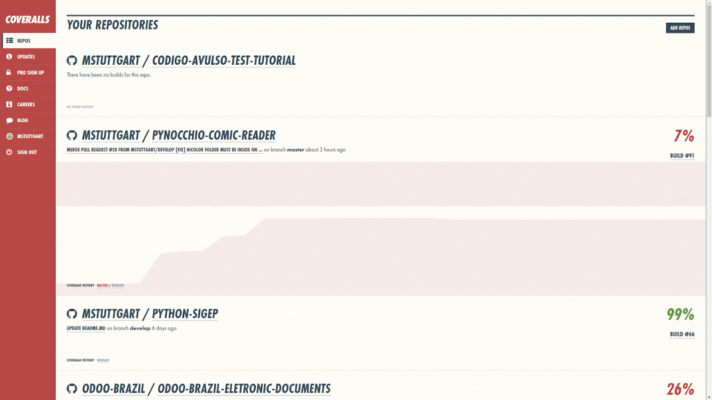
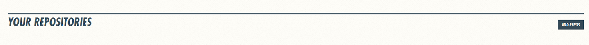
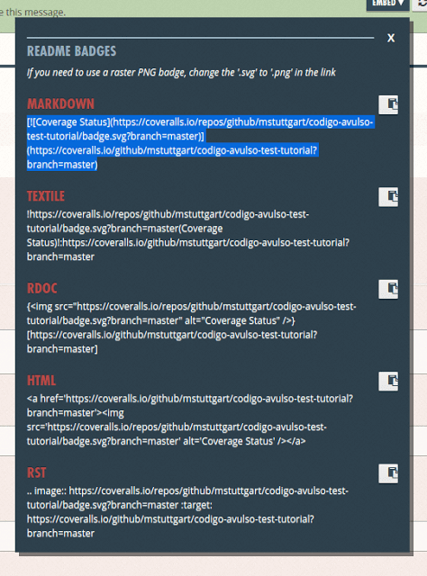

Title: Python com Unittest, Travis CI, Coveralls e Landscape (Parte 3 de 4)
Slug: python-com-unittest-travis-ci-coveralls-e-landscape-parte-3-de-4
Date: 2016-05-12 12:41:38
Category: Python
Tags: git, travis-ci, python, coveralls, landscape, test, tutorial
Author: Michell Stuttgart
Email: michellstut@gmail.com
Github: mstuttgart
Linkedin: michellstut
Facebook: michell.stuttgart
Site: http://codigoavulso.com.br

Fala pessoal, tudo bem?

Na [segunda](python-com-unittest-travis-ci-coveralls-e-landscape-parte-2-de-4.html) parte deste tutorial, aprendemos a usar o `Travis CI` para automatizar os testes do nosso projeto, facilitando a manutenção do código quando temos vários colaboradores. Nesta terceira parte, vamos configurar o serviço [Coveralls](https://coveralls.io) para que o mesmo gere relatórios de teste sobre o nosso projeto. Os relatórios são muito úteis quando desejamos verificar o quanto do nosso projeto está coberto por testes, evitando assim que alguma *feature* importante fique de fora. Assim como o `Travis CI`, o `Coveralls` será executado após cada *push* ou *pull request*.

Diferente do tutorial anterior, serei breve sobre o processo de inscrição do `Coveralls`, focando mais no seu uso.

#### Criando uma conta

Antes de começarmos a usar o `Coveralls` precisamos criar uma conta no serviço. Isso pode ser feito [aqui](https://coveralls.io/). O serviço é totalmente gratuíto para projetos *opensource*.


Após a inscrição, você será levado para uma nova página com uma listagem dos repositórios que você possui no [Github](https://github.com/).



Na imagem acima já podemos visualizar o projeto que estou usando neste tutorial: *codigo-avulso-test-tutorial*. Caso o seu repositório não esteja na lista, clique no botão `ADD REPOS` no canto superior direito da tela.



Ao clicar no botão, você será redirecionado a uma página onde é possível slecionar quais repositórios serão analisados pelo `Coveralls`. Caso o repositório desejado não esteja na lista, clique no botão `RE-SYNC REPOS` no canto superior direito. Ele vai realizar o escaneamento do seu perfil no [Github](https://github.com/) e importar seus projetos.

Clique no botão escrito `OFF` ao lado esquerdo do nome do repositório. Isso ativará o serviço para este repositório.


Clique no botão `DETAILS` ao lado direito do nome do repositório e você será redirecionado para uma tela de configuração. Aqui o passo mais interessante é pegar a *url* da `badge`para usarmos em nosso *README.md*.

[](https://coveralls.io/github/mstuttgart/codigo-avulso-test-tutorial?branch=master)

Na área superior da tela, temos o seguinte:


Clique em `EMBED` e uma janelá de dialogo irá se abrir, selecione e copie o código em `MARKDOWN`.



Agora cole o código no cabeçalho do seu arquivo *README.md*, semelhante ao que fizemos com o `Travis CI` no tutorial anterior.

```markdown
# Codigo Avulso Test Tutorial
[](https://travis-ci.org/mstuttgart/codigo-avulso-test-tutorial)

[](https://coveralls.io/github/mstuttgart/codigo-avulso-test-tutorial?branch=master)

```
Concluída esta estapa, o próximo passo será adicionarmos o serviço em nosso projeto no `Github`.

#### Adicionando o Coveralls

Vamos adicionar o serviço durante o processo de teste do projeto. Assim, depois de cada *push* ou *pull request*, o `Coveralls` irá gerar o relatório sobre nossos testes.

Abra o arquivo *.travis.yml* em seu editor. Teremos o seguinte código:

```travis
language: python

python:
  - "2.7"

sudo: required

install:
  - pip install flake8

before_script:
  - flake8 codigo_avulso_test_tutorial

script:
  - run setup.py test

```
Agora vamos alterá-lo adicionando a funcionalidade do `Coveralls`. O códio atualizado do *.travis.yml* pode ser visto a seguir:

```travis
language: python

python:
  - "2.7"

sudo: required

install:
  - pip install flake8
  - pip install coveralls

before_script:
  - flake8 codigo_avulso_test_tutorial

script:
  - coverage run --source=codigo_avulso_test_tutorial setup.py test

after_success:
  - coveralls

```
* `install`:  aqui adicionamos o comando `pip install coveralls`. A instalação do `coveralls` é necessaria para que possamos gerar os relatórios. Obs.: Você pode instalá-lo em sua máquina e gerar relátorios em html. Fica a sugestão de estudo.
* `script`: aqui substimuímos o comando `run setup.py test` por `coverage run --source=codigo_avulso_test_tutorial setup.py test`. Esse comando executa os mesmo testes de antes, mas já prove um relatório sobre a cobertura de testes do seu código.
* `after_success`: a última alteração foi adicionar a tag `after_success`. Essa tag indica que após a execuação bem sucedida dos testes, deve-se iniciar o serviço de analise do `Coveralls`.

Assim que terminar de fazer essas alterações você já pode enviar o seu código para o `Github`. Assim que subir o código, o `Travis CI` irá iniciar o processo de teste. Finalizando os testes, o `Coveralls`será iniciado. Se tudo ocorrer bem, a badge que adicionamos no aquivo README do projeto será atualizada exibindo a porcentagem do nosso código que está coberta por testes. Você pode clicar na badge ou ir até o seu perfil no site do [Coveralls](https://coveralls.io) e verificar com mais detalhes as informações sobre seu projeto.


Na seção `LATEST BUILDS` clique no último build disponível que será possível verificar a porcentagem cobertura de teste para cada arquivo do seu projeto.

Caso tenha interessa, aqui está o link do repositorio que usei para esse tutorial: [codigo-avulso-test-tutorial](https://github.com/mstuttgart/codigo-avulso-test-tutorial).

#### Conclusão

Aqui encerramos a terceira parte do nossa série de tutoriais sobre `Unittest`. O `Coveralls` ainda possui muitas configurações não mostradas aqui, então se você se interessar, fica a sugestão de estudo. No próximo tutorial veremos como utilizar o `Landscape`, um *linter* que analise nossos códigos atrás de problemas de sintaxe, formatação e possíveis erros de códigos (variáveis não declaradas, varíaveis com escopo incorreto e etc).

É isso pessoal. Obrigado por ler até aqui e até o próximo tutorial!

**Publicado originalmente:** [python-com-unittest-travis-ci-coveralls-e-landscape-parte-3-de-4](http://codigoavulso.com.br/python-com-unittest-travis-ci-coveralls-e-landscape-parte-3-de-4.html)
