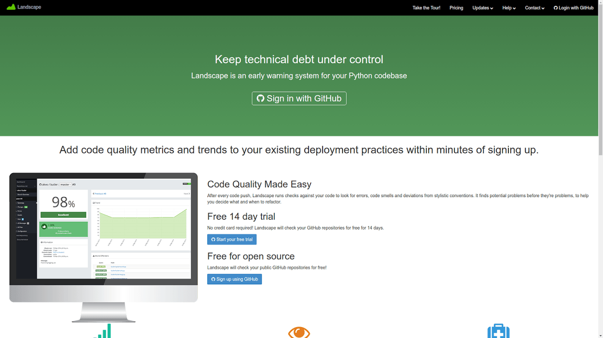
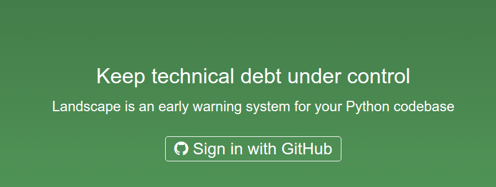
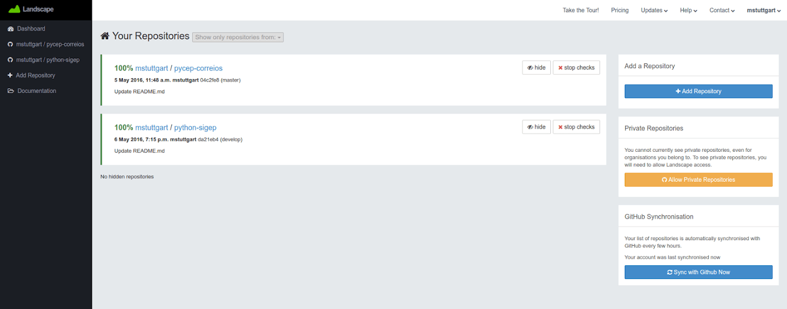
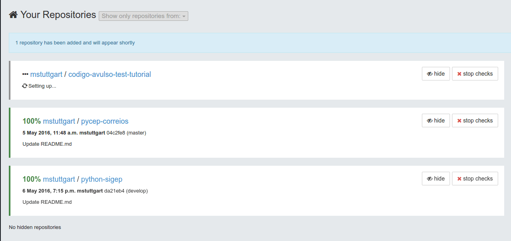
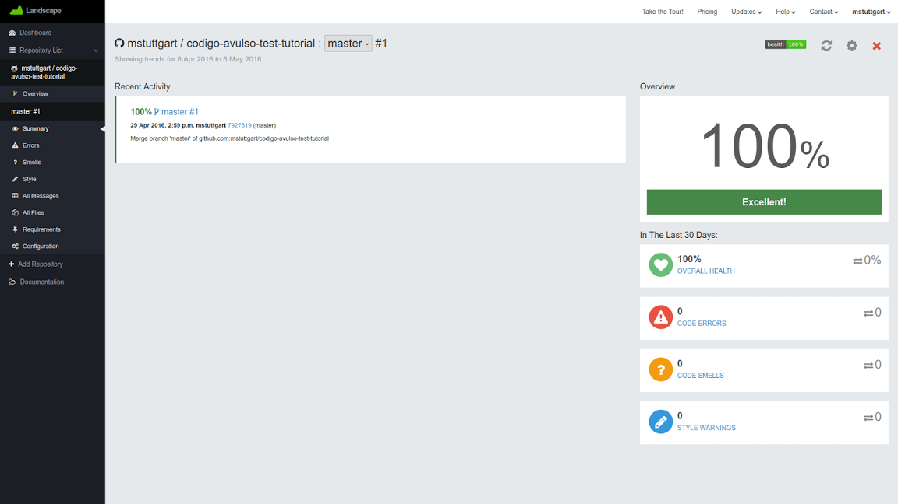
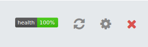
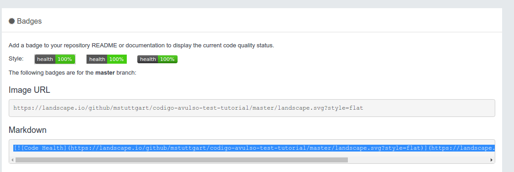
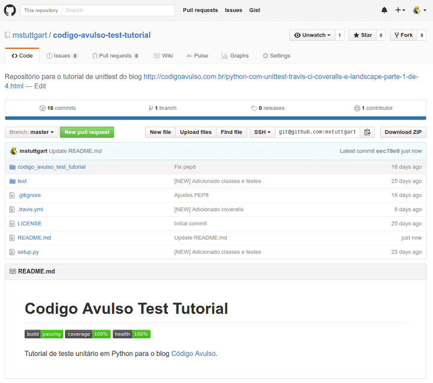

Title: Python com Unittest, Travis CI, Coveralls e Landscape (Parte 4 de 4)
Slug: python-com-unittest-travis-ci-coveralls-e-landscape-parte-4-de-4
Date: 2016-05-20 21:09:18
Category: Python
Tags: git, travis-ci, python, coveralls, landscape, test, tutorial
Author: Michell Stuttgart
Email: michellstut@gmail.com
Github: mstuttgart
Linkedin: michellstut
Facebook: michell.stuttgart
Site: http://codigoavulso.com.br

Fala pessoal, tudo bem?

Na [terceira](python-com-unittest-travis-ci-coveralls-e-landscape-parte-3-de-4.html) parte deste tutorial, aprendemos a usar o `Coveralls` para gerar relatórios de testes para o nosso projeto. A próxima ferramenta que iremos estudar será o serviço `Landscape`. Neste tutorial serei breve, já que o uso *default* da ferramenta é bem simples.

#### Sobre o Landscape

[Landscape](https://landscape.io/) é uma ferramenta online semelhante ao já conhecido [PyLint](https://www.pylint.org/), ou seja, é um verificador de *bugs*, estilo e de qualidade de código para [Python](https://www.python.org/).

<center>

</center>

Quando ativamos a análise do `Landscape` em nosso repositório, ele é executado após cada *push* ou *pull request* e realiza uma varredura em nosso código fonte [Python](https://www.python.org/) atrás de possíveis *bugs*, como por exemplo variáveis sendo usadas antes de serem declaradas, nomes reservados sendo usados como nomes de variáveis e etc. Ele também verifica se a formatação do seu código esta seguindo a [PEP8](https://www.python.org/dev/peps/pep-0008/) e aponta possíveis falhas de *design* em seu código.

Uma vez que a análise esteja finalizada, a ferramenta indica em porcentagem a "qualidade" do nosso código, ou em palavras mais precisas, o quanto nosso código está bem escrito segundo as boas práticas de desenvolvimento. Vale deixar claro que o `Landscape` não verifica se seu código funciona corretamente, isso é responsabilidade dos testes que você escreveu, como foi visto na [primeira parte](python-com-unittest-travis-ci-coveralls-e-landscape-parte-1-de-4.html) do tutorial.

Semelhante as ferramentas dos tutoriais anteriores, o `Landscape` é totalmente gratuito para projetos *opensource*.

#### Criando uma conta

O processo de inscrição é simples. No topo da página temos a permissão de nos inscrevermos usando a conta do `Github`. Realize a inscrição e vamos as configurações.

<center>

</center>

#### Ativando o serviço

De todas as ferramentas apresentadas, esta é a mais simples de configurar. O único passo necessário aqui é ativar o serviço para o nosso repositório. Como exemplo, estarei usando o mesmo repositório dos últimos tutoriais. Clique [aqui](https://github.com/mstuttgart/codigo-avulso-test-tutorial) para visualizar o repositório.

Assim que realizar o cadastro, vamos nos deparar com uma tela contendo a listagem dos nosso repositórios que estão utilizando o serviço. Se você nunca usou o serviço provavelmente não terá nenhum repositório, então faça o seguinte: clique no botão `Sync with Github now`, para realizar a sincronização com a sua conta do [Github](https://github.com). Assim que a sincronização estiver completa, clique no botão `Add repository`.

<center>

</center>

Ao clicar, seremos levados a uma tela com a listagem de todos os repositórios que temos permissão de escrita. Procure o repositório que deseja ativar o serviço (lembrando que o `Landscape` funciona apenas para projetos `Python`) e o selecione (basta clicar sobre o nome do repositório).

<center>

</center>

Adicione o repositório clicando no botão verde `Add Repository`, logo abaixo da lista. Seremos novamente redirecionados a tela inicial, agora com o repositório escolhido já visível.

<center>

</center>

 Inclusive, a partir desse momento, o `Coveralls` já irá iniciar a análise do seu projeto. Clique no nome do repositório para ver mais detalhes da analise.

<center>

</center>

 No caso do meu projeto de teste, temos que a "saúde" do código está em `100%`, ou seja, nenhuma parte do código apresenta erros de estilo, *bugs* e está utilizando boas práticas de programação em todo seu escopo.

 Na barra lateral localizada à esquerda da página, temos alguns items, entre os quais os mais importantes são descritos a seguir:

 * `Error`: são instruções no código que provavelmente indicam um erro. Por exemplo, quando referenciamos uma variável sem declará-la antes ou realizamos a chamada de algum método inexistente.
 * `Smells`: são sinais ou sintomas no código que possivelmente indicam uma falha no projeto do *software*. Diferentemente de um *bug*, *code smells* não indicam uso incorreto da linguagem de programação e nem impedem o *software* de funcionar. Ao invés disso, eles indicam falhas no *design* do projeto que podem atrasar seu desenvolvimento ou mesmo ser a porta de entrada para *bugs* no futuro. Exemplos de *code smells* são: métodos ou códigos duplicados, classes muito grandes, uso forçado de algum *design pattern* quando o mesmo poderia ser substituído por um código mais simples e fácil de manter, métodos muito longos ou com excessivo números de parâmetros e por aí vai. A lista pode crescer muito haha... para mais detalhes [leia](https://en.wikipedia.org/wiki/Code_smell).
 * `Style`: como o nome sugere, este item exibe os erros de estilo em seu código indicando trechos de código que não estão seguindo as regras de estilo da `PEP8`, trechos de códigos com identação incorreta e etc.

Como último passo, agora somente nos resta adicionar uma `badge` no arquivo `README.md` em nosso repositório. Assim poderemos ver a porcentagem de "saúde" do nosso projeto sem precisar acessar a página do `Landscape`.

Na página com o resultado da análise (onde é exibido a porcentagem de "saúde" do seu projeto), podemos pegar a `badge` do `Landscape`. No canto superior direito da tela, você encontra os botões abaixo:

<center>

</center>

Clique na `badge` (onde está escrito *health*) e a seguinte janela será exibida:

<center>

</center>

Selecione o texto da opção `Markdown` e cole-o no `README.md` do seu repositório. O meu `README.md` ficou assim:

```markdown
# Codigo Avulso Test Tutorial
[](https://travis-ci.org/mstuttgart/codigo-avulso-test-tutorial)

[](https://coveralls.io/github/mstuttgart/codigo-avulso-test-tutorial?branch=master)

[](https://landscape.io/github/mstuttgart/codigo-avulso-test-tutorial/master)

```

Também é possível configurar o `Landscape` para que o mesmo exclua algum diretório/arquivo da análise (muito útil com arquivos de interface compilados, usando por quem trabalha com PyQt/PySide) entre outras opções, mas isso fica para um tutorial futuro.

Abaixo podemos ver as três `badges` que adicionamos em nosso projeto. Clique [aqui](https://github.com/mstuttgart/codigo-avulso-test-tutorial) para acessar o repositório.

<center>

</center>

#### Conclusão

Pronto pessoal, agora temos o nosso repositório exibindo informações sobre os testes unitários, relatórios de testes e analises de qualidade de código. Isso não garante que seu projeto seja livre de falhas e *bugs*, mas te ajuda a evitá-los.

Vale lembrar que todas essas ferramentas ajudam muito, mas nada substitui o senso crítico e o hábito de sempre usar boas práticas durante o desenvolvimento. Por isso sempre busque aprender mais, estudar mais, ser humilde e ouvir quem tem mais experiência que você. Enfim, ser um programador e uma pessoa melhor a cada dia. Fica o conselho para todos nós, incluindo para este que vos escreve.

Espero que tenham gostado desta série de tutoriais. Obrigado por ler até aqui e até o próximo *post*.

**Publicado originalmente:** [python-com-unittest-travis-ci-coveralls-e-landscape-parte-4-de-4](http://codigoavulso.com.br/python-com-unittest-travis-ci-coveralls-e-landscape-parte-4-de-4.html)
