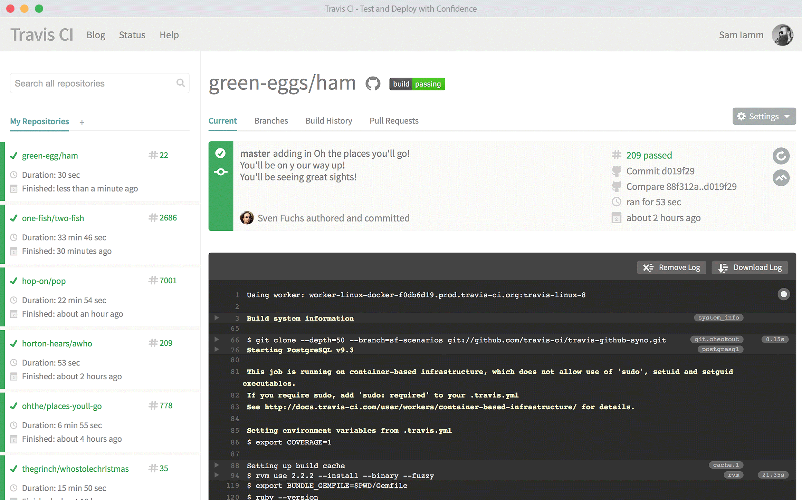
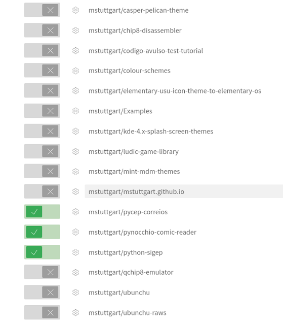
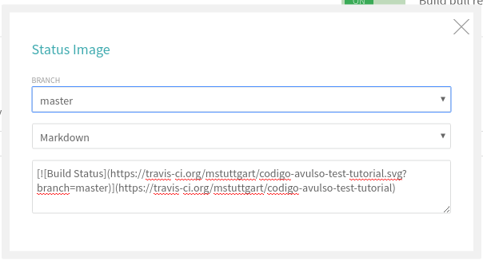
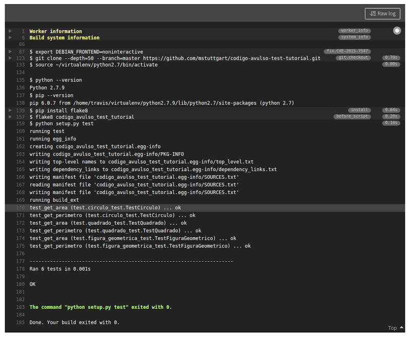

Title: Python com Unittest, Travis CI, Coveralls e Landscape (Parte 2 de 4)
Slug: python-com-unittest-travis-ci-coveralls-e-landscape-parte-2-de-4
Date: 2016-05-08 20:34:44
Category: Python
Tags: git, travis-ci, python, coveralls, landscape, test, tutorial
Author: Michell Stuttgart
Email: michellstut@gmail.com
Github: mstuttgart
Linkedin: michellstut
Facebook: michell.stuttgart
Site: http://mstuttgart.com.br

Fala pessoal, tudo bem?

Na [primeira](python-com-unittest-travis-ci-coveralls-e-landscape-parte-1-de-4.html) parte deste tutorial, aprendemos como criar testes para nosso projeto. Nesta segunda parte, vamos configurar o serviço Travis CI para que o mesmo execute os testes do nosso projeto diretamente no github. Isso é especialmente útil quando possuímos várias pessoas trabalhando em um mesmo projeto, pois o `Travis CI` executa os testes após cada *push* ou *pull request*. Dessa forma garantimos que um determinado *commit* não irá "quebrar" nossa aplicação.

Antes de inicarmos nosso trabalho de configuração do `Travis CI`, vamos aprender um pouco mais sobre esse serviço.

#### Sobre o Travis CI

[Travis CI](https://travis-ci.org/) é uma ferramenta online que permite executar o *deploy* de sua aplicação, rodando de maneira automática os testes do seu projeto hospedado no [Github](https://github.com/). Através dele é possível manter um histórico dos testes para cada *commit* do seu projeto, executar testes em paralelo, além do suporte a diversas linguagens de programação. Você pode, por exemplo, verificar se seu projeto funciona corretamente tanto com Python 2.7, quanto com o Python 3.

Após a execução do teste, recebemos um email nos informando se o teste foi bem sucedido ou se houve alguma falha. O serviço é totalmente gratuito para projetos *opensource*.

<center>

</center>

#### Criando uma conta

Para utilizarmos o `Travis CI` em nosso projeto, precisamos primeiro realizar nosso cadastro no serviço. Para isso acesse [https://travis-ci.org/](https://travis-ci.org/).

Logo no topo direito da página, temos o botão abaixo, para nos inscrevermos usando nossa conta no Github.

<center>

</center>

Ao pressionar o botão, você será direcionado para a página a seguir:

<center>

</center>

Realize o login com seu usuário/senha do `Github`. Assim que realizar o login, na canto superior direito da tela, clique no seu nome de usuário e, em seguida, em `"Accounts"`. Com isso, uma tela com todos os repositórios que você tem permissão de escrita (repositórios pessoais, de organização, forks e etc) será exibida.

<center>

</center>

Agora vamos ativar o serviço para o repositório que criei na primeira parte do tutorial: [codigo-avulso-test-tutorial](https://github.com/mstuttgart/codigo-avulso-test-tutorial). Basta clicar no botão "X" ao lado esquerdo do nome do seu repositório. Ele ficará assim:

<center>

</center>

Bom, a partir de agora, seu repositório está pronto para o usar o `Travis CI`, porém antes precisamos configurar os parâmetros de teste do nosso projeto.

#### Configurando o Travis CI em nosso repositório

No diretório raiz do nosso projeto, vamos criar um arquivo chamado `.travis.yml`.

```bash
touch .travis.yml
```
 Observe que o nome do arquivo obrigatoriamente deve inciar com ponto. Após criarmos o arquivo, teremos a seguinte estrutura de diretórios:

```
.
├── codigo_avulso_test_tutorial
│   ├── circulo.py
│   ├── circulo.pyc
│   ├── figura_geometrica.py
│   ├── figura_geometrica.pyc
│   ├── __init__.py
│   ├── __init__.pyc
│   ├── quadrado.py
│   └── quadrado.pyc
├── codigo_avulso_test_tutorial.egg-info
│   ├── dependency_links.txt
│   ├── PKG-INFO
│   ├── SOURCES.txt
│   └── top_level.txt
├── LICENSE
├── README.md
├── setup.py
├── test
│   ├── circulo_test.py
│   ├── circulo_test.pyc
│   ├── figura_geometrica_test.py
│   ├── figura_geometrica_test.pyc
│   ├── __init__.py
│   ├── __init__.pyc
│   ├── quadrado_test.py
│   └── quadrado_test.pyc
└── .travis.yml
```

Esse é nosso arquivo de configuração. Nele vamos adicionar qual linguagen nosso projeto utiliza, de quais módulos e pacotes ele depende, entre outras inúmeros ajustes, dependendo do seu projeto. Aqui, vou mostrar as configurações básicas que utilizo, para que o tutorial não fique muito extenso. Então, abra o arquivo `.travis.yml` em seu editor preferido e adicione o seguinte código.

```travis
language: python

python:
  - "2.7"

sudo: required

script:
  - python setup.py test

```
 Agora vamos explicar cada tag do arquivo:

* `language`: podemos definir qual linguagem nosso projeto utiliza. Se este parâmetro não for incluso, o `Travis CI` irá considerar a linguagem `ruby` como *default*.
* `python`: aqui definimos que os testes serão executados usando o Python 2.7 e se desejarmos, também podemos adicionar outras versões do Python.
* `sudo`: usado para executar o `Travis CI` como permissão de usuário `root`. Necessário caso você deseje instalar alguma dependência usando o comando `apt-get install nomepacote`.
* `script`: nessa `tag`, finalmente vamos executar nosso *script* de teste.

Dica: neste [link](http://lint.travis-ci.org/) você pode colar o código do seu arquivo `.travis.yml` para verificar se o mesmo está correto.

### Adicionado uma badge para o repositório
O próximo passo é é adicionar uma `badge` para o nosso repositório. Isso não é obrigatório, mas ajuda você, sua equipe e outras pessoas que se interessarem pelo seu repositório, a visualizar o *status* da execução dos testes e verificar se seu código está funcionando corretamente.

<center>
[](https://travis-ci.org/mstuttgart/codigo-avulso-test-tutorial)
</center>

Na tela onde você ativou o `Travis CI` para seu reposiorio, clique no símbolo da engrenagem.

<center>

</center>

Na nova tela, podemos realizar algumas configurações, como por exemplo se o `Travis CI` será executado para *push* e para *pull requests* e também podemos pegar a `badge`. Ao clicarmos no botão logo ao lado do nome do repositório, uma janela será exibida.

<center>

</center>

Selecione a *branch* a ser observada pelo Travis CI, escolha a opção `Markdown` e copie o código que aparecerá na caixa de texto para o arquivo `README.md` do seu repositório. O meu `README.md` ficou assim:

```markdown
# Codigo Avulso Test Tutorial
[](https://travis-ci.org/mstuttgart/codigo-avulso-test-tutorial)

```

Com esses passos, quando algum *push* ou *pull request* for enviado ao repositório, o `Travis CI` executará os testes, garantindo assim o funcionamento estável do nosso código e nos avisando caso alguma modificação venha causar algum erro em nossa aplicação.

<center>

</center>

Vale lembrar que o tempo para *deploy* pode variar, dependendo da quantidade de testes do seu projeto, quantidade de dependências a serem instaladas e etc.

#### Conclusão

Aqui encerramos a segunda parte do nossa série de tutoriais sobre `Unittest`. Eu decidi separar a série em 4 partes para que cada uma fosse explicada com mais detalhes mas sem deixar o tutorial muito extenso. O `Travis IC` ainda possui muitas configurações não abordadas aqui, então se você se interessar, pode dar uma olhada na sua documentação oficial [aqui](https://docs.travis-ci.com/). No próximo tutorial veremos como utilizar o `Coveralls` para gerar relatórios dos nossos testes.

É isso pessoal. Obrigado por ler até aqui!

Até o próximo tutorial!

**Publicado originalmente:** [python-com-unittest-travis-ci-coveralls-e-landscape-parte-2-de-4](http://mstuttgart.com.br/python-com-unittest-travis-ci-coveralls-e-landscape-parte-2-de-4.html)
