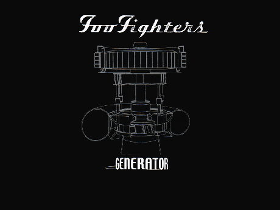

Title: Python Generators
Date: 2016-02-19 16:15
Tags: python,generator,generators
Author: Andre Almar
Email:  andre@y7mail.com
Github: andrealmar
Site: http://andrealmar.com
Twitter: andre_almar
Linkedin: andrealmar
Category: Python

```Publicado originalmente em:``` [http://andrealmar.com/2016/02/generators](http://andrealmar.com/2016/02/generators)

> I'm the Generator, firing whenever you quit  Yeah whatever it is, you go out and it's on  
Yeah can't you hear my motored heart  You're the one that started it

<br /> 
<figure>
<center></center>
</figure>
<br />  
Não...eu não vou escrever neste post sobre a ótima música do Foo Fighters, embora recomendo que você a escute =P. Estamos aqui para falar de uma função bastante legal na nossa linguagem de programação preferida: Os famosos **Generators**.
<br />  
Em termo simples os **Generators** são *funções que permitem a você declarar uma função que se comporta como um iterador, ou seja, que pode ser usado dentro de um loop* **for**.  
<br />
Simplificando mais ainda: **Generators** são uma forma simples de criarmos iteradores.  Ele irá retornar um objeto (iterador) para que nós possamos iterar sobre este objeto (um valor de cada vez).  
<br />
É muito simples criar uma função **Generator**, mas existem algumas peculiaridades. Por exemplo, nós usamos a declaração **yield** ao invés de **return**. Se a função contém ao menos uma declaração **yield** então ela se torna uma função **Generator**.
<br />  
Um exemplo bem simples. Abra o seu interpretador Python e digite a função abaixo:
<br />

```python
def generator():
    n = 1
    print("Essa  uma função Generator")
    yield n

    n += 1
    yield n

    n += 1
    yield n

```
Vamos agora, executar a função no interpretador Python:

```python
>>> # Retorna um objeto mas não executa a função imediatamente.
>>> a = generator()

>>> # Podemos iterar sobre os items usando next().
>>> next(a)
Essa  uma função Generator
1
>>> # Assim que a função executa o yield, ela é pausada e o controle da execução é transferido para quem a chamou.

>>> # Variáveis locais e os seus estados são "lembradas" durante as sucessivas chamadas à função.
>>> next(a)
2
>>> next(a)
3

>>> # Quando a função termina, a exceção StopIteration é levantada automaticamente.
>>> next(a)
Traceback (most recent call last):
...
StopIteration
>>> next(a)
Traceback (most recent call last):
...
StopIteration

```
Interessante notar que o valor da variável *a* no exemplo acima é lembrada durante cada chamada do método *next()*. Nós declaramos 3 **yields**, então o valor da variável *a* será lembrado por 3 vezes. Quando tentamos chamar *next(a)* pela 4a vez, veja o que acontece:  

```python
>>> # Quando a função termina, a exceção StopIteration é levantada automaticamente.
>>> next(a)
Traceback (most recent call last):
...
StopIteration
>>> next(a)
Traceback (most recent call last):
...
StopIteration

```
Uma exceção *StopIteration* é lançada, alertando que a iteração acabou. Ou seja, as variáveis locais NÃO são destruídas quando usamos o **yield**. O objeto **Generator** só pode ser iterado uma única vez. Se quisermos restartar o processo nós precisaremos criar um outro objeto **Generator**, por exemplo *b = generator()*.
<br />  
Também podemos utilizar **Generators** dentro de um laço **for** diretamente. Isso porque o laço **for** também utiliza a função *next()* para iterar e automaticamente encerra a iteração quando a exceção *StopIteration* é lançada.

```python
>>> for item in generator():
...     print(item)
...
Essa é uma função Generator
1
2
3
>>
```
**Generators Expressions**
<br />  
As **Generators Expressions** facilitam à criação de **Generators**. Assim como uma função lambda cria uma função anônima, uma **Generator Expression** cria uma função **Generator** anônima. A sintaxe é bem parecida com as famosas *List Comprehensions* com o pequeno detalhe de que os colchetes [ ] são subsituídos pelos parênteses ().

```python
list_comprehension = [1,2,3,4,5,6,7,8]
```

```python
generator_expression = (1,2,3,4,5,6,7,8)
```

```python
>>> x = [1, 2, 3, 4, 5, 6, 6, 8]
>>> x
[1, 2, 3, 4, 5, 6, 6, 8]
>>> generator_expression = (i for i in x)
>>> generator_expression
<generator object <genexpr> at 0x101812af0>
>>> list_comprehension = [i for i in x]
>>> list_comprehension
[1, 2, 3, 4, 5, 6, 6, 8]
>>> 
```

Note no exemplo acima que a **List Comprehension** nos retorna a lista em si mas a **Generator Expression** nos retorna o objeto gerado: 
```<generator object <genexpr> at 0x101812af0>```.   
<br />
A outra vantagem é que enquanto a *List Comprehension* gera a lista inteira, a **Generator Expression** gera um item de cada vez. Isso também é chamado de *lazy ou on demand generation of values*. E por consequência de ser *lazy* (preguiçosa), a **Generator Expression** consome bem menos memória sendo mais eficiente do que uma *List Comprehension*.  
<br />
Espero que tenham gostado dessa explicação a respeito dos **Generators** e quaisquer dúvidas ou sugestões deixem seus comentários abaixo.  
<br />
{}'s


