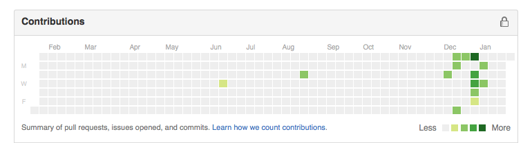

Title: Salvando gráfico de contribuições do Github com Python e Selenium
Date: 2016-02-11 11:47:44
Tags: python, selenium, github
Slug: salvando-grafico-github-python-selenium
Author: Othon Alberto
Site: http://www.othonalberto.com.br
Email: othonalberto@gmail.com
Github: othonalberto
Facebook: othonnn


Como alguns sabem, sou apaixonado por Python. Atualmente, minha linguagem favorita por conta de sua simplicade e poder (além de ficar LINDJA toda indentada, hahahaha).

Uma das coisas mais legais da linguagem é a enorme quantidade de bibliotecas disponíveis. Cada dia que abro um grupo de discussão acabo conhecendo alguma funcionalidade interessante. Se você faz parte de algum desses grupos, provavelmente já viu o post do Alex Recker ["Using Selenium to Buy a Bus Pass"](http://alexrecker.com/using-selenium-buy-bus-pass/), em que ele mostra como automatizou a compra de passagens de ônibus com Selenium e Python. 

Eu já havia ouvido falar do [Selenium](http://selenium-python.readthedocs.org/), mas nunca tinha experimentado na prática e o post do Alex foi o empurrão que faltava. 

Obviamente, meu projetinho é bem mais simples, mas foi algo divertido de se fazer como forma de aprendizado. Batizei-o de GHSS(Github Screenshot). Como o próprio nome sugere, ele entra no seu perfil do Github e tira um screenshot do gráfico de contribuições, salvando com a data atual.

Abaixo, irei mostrar como fazer. Visto que há muita gente que usa Python sem ser programador por profissão, tentarei explicar de forma mais simples possível. O código completo pode ser encontrado no [meu Github](https://github.com/othonalberto/ghss).

-----

Neste código, utilizaremos o Python2.

Primeiramente, temos que importar todas as bibliotecas necessárias.

Na linha 1, importamos o "OS", que será utilizado para "acharmos" o arquivo ``` secrets.yml ```. Explicarei daqui a pouco. 

Na linha 2, importamos do Selenium o Webdriver, responsável pela automatização (abertura das páginas e preenchimento dos campos).

Nas próximas duas linhas, importamos as bibliotecas restantes que são responsáveis pelo nosso arquivo secrets.yml, no qual o username e password serão guardados, e pela data que será salva no nome do arquivo final.

Na última linha, importamos o responsável por tirar o screenshot.

```python
import os
from selenium import webdriver
import yaml
from datetime import date
import pyscreenshot as ImageGrab
```
-----
Neste bloco de código, mostramos ao nosso programa onde está nosso arquivo secrets.yml e o carregamos.

```python
cur_dir = os.path.dirname(os.path.realpath(__file__))
secret_path = os.path.join(cur_dir, 'secrets.yml')

with open(secret_path, 'r') as stream:
    data = yaml.load(stream)
    USERNAME = data.get('user','')
    PASSWORD = data.get('password')
```
-----
O arquivo secrets.yml é composto por apenas dois campos, "password" e "user", que, PASMEM, são para inserir sua senha e seu usuário.

```python
password: senha_do_zezinho_hacker
user: zezinhohacker123
```
-----
Nestas três linhas abrimos o Firefox, passamos para ele qual o endereço desejamos acessar e maximizamos a janela, respectivamente.

```python
driver = webdriver.Firefox()
driver.get("https://github.com/login")
driver.maximize_window()
```
-----
Aqui é onde a "mágica" acontece.

Na primeira linha, a propriedade ```"find_element_by_id"``` busca o campo ```"login_field"```, onde devemos inserir o nome de usuário. 
Na linha posterior, enviamos aquele username informado lá no secrets, lembra?

Nas próximas duas linhas, é feito o mesmo procedimento, mas, desta vez, com a senha.

Na última, clicamos o botão para logarmos.

```python
email = driver.find_element_by_id("login_field")
email.send_keys(USERNAME)
senha = driver.find_element_by_id("password")
senha.send_keys(PASSWORD)
driver.find_element_by_name('commit').click()
```
-----
Nesta linha, nós entramos no nosso perfil do Github.

Quando utilizamos {0}, "guardamos" o espaço, para o que informarmos adiante. Ou seja, no espaço reservado, será inserido o username.

```python
driver.get("https://github.com/{0}" .format(USERNAME))
```

Por exemplo, se fizermos o seguinte código:

```python
print("Meus esportes preferidos são: {0}, {1} e {2}" .format("futebol", "basquete", "corrida"))
```

O resultado será:

```python
 Meus esportes preferidos são: futebol, basquete e corrida.
```

Deu para entender?

-----

Na última linha do programa, salvamos a imagem.

No campo bbox, informamos qual área da tela queremos dar o screenshot, na ordem: X1, Y1, X2, Y2. Você pode alterá-lo de acordo com seu navegador.

No save, utilizamos o que ensinei acima para gerar o arquivo da seguinte maneira: ```"dataatual_gitshot_nomedousuario"```.

```python
img = ImageGrab.grab(bbox=(460,540,770,208)).save("{0}_gitshot_{1}.png" .format(date.today(), USERNAME))
```
-----

Este será o resultado. O nome do arquivo, no meu caso, ficou ```"2016-01-24_gitshot_othonalberto.png"```.



-----
Código completo:

```python


#!/usr/bin/env python
# -*- coding: utf-8 -*-
import os

from selenium import webdriver
import yaml
from datetime import date
import pyscreenshot as ImageGrab

cur_dir = os.path.dirname(os.path.realpath(__file__))
secret_path = os.path.join(cur_dir, 'secrets.yml')

with open(secret_path, 'r') as stream:
    data = yaml.load(stream)
    USERNAME = data.get('user','')
    PASSWORD = data.get('password')

driver = webdriver.Firefox()
driver.get("https://github.com/login")
driver.maximize_window()

email = driver.find_element_by_id("login_field")
email.send_keys(USERNAME)
senha = driver.find_element_by_id("password")
senha.send_keys(PASSWORD)
driver.find_element_by_name('commit').click()

driver.get("https://github.com/{0}" .format(USERNAME))

img = ImageGrab.grab(bbox=(460,540,770,208)).save("{0}_gitshot_{1}.png" .format(date.today(), USERNAME))
# bbox=(X1, Y1, X2, Y2)

```
-----
É isso! Espero ter contribuído com o conhecimento de vocês com este post e gerado curiosidade para que experimentem o Selenium.

Quem quiser contribuir, seja com código ou sugestões, sinta-se à vontade.

Abraços!


