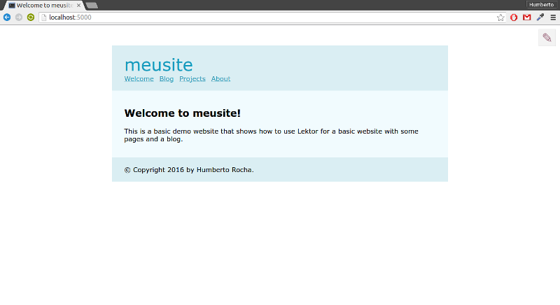
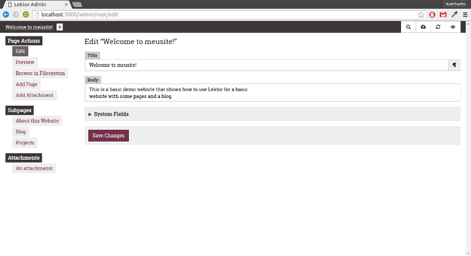

Title: Sites Estáticos com Lektor
Slug: sites-estaticos-com-lektor
Date: 2016-04-30 12:00
Tags: tutorial,lektor,blog,framework
Category: Lektor
Author: Humberto Rocha
Email:  humrochagf@gmail.com
Github: humrochagf
Twitter: humrochagf
Facebook: humrochagf
Linkedin: humrochagf

**Publicado originalmente em:** [humberto.io/2016/4/sites-estaticos-com-lektor](http://humberto.io/2016/4/sites-estaticos-com-lektor/)

Faz pelo menos 4 anos que eu ensaio para montar um blog, e nessa brincadeira já montei alguns,  mas quando chegava na hora de criar o meu eu nunca conseguia publicar.

Inicialmente com ferramentas de publicação como wordpress o problema era a dificuldade de customizar e o tanto de coisa que vinha junto que eu não ia usar mas ficava me tirando a atenção. Em seguida com o [GitHub Pages](https://pages.github.com) eu descobri o [Pelican](http://blog.getpelican.com) por indicação do [Magnun Leno](http://mindbending.org/pt) e comecei a fazer muita coisa com ele, mas da mesma forma que eu ganhei em liberdade de customização, o processo autoral é o mesmo de desenvolvimento, e como descrito no subtitulo do blog, meu lado cientista, pythonista e curioso ficava ali me cutucando para melhorar o site ao invés de escrever conteúdo.

Eis que em uma conversa no [grupo de telegram da comunidade python](https://telegram.me/pythonbr) me citam o Lektor e aí começou a aventura.

## Lektor?

[Lektor](https://www.getlektor.com) é um gerenciador de conteúdo estático criado por [Armin Ronacher](http://lucumr.pocoo.org) (sim, o criador do [flask](http://flask.pocoo.org)) que permite a criação de websites a partir de arquivos de texto.

## Porque usar?

Como descrito no próprio [site](https://www.getlektor.com/docs/what) ele bebeu das fontes dos CMS`s, dos frameworks e dos geradores de site estático e chegou em algo que eu considero um ponto de equilíbrio entre eles, e que nos leva as seguintes vantagens:

- **Estático:** O site final é totalmente estático, o que permite sua hospedagem em qualquer lugar;
- **CMS:** Uma interface de produção de conteúdo que roda localmente e tira a necessidade de entender programação para poder produzir conteúdo. (no meu caso me tira do mundo do código e me deixa focar no conteúdo);
- **Framework:** Ele possuí um sistema de models em arquivos de texto e um sistema de templates que usa Jinja2 que cria um ambiente familiar para quem já desenvolveu algo em django, flask e similares;
- **Deploy:** O sistema de deploy dele é reduzido á uma configuração em um arquivo, o que permite a rápida publicação sem ficar dias aprendendo técnicas de deploy quando tudo que você quer no começo é colocar seu site no ar.

## Instalação

A instalação do Lektor é bem direta:

```
$ curl -sf https://www.getlektor.com/install.sh | sh
```

Este comando instala diretamente no sistema, se você prefere instalar em sua virtualenv:

```
$ virtualenv venv
$ . venv/bin/activate
$ pip install Lektor
```

Esta forma é desencorajada pelos desenvolvedores pois o lektor gerencia virtualenvs internamente para instalação de seus plugins, portanto caso seja desenvolvedor e quer ter mais controle sobre o lektor instale a versão de desenvolvimento e esteja pronto para sujar as mãos quando for preciso, e quem sabe até contribuir com o desenvolvimento do lektor:

```
$ git clone https://github.com/lektor/lektor
$ cd lektor
$ make build-js
$ virtualenv venv
$ . venv/bin/activate
$ pip install --editable .
```

**Obs.:** requer `npm` instalado para montar a interface de administração.

## Criando o Site

Após a instalação para criar o seu site basta utilizar o comando de criação de projeto:

```
$ lektor quickstart
```

Ele irá te fazer algumas perguntas e criar um projeto com o nome que você informou.

### Estrutura

Esta é a estrutura básica de um site gerado pelo lektor:

```
meusite
├── assets/
├── content/
├── templates/
├── models/
└── meusite.lektorproject
```

- **assets:** Pasta onde ficam os arquivos  .css, .js, .ico entre outros recursos estáticos;
- **content:** Pasta onde ficam os arquivos que iram gerar as páginas do site, cada subpasta corresponde a uma página no site gerado;
- **templates:** Pasta onde ficam os arquivos de template que definem a sua estrutura visual;
- **models:** Pasta onde ficam os arquivos que definem a modelagem de dados;
- **meusite.lektorproject:** Arquivo com as configurações gerais do site.

### Executando localmente

Para rodar o site em sua máquina basta entrar no diretório criado e iniciar o servidor local:

```
$ cd meusite
$ lektor server
```

Com o servidor rodando acesse [localhost:5000](http://localhost:5000) para ver o resultado:



### Acessando o Admin

Para acessar o admin clique na imagem de lápis no canto superior direito da página que você criou ou acesse [localhost:5000](http://localhost:5000/admin)



## Publicando o Site

Exitem duas maneiras de se fazer o deploy do site construído com o lektor, a manual, que é basicamente rodar o comando `build` e copiar manualmente os arquivos para o servidor:

```
$ lektor build --output-path destino
```

E a forma automática, que pode ser feita (neste caso para o GitHub Pages) adicionando a seguinte configuração no arquivo `meusite.lektorproject`:

```ini
[servers.production]
target = ghpages://usuario/repositorio
```

E rodando em seguida o comando:

```
$ lektor deploy
```

**Obs.:**  O deploy faz um force push na branch `master` ou `gh-pages` dependendo do tipo de repositório, portanto, cuidado para não sobrescrever os dados de seu repositório. Mantenha o código fonte em uma branch separada, você pode dar uma conferida no [meu repositório](https://github.com/humrochagf/humrochagf.github.io) para ter uma idéia.

Para informações mais detalhadas você pode acessar a [documentação do lektor](https://www.getlektor.com/docs) e também ficar de olho nas próximas postagens.
