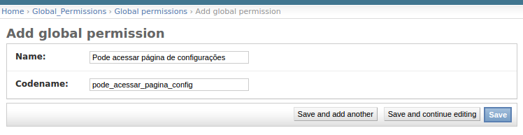
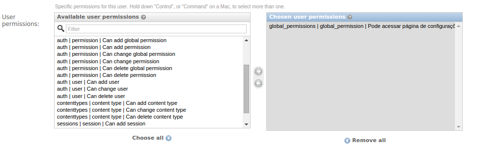

Title: Solução (quase) definitiva para permissões em projetos Django
Date: 2014-11-22 11:30
Tags: Django, django-global-permissions
Category: Django
Slug: solucao-quase-definitiva-para-permissoes-em-projetos-django
Author: Eduardo Matos
Email: eduardo.matos.silva@gmail.com
Github: eduardo-matos

De todas as tarefas que o Django se propõe a resolver, é possível que o módulo de permissões seja o mais gera dúvidas. Seu funcionamento é bastante simples, mas existe uma peça faltando no quebra-cabeça que o torna confuso para marinheiros de primeira viagem.

## O que está faltando?

Atualmente o Django suporta, de forma nativa, somente permissões baseadas em modelos. Então é possível atribuir ou remover a permissão criar/alterar/deletar um dado modelo. Essas permissões são criadas criadas automaticamente através da inspeção dos modelos usados na aplicação, bastando estar persente na tupla `INSTALLED_APPS`.

O problema reside no fato de que, em geral, não nos interessa atribuir permissões a modelos, e sim criar permissões genéricas, como poder acessar uma página ou poder visualizar um item no menu por exemplo. Como este tipo de permissão não está atrelada a um modelo, em tese não é possível utilizá-la.

## Qual a solução?

Devido a ser um problema recorrente, publiquei um pacote no PyPI chamado [Django Global Permissions](https://pypi.python.org/pypi/django-global-permissions/0.1.0), que possibilita a criação de permissões genéricas, resolvendo o empecilho que mencionei anteriormente.

Para utilizar esse pacote, basta instalá-lo e adicioná-lo à tupla `INSTALLED_APPS`.

```
pip install django-global-permissions
```

```python
INSTALLED_APPS += ('global_permissions',)
```

Caso você use o admin do Django, você pode acessar a seção do *Global Permissons*, e criar suas permissões genéricas informando `name` (descrição) e `codename`. O `codename` será utilizado sempre que for necessário verificar uma dada permissão. É altamente recomendável que o `codename` contenha somente *letras* e o caractere *underscore*.



Após criada a permissão, você pode associá-la a um usuário ou um grupo de usuários. Se quiser associar a um usuário, basta acessar a página de edição do mesmo, e na seção de permissões atribuí-la ao usuário, e por fim salvar. 



A permissão pode ser associada também a um grupo de usuários, e para isso basta acessar a página de um grupo específico, e associar a permissão da mesma maneira que faz com qualquer outra permissão no Django.

## Limitando o acesso nas views

Toda view recebe um `request` como parâmetro contendo uma referência ao usuário logado. Dessa maneira é possível verificar se este usuário tem uma dada permissão usando o método `has_perm`.

```python
from django.core.exceptions import PermissionDenied

def config_view(request):
    if not request.user.has_perm('global_permissions.pode_acessar_pagina_config'):
        raise PermissionDenied

    # continuar com o restante do processamento...
```

No exemplo acima, se o usuário tiver a permissão `pode_acessar_pagina_config` ou pertencer a um grupo que tenha essa permissão, então passará pelo `if` sem problemas, caso contrário receberá um erro de permissão negada.

Também é possível verificar se um usuário tem mais de uma permissão sem a necessidade de um `if` com vários `and`, através do método [`has_perms`](https://docs.djangoproject.com/en/dev/ref/contrib/auth/#django.contrib.auth.models.User.has_perms). 

## Limitando o acesso nos templates

Limitar o acesso nos templates é tão simples quanto implementar nas views, mas diferentemente do primeiro, os templates já recebem automaticamente um objeto de permissões do usuário logado (desde que você utilize o *context processor* `django.contrib.auth.context_processors.auth`). Supondo que queiramos saber se o usuário pode visualizar um dado item do menu, podemos fazer da seguinte forma:

```htmldjango

    <a href="/config/">Configuração</a>

```

## Isso resolve tudo?

Não.

Existem casos onde pode ser útil outro tipo de arquitetura para permissões. Se você precisar limitar o acesso baseado em um registro no banco de dados, então pode usar o [django-guardian](https://github.com/lukaszb/django-guardian). Se percisar de algo mais rebuscado, o [django-permission](https://github.com/lambdalisue/django-permission) talvez seja uma escolha mais acertada. O [django-global-permissions](https://github.com/eduardo-matos/django-global-permissions) tem como foco simplificar a criação e uso de permissões globais. Se é isso que você precisa, então não precisa mais procurar por uma solução ;)

## Contribuindo

Caso você encontre algum bug ou tenha uma ideia de como melhorar o projeto, fique a vontade para contribuir através do [repositório no GitHub](https://github.com/eduardo-matos/django-global-permissions)!
