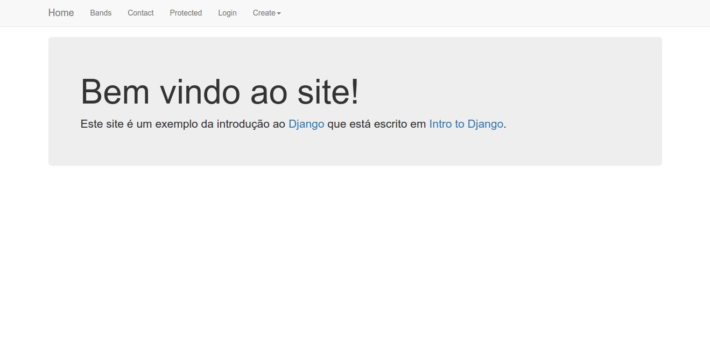
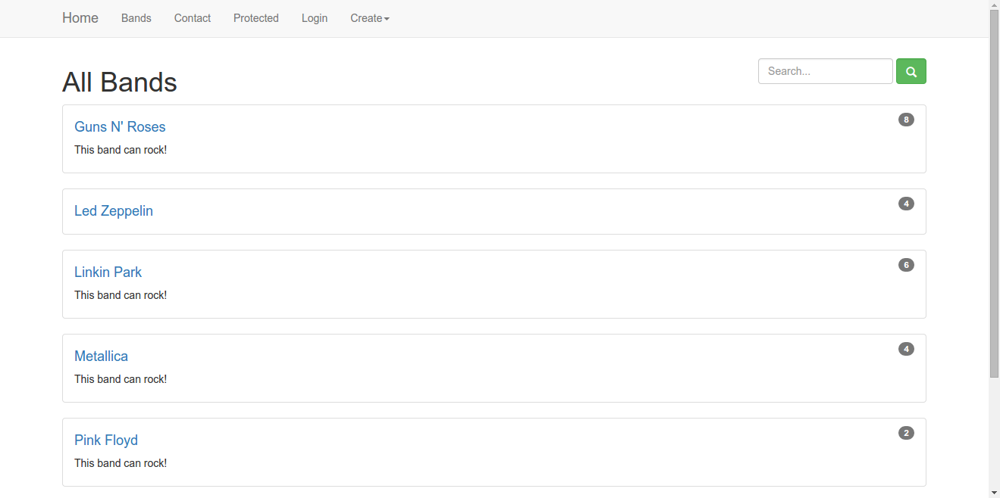
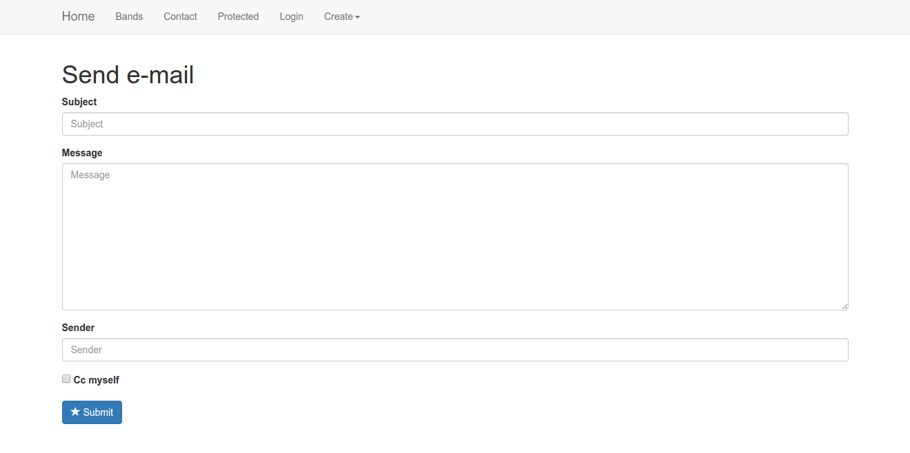
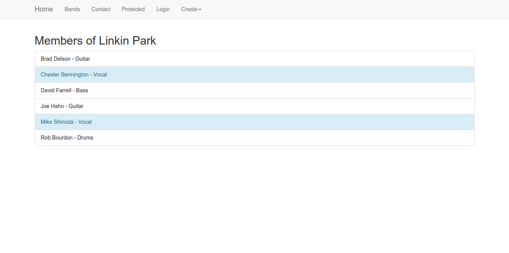
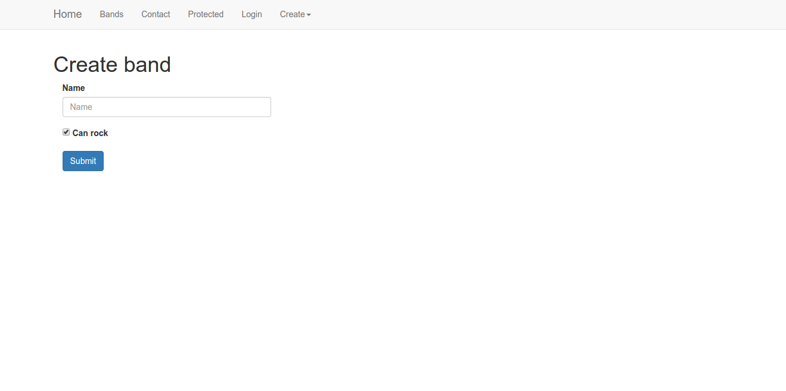
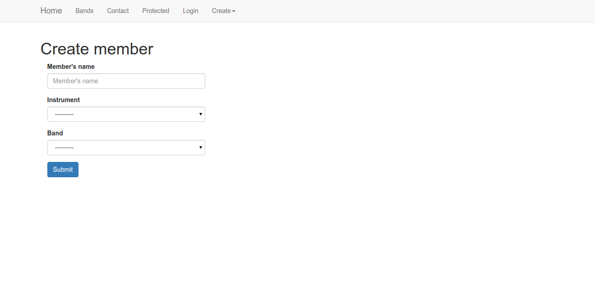
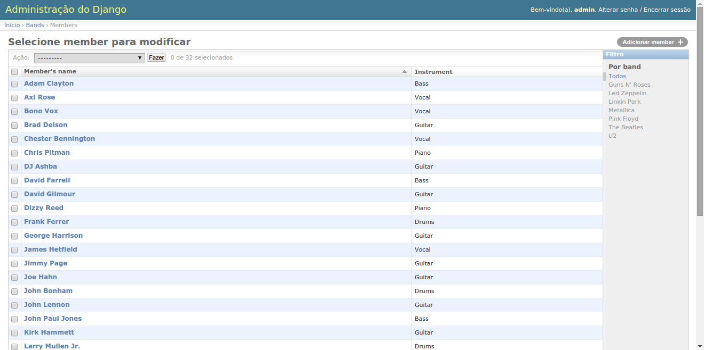

Tutorial Django 1.7
===================

:date: 2015-01-07 06:00
:tags: Python, Django
:category: Python, Django
:slug: tutorial-django-17
:author: Regis da Silva
:email: regis.santos.100@gmail.com
:github: rg3915
:summary: Veja como criar um projeto usando Django 1.7 baseado em `Intro to Django <https://www.djangoproject.com/start/>`_ no site oficial `Django project <https://www.djangoproject.com/>`_.

Fiz um video com um tutorial do Django 1.7 seguindo o modelo que tem no site oficial `Django project <https://www.djangoproject.com/>`_.

.. youtube:: OayIF9Pz7rE

Mas... apesar de já existir os posts `Como criar um site com formulário e lista em 30 minutos? <http://pythonclub.com.br/criar-site-com-form-lista-30-min.html>`_ e `Seu primeiro projeto Django com Sublime Text no Linux <http://pythonclub.com.br/primeiro-projeto-django-no-linux-com-sublime.html>`_ eu resolvi dar uma *atualizada*. E para acrescentar algumas novidades, neste post, eu falo também sobre **shell** e **json**.

Git Hub: https://github.com/rg3915/django1.7

`O que você precisa?`_

`Criando o ambiente`_

`Instalando Django 1.7 + django-bootstrap3`_

`Criando o projeto e a App`_

`Editando settings.py`_

`Editando models.py`_

`Editando urls.py`_

`Editando views.py`_

`Comandos básicos do manage.py`_

`shell`_

`Criando os templates`_

`forms.py`_

`admin.py`_

`Carregando dados de um json`_

`Video e GitHub`_

O que você precisa?
-------------------

* Instale primeiro o `pip <http://pip.readthedocs.org/en/latest/>`_ 

Primeira opção

.. code-block:: shell

    $ wget https://bootstrap.pypa.io/get-pip.py
    $ sudo python get-pip.py

Segunda opção

.. code-block:: shell

    $ sudo apt-get install -y python-pip

* `VirtualEnv <https://virtualenv.pypa.io/en/latest/>`_ 

.. code-block:: shell

    $ sudo pip install virtualenv
    $ # ou
    $ sudo apt-get install -y virtualenv

Criando o ambiente
------------------

Vamos criar um ambiente usando o **Python 3**, então digite

.. code-block:: shell

	$ virtualenv -p /usr/bin/python3 django1.7

onde ``django1.7`` é o nome do ambiente.

Entre na pasta

.. code-block:: shell

	$ cd django1.7

e *ative o ambiente*

.. code-block:: shell

	$ source bin/activate

Para diminuir o caminho do prompt digite

.. code-block:: shell
	
	$ PS1="(`basename \"$VIRTUAL_ENV\"`):/\W$ "

Instalando Django 1.7 + django-bootstrap3
-----------------------------------------

.. code-block:: shell

	$ pip install django==1.7.2 django-bootstrap3

*Dica*: se você digitar ``pip freeze`` você verá a versão dos programas instalados.

Criando o projeto e a App
-------------------------

Para criar o projeto digite

.. code-block:: shell

	$ django-admin.py startproject mysite .

repare no ponto no final do comando, isto permite que o arquivo ``manage.py`` fique nesta mesma pasta *django1.7*.

Agora vamos criar a *app* **bands**, mas vamos deixar esta *app* dentro da pasta *mysite*. Então entre na pasta

.. code-block:: shell

	$ cd mysite

e digite

.. code-block:: shell

	$ python ../manage.py startapp bands

A intenção é que os arquivos tenham a seguinte hierarquia nas pastas:

.. code-block:: bash

	.
	├── fixtures.json
	├── manage.py
	├── mysite
	│   ├── bands
	│   │   ├── admin.py
	│   │   ├── forms.py
	│   │   ├── models.py
	│   │   ├── templates
	│   │   │   ├── bands
	│   │   │   │   ├── band_contact.html
	│   │   │   │   ├── band_detail.html
	│   │   │   │   ├── band_form.html
	│   │   │   │   ├── band_listing.html
	│   │   │   │   ├── member_form.html
	│   │   │   │   └── protected.html
	│   │   │   ├── base.html
	│   │   │   ├── home.html
	│   │   │   └── menu.html
	│   │   ├── tests.py
	│   │   └── views.py
	│   ├── settings.py
	│   ├── urls.py

Agora permaneça sempre na pasta *django1.7*

.. code-block:: shell

	$ cd ..

e digite

.. code-block:: shell

	$ python manage.py migrate

para criar a primeira *migração* e

.. code-block:: shell

	$ python manage.py runserver

e veja que o projeto já está funcionando.

Editando settings.py
--------------------

Em ``INSTALLED_APPS`` acrescente as linhas abaixo.

.. code-block:: python

    INSTALLED_APPS = (
        ...
        'mysite.bands',
        'bootstrap3',
    )

E mude também o idioma.

.. code-block:: python

	LANGUAGE_CODE = 'pt-br'

Editando models.py
------------------

.. code-block:: python

    from django.db import models

    class Band(models.Model):

        """A model of a rock band."""
        name = models.CharField(max_length=200)
        can_rock = models.BooleanField(default=True)

        class Meta:
            ordering = ['name']
            verbose_name = 'band'
            verbose_name_plural = 'bands'

        def __str__(self):
            return self.name

        # count members by band
        # conta os membros por banda
        def get_members_count(self):
            return self.band.count()

        # retorna a url no formato /bands/1
        def get_band_detail_url(self):
            return u"/bands/%i" % self.id

    class Member(models.Model):

        """A model of a rock band member."""
        name = models.CharField("Member's name", max_length=200)
        instrument = models.CharField(choices=(
            ('g', "Guitar"),
            ('b', "Bass"),
            ('d', "Drums"),
            ('v', "Vocal"),
            ('p', "Piano"),
        ),
            max_length=1
        )

        band = models.ForeignKey("Band", related_name='band')

        class Meta:
            ordering = ['name']
            verbose_name = 'member'
            verbose_name_plural = 'members'

        def __str__(self):
            return self.name

Editando urls.py
----------------

.. code-block:: python

    from django.conf.urls import patterns, include, url
    from mysite.bands.views import *

    from django.contrib import admin

    urlpatterns = patterns(
        'mysite.bands.views',
        url(r'^$', 'home', name='home'),
        url(r'^bands/$', 'band_listing', name='bands'),
        url(r'^bands/(?P<pk>\d+)/$', 'band_detail', name='band_detail'),
        url(r'^bandform/$', BandForm.as_view(), name='band_form'),
        url(r'^memberform/$', MemberForm.as_view(), name='member_form'),
        url(r'^contact/$', 'band_contact', name='contact'),
        url(r'^protected/$', 'protected_view', name='protected'),
        url(r'^accounts/login/$', 'message'),
        url(r'^admin/', include(admin.site.urls), name='admin'),
    )

Editando views.py
-----------------

.. code-block:: python

    from django.shortcuts import render
    from django.http import HttpResponse
    from django.contrib.auth.decorators import login_required
    from django.views.generic import CreateView
    from django.core.urlresolvers import reverse_lazy
    from .models import Band, Member
    from .forms import BandContactForm

A função a seguir retorna um *HttpResponse*, ou seja, uma mensagem simples no navegador.

.. code-block:: python

    def home(request):
        return HttpResponse('Welcome to the site!')

A próxima função (use uma ou outra) renderiza um *template*, uma página html no navegador.

.. code-block:: python

    def home(request):
        return render(request, 'home.html')

A função ``band_listing`` retorna todas as bandas.

Para fazer a *busca* por nome de banda usamos o comando ``var_get_search = request.GET.get('search_box')``, onde ``search_box`` é o nome do campo no template *band_listing.html*.

E os nomes são retornados a partir do comando ``bands = bands.filter(name__icontains=var_get_search)``. Onde ``icontains`` procura um texto que contém a palavra, ou seja, você pode digitar o nome incompleto.

.. code-block:: python

    def band_listing(request):
        """ A view of all bands. """
        bands = Band.objects.all()
        var_get_search = request.GET.get('search_box')
        if var_get_search is not None:
            bands = bands.filter(name__icontains=var_get_search)
        return render(request, 'bands/band_listing.html', {'bands': bands})

A função ``band_contact`` mostra como tratar um formulário na *view*.

.. code-block:: python

    def band_contact(request):
        """ A example of form """
        if request.method == 'POST':
            form = BandContactForm(request.POST)
        else:
            form = BandContactForm()
        return render(request, 'bands/band_contact.html', {'form': form})

A função ``band_detail`` retorna todos os membros de cada banda, usando o ``pk`` da banda junto com o comando ``filter`` em members.

.. code-block:: python

    def band_detail(request, pk):
        """ A view of all members by bands. """
        band = Band.objects.get(pk=pk)
        members = Member.objects.all().filter(band=band)
        context = {'members': members, 'band': band}
        return render(request, 'bands/band_detail.html', context)

``BandForm`` e ``MemberForm`` usam o `Class Based View <https://docs.djangoproject.com/en/1.7/topics/class-based-views/>`_ para tratar formulário de uma forma mais simplificada usando a classe ``CreateView``. O ``reverse_lazy`` serve para tratar a url de retorno de página.

.. code-block:: python

    class BandForm(CreateView):
        template_name = 'bands/band_form.html'
        model = Band
        success_url = reverse_lazy('bands')

    class MemberForm(CreateView):
        template_name = 'bands/member_form.html'
        model = Member
        success_url = reverse_lazy('bands')

A próxima função requer que você entre numa página somente quando estiver logado.

`@login_required <https://docs.djangoproject.com/en/1.7/topics/auth/default/#django.contrib.auth.decorators.login_required>`_ é um *decorator*.

``login_url='/accounts/login/'`` é página de erro, ou seja, quando o usuário não conseguiu logar.

E ``render(request, 'bands/protected.html',...`` é página de sucesso.

.. code-block:: python

    @login_required(login_url='/accounts/login/')
    def protected_view(request):
        """ A view that can only be accessed by logged-in users """
        return render(request, 'bands/protected.html', {'current_user': request.user})

``HttpResponse`` retorna uma mensagem simples no navegador sem a necessidade de um template.

.. code-block:: python

    def message(request):
        """ Message if is not authenticated. Simple view! """
        return HttpResponse('Access denied!')

Comandos básicos do manage.py
-----------------------------

Para criar novas migrações com base nas alterações feitas nos seus modelos

.. code-block:: shell

    $ python manage.py makemigrations bands

Para aplicar as migrações, bem como anular e listar seu status

.. code-block:: shell

    $ python manage.py migrate

Para criar um usuário e senha para o admin

.. code-block:: shell

    $ python manage.py createsuperuser

Para rodar a aplicação

.. code-block:: shell

    $ python manage.py runserver

shell
-----

É o *interpretador interativo do python* rodando *via terminal* direto na aplicação do django.

.. code-block:: shell

    $ python manage.py shell

Veja a seguir como inserir dados direto pelo *shell*.

.. code-block:: python

    >>> from mysite.bands.models import Band, Member
    >>> # criando o objeto e salvando
    >>> band = Band.objects.create(name='Metallica')
    >>> band.name
    >>> band.can_rock
    >>> band.id
    >>> # criando uma instancia da banda a partir do id
    >>> b = Band.objects.get(id=band.id)
    >>> # criando uma instancia do Membro e associando o id da banda a ela
    >>> m = Member(name='James Hetfield', instrument='b', band=b)
    >>> m.name
    >>> # retornando o instrumento
    >>> m.instrument
    >>> m.get_instrument_display()
    >>> m.band
    >>> # salvando
    >>> m.save()
    >>> # listando todas as bandas
    >>> Band.objects.all()
    >>> # listando todos os membros
    >>> Member.objects.all()
    >>> # criando mais uma banda
    >>> band = Band.objects.create(name='The Beatles')
    >>> band = Band.objects.get(name='The Beatles')
    >>> band.id
    >>> b = Band.objects.get(id=band.id)
    >>> # criando mais um membro
    >>> m = Member(name='John Lennon', instrument='v', band=b)
    >>> m.save()
    >>> # listando tudo novamente
    >>> Band.objects.all()
    >>> Member.objects.all()
    >>> exit()

Criando os templates
--------------------

.. code-block:: shell

    $ mkdir mysite/bands/templates
    $ mkdir mysite/bands/templates/bands
    $ touch mysite/bands/templates/{menu.html,base.html,home.html}
    $ touch mysite/bands/templates/bands/{band_listing.html,band_contact.html,protected.html}

Veja o código de cada template no `github <https://github.com/rg3915/django1.7/tree/master/mysite/bands/templates>`_.

    Vou comentar apenas os comandos que se destacam.

**menu.html**

Repare que no **menu** usamos *links nomeados*, exemplo:

.. code-block:: html

    <a class="navbar-brand" href="">Home</a>

onde 'home' é o nome que foi dado ao link lá em urls.py.

.. code-block:: python

    url(r'^$', 'home', name='home'),

**base.html**

Note que em **base** carregamos o `bootstrap3 <http://django-bootstrap3.readthedocs.org/en/latest/>`_ com o comando

.. code-block:: python

    
    
    

E também o comando **include** para inserir o *menu* em *base*.

.. code-block:: python

    

**home.html**

Em **home** usamos o comando **extends** para usar a estrutura inicial do *base*.

.. code-block:: html

    

**band_listing.html**

Neste template usamos um campo de busca com o nome ``name="search_box"``. Este nome será usada na *views* para localizar um nome de banda.

E para lista as bandas usamos o comando

.. code-block:: html

    ...
    
        <ul>
            <li>
                <h4>{{ band.name}}</h4>
            </li>
        </ul>
    
    ...

**band_contact**

Usando o *django-bootstrap3* podemos digitar apenas

.. code-block:: html

    
    <form>
    ...
        
    ...
    </form>

que todos os campos do formulário serão inseridos automaticamente.

**band_detail.html**

Um destaque para o *if* que "pinta" de azul os membros que são vocal.

.. code-block:: html

    ...
    
        <li class="list-group-item list-group-item-info">
    
        <li class="list-group-item">
    
    ...

E ``{{ member.get_instrument_display }}`` que retorna o segundo elemento da lista ``choices`` em *models.py*. Ou seja, retorna 'vocal' ao invés de 'v'.

**band_form.html**

.. code-block:: python

    

    

    
        <title>Band Form</title>
    

    

        <h1>Create band</h1>
        <form class="form col-sm-4" method="POST">
            
            
            
                <button type="submit" class="btn btn-primary">Submit</button>
            
        </form>

    

**member_form.html**

Pegue o código no GitHub.

forms.py
--------

.. code-block:: shell

	$ touch mysite/bands/forms.py

Edite o forms.py.

.. code-block:: python

    from django import forms
    from .models import Band, Member

    class BandContactForm(forms.Form):
        subject = forms.CharField(max_length=100)
        message = forms.CharField(widget=forms.Textarea)
        sender = forms.EmailField()
        cc_myself = forms.BooleanField(required=False)

    class BandForm(forms.ModelForm):

        class Meta:
            model = Band

    class MemberForm(forms.ModelForm):

        class Meta:
            model = Member

admin.py
--------

Criamos uma customização para o admin onde em *members* aparece um **filtro** por *bandas*.

.. code-block:: python

    from django.contrib import admin
    from .models import Band, Member

    class MemberAdmin(admin.ModelAdmin):

        """Customize the look of the auto-generated admin for the Member model"""
        list_display = ('name', 'instrument')
        list_filter = ('band',)

    admin.site.register(Band)  # Use the default options
    admin.site.register(Member, MemberAdmin)  # Use the customized options

Carregando dados de um json
---------------------------

Baixe o arquivo *fixtures.json* no github e no terminal digite

.. code-block:: python

    $ python manage.py loaddata fixtures.json

Video e GitHub
--------------

Video: https://www.youtube.com/watch?v=OayIF9Pz7rE

Git Hub: https://github.com/rg3915/django1.7