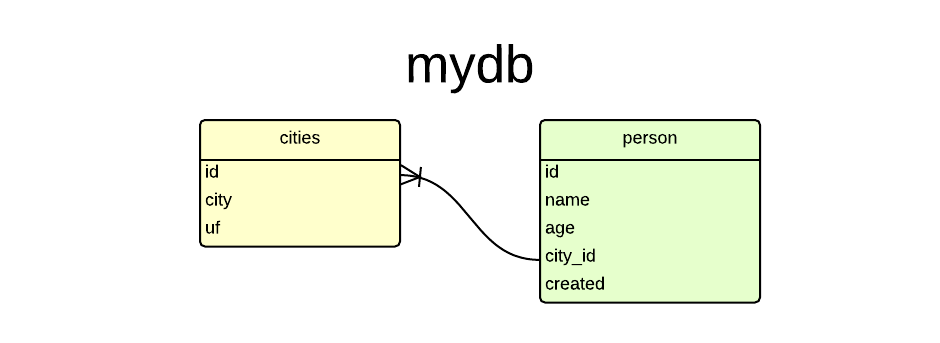
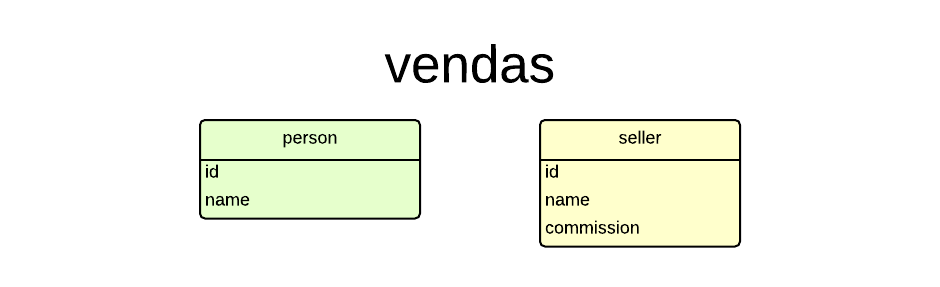

Tutorial PostgreSql
===================

:date: 2015-02-05 12:00
:tags: python, postresql, banco de dados
:category: Python, Banco de dados
:slug: tutorial-postgresql
:author: Regis da Silva
:email: regis.santos.100@gmail.com
:github: rg3915
:summary: Esta é a parte 1 (de 3) da série de posts sobre PostgreSql...

Para quem já leu `Two Scoops of Django <http://twoscoopspress.com/products/two-scoops-of-django-1-6>`_ sabe que o `PyDanny <http://www.pydanny.com/>`_ recomenda fortemente o uso do `PostgreSQL <http://www.postgresql.org/>`_ em seus projetos.

Então eu resolvi escrever esta série de 3 posts sobre PostgreSQL. Onde os outros 2 são:

*PostgreSql + Python3*

*PostgreSql + Django*

Sumário:

`Instalação`_

`Criando um banco de dados`_

`Usando o banco de dados`_

`Criando as tabelas`_

`Inserindo dados`_

`Lendo os dados`_

`Atualizando`_

`Deletando`_

`Herança`_

`Modificando tabelas`_

`Backup`_

    Ah, talvez isso aqui também seja útil `postgresql cheat sheet <http://www.postgresonline.com/downloads/special_feature/postgresql90_cheatsheet_A4.pdf>`_.

Instalação
----------

*Eu apanhei bastante para instalar até descobrir que meu SO estava zuado... então se você tiver problemas na instalação não me pergunte porque eu não saberei responder. Eu recorri à comunidade... e Google sempre! Dai eu formatei minha máquina instalei um Linux do zero e deu certo... (não sei instalar no Windows)...*

Bom, vamos lá. No seu **terminal** digite esta sequência:

.. code-block:: bash

    $ dpkg -l | grep -i postgres

Este comando é só pra ver se não tem alguma coisa já instalado.

Agora instale...

.. code-block:: bash

    $ sudo apt-get install -y python3-dev python3-setuptools postgresql-9.3 postgresql-contrib-9.3 pgadmin3 libpq-dev build-essential binutils g++

`pgadmin3 <http://www.pgadmin.org/>`_ é a versão com interface visual... no `youtube <https://www.youtube.com/results?search_query=pgadmin>`_  tem vários tutoriais legais. É bem fácil de mexer.

``binutils g++`` talvez não seja necessário, mas no meu caso precisou.

No final, se você conseguir ver a versão do programa é porque deu tudo certo.

.. code-block:: bash

    $ psql -V
    psql (PostgreSQL) 9.3.5

Criando um banco de dados
-------------------------

Usando o **terminal** sempre!

.. code-block:: bash

    $ sudo su - postgres

Seu prompt vai ficar assim:

.. code-block:: bash

    postgres@usuario:~$

Criando o banco

.. code-block:: bash

    $ createdb mydb

Se quiser deletar o banco

.. code-block:: bash

    $ dropdb mydb

Criando um usuário

.. code-block:: bash

    $ createuser -P myuser

Acessando o banco

.. code-block:: bash

    $ psql mydb

O comando a seguir define direito de acesso ao novo usuário.

.. code-block:: sql

    $ GRANT ALL PRIVILEGES ON DATABASE mydb TO myuser;

Para sair do programa **psql**

.. code-block:: bash

    \q

Para sair do *root* pressione ``ctrl+d``.

Usando o banco de dados
-----------------------

Antes vamos criar 2 arquivos porque nós iremos usá-los mais na frente.

*person.csv*

.. code-block:: bash

    $ cat > person.csv << EOF
    name,age,city_id
    Abel,12,1
    Jose,54,2
    Thiago,15,3
    Veronica,28,1
    EOF

*basics.sql*

.. code-block:: sql

    $ cat > basics.sql << EOF
    CREATE TABLE cities (id SERIAL PRIMARY KEY, city VARCHAR(50), uf VARCHAR(2));
    INSERT INTO cities (city, uf) VALUES ('São Paulo', 'SP');
    SELECT * FROM cities;
    DROP TABLE cities;
    EOF

Agora, vamos abrir o banco de dados *mydb*.

.. code-block:: bash

    $ psql mydb
    psql (9.3.5)
    Type "help" for help.
    
    mydb=> 

Para rodar os comandos que estão no arquivo *basics.sql* digite

.. code-block:: bash

    mydb=> \i basics.sql

Resultado:

.. code-block:: bash

    CREATE TABLE
    INSERT 0 1
     id |   city    | uf 
    ----+-----------+----
      1 | São Paulo | SP
    (1 row)
    
    DROP TABLE

Como você deve ter percebido, criamos uma tabela *cities*, inserimos um registro, lemos o registro e excluimos a tabela.

Criando as tabelas
------------------

Daqui pra frente vou omitir o prompt, assumindo que seja este:

.. code-block:: bash

    mydb=>

Considere as tabelas a seguir:

Então vamos criar as tabelas...

    Ah, talvez isso aqui também seja útil `postgresql cheat sheet <http://www.postgresonline.com/downloads/special_feature/postgresql90_cheatsheet_A4.pdf>`_.

.. code-block:: sql

    CREATE TABLE cities (id SERIAL PRIMARY KEY, city VARCHAR(50), uf VARCHAR(2));
    CREATE TABLE person (
        id SERIAL PRIMARY KEY,
        name VARCHAR(50),
        age INT,
        city_id INT REFERENCES cities(id),
        created TIMESTAMP WITH TIME ZONE NOT NULL DEFAULT NOW()
    );

Alguns comandos:

``SERIAL`` é o conhecido *auto incremento* numérico.

``TIMESTAMP WITH TIME ZONE`` data e hora com *time zone*.

``DEFAULT NOW()`` insere a data e hora atual automaticamente.

Mais tipos de campos em `Chapter 8. Data Types <http://www.postgresql.org/docs/9.4/static/datatype.html>`_.

Para ver as tabelas

.. code-block:: bash

    \dt

Resultado:

.. code-block:: bash

            List of relations
     Schema |  Name  | Type  | Owner  
    --------+--------+-------+--------
     public | cities | table | myuser
     public | person | table | myuser
    (2 rows)

Para ver o esquema de cada tabela

.. code-block:: bash

    \d cities

Resultado:

.. code-block:: bash

                                Table "public.cities"
     Column |         Type          |                      Modifiers                      
    --------+-----------------------+-----------------------------------------------------
     id     | integer               | not null default nextval('cities_id_seq'::regclass)
     city   | character varying(50) | 
     uf     | character varying(2)  | 
    Indexes:
        "cities_pkey" PRIMARY KEY, btree (id)
    Referenced by:
        TABLE "person" CONSTRAINT "person_city_id_fkey" FOREIGN KEY (city_id) REFERENCES cities(id)

Para deletar as tabelas

.. code-block:: sql

    DROP TABLE cities
    DROP TABLE person

Para definir o *timezone*

.. code-block:: sql

    SET timezone = 'America/Sao_Paulo';

Caso dê erro ao inserir a data tente

.. code-block:: sql

    SET timezone = 'UTC';

Dica: `stackoverflow <http://stackoverflow.com/a/6158432/802542>`_

Inserindo dados
---------------

Pra quem já manja de SQL...

.. code-block:: sql

    INSERT INTO cities (city, uf) VALUES ('São Paulo', 'SP'),('Salvador', 'BA'),('Curitiba', 'PR');
    INSERT INTO person (name, age, city_id) VALUES ('Regis', 35, 1);

Se lembra do arquivo *person.csv* que criamos lá em cima?

Troque *user* pelo nome do seu usuário!

.. code-block:: sql

    COPY person (name,age,city_id) FROM '/home/user/person.csv' DELIMITER ',' CSV HEADER;

**Erro:** Comigo deu o seguinte erro:

.. code-block:: bash

    ERROR:  must be superuser to COPY to or from a file

Ou seja, você deve entrar como *root*. Saia do programa e entre novamente.

.. code-block:: bash

    $ sudo su - postgres
    $ psql mydb
    mydb=# COPY person (name,age,city_id) FROM '/home/user/person.csv' DELIMITER ',' CSV HEADER;

Repare que o prompt ficou com ``#``, ou seja, você entrou como *root*.

Lendo os dados
--------------

Pra quem não sabe usar ``JOIN``...

.. code-block:: sql

    SELECT * FROM person ORDER BY name;
    SELECT * FROM person INNER JOIN cities ON (person.city_id = cities.id) ORDER BY name;

Resultado:

.. code-block:: bash

     id |   name   | age | city_id |            created            | id |   city    | uf 
    ----+----------+-----+---------+-------------------------------+----+-----------+----
      2 | Abel     |  12 |       1 | 2015-02-04 03:49:01.597185-02 |  1 | São Paulo | SP
      3 | Jose     |  54 |       2 | 2015-02-04 03:49:01.597185-02 |  2 | Salvador  | BA
      1 | Regis    |  35 |       1 | 2015-02-04 03:47:10.63258-02  |  1 | São Paulo | SP
      4 | Thiago   |  15 |       3 | 2015-02-04 03:49:01.597185-02 |  3 | Curitiba  | PR
      5 | Veronica |  28 |       1 | 2015-02-04 03:49:01.597185-02 |  1 | São Paulo | SP
    (5 rows)

Exemplo de count e inner join
^^^^^^^^^^^^^^^^^^^^^^^^^^^^^

Um exemplo interessante, e talvez útil, é saber quantas pessoas moram em cada cidade.

.. code-block:: sql

    SELECT cities.city, COUNT(person.city_id) AS persons
    FROM cities INNER JOIN person ON cities.id = person.city_id
    GROUP BY cities.city;

Mais em `2.7. Aggregate Functions <http://www.postgresql.org/docs/9.4/static/tutorial-agg.html>`_.

.. code-block:: bash

       city    | persons 
    -----------+---------
     São Paulo |       3
     Curitiba  |       1
     Salvador  |       1
    (3 rows)

E apenas para não esquecer, o operador para *diferente* é

.. code-block:: sql

    SELECT * FROM person WHERE city_id <> 1;

Atualizando
-----------

.. code-block:: sql

    UPDATE person SET name = 'Jose da Silva', age = age - 2 WHERE name = 'Jose';

antes: ``SELECT * FROM person WHERE name Like 'Jose';``

.. code-block:: bash

     id | name | age | city_id |            created            
    ----+------+-----+---------+-------------------------------
      3 | Jose |  54 |       2 | 2015-02-04 03:49:01.597185-02

depois: ``SELECT * FROM person WHERE id=3;``

.. code-block:: bash

     id |     name      | age | city_id |            created            
    ----+---------------+-----+---------+-------------------------------
      3 | Jose da Silva |  52 |       2 | 2015-02-04 03:49:01.597185-02

Note que ``age = age - 2`` fez com que a idade diminuisse de 54 para 52. Ou seja, dá pra fazer operações algébricas com ``UPDATE``.

Deletando
---------

.. code-block:: sql

    DELETE FROM person WHERE age < 18;

Fazendo ``SELECT * FROM person;`` repare que foram excluidos *Abel* e *Thiago*.

.. code-block:: bash

     id |     name      | age | city_id |            created            
    ----+---------------+-----+---------+-------------------------------
      1 | Regis         |  35 |       1 | 2015-02-04 03:47:10.63258-02
      5 | Veronica      |  28 |       1 | 2015-02-04 03:49:01.597185-02
      3 | Jose da Silva |  52 |       2 | 2015-02-04 03:49:01.597185-02

Mais informações em `Chapter 2. The SQL Language <http://www.postgresql.org/docs/9.4/static/tutorial-sql.html>`_.

Herança
-------

Considere o banco de dados chamado *vendas*.

Suponha que você tenha duas tabelas: *person* (pessoa) e *seller* (vendedor).

    
Então façamos:

.. code-block:: bash

    $ sudo su - postgres
    $ createdb vendas
    $ psql vendas

.. code-block:: sql

    CREATE TABLE person (
        id SERIAL PRIMARY KEY,
        name TEXT
    );
    CREATE TABLE seller (
        id SERIAL PRIMARY KEY,
        name TEXT,
        commission DECIMAL(6,2)
    );
    INSERT INTO person (name) VALUES ('Paulo');
    INSERT INTO seller (name,commission) VALUES ('Roberto',149.99);

Dai criamos uma VIEW:

.. code-block:: sql

    CREATE VIEW peoples AS
        SELECT name FROM person
            UNION
        SELECT name FROM seller;
    
    SELECT * FROM peoples;

Que retorna:

.. code-block:: bash

      name   
    ---------
     Paulo
     Roberto
    (2 rows)

Lembre-se que 'Paulo' pertence a *person* e 'Roberto' pertence a *seller*.

Mas esta não é a melhor solução. Usando a herança façamos da seguinte forma:

.. code-block:: sql

    DROP VIEW peoples;
    DROP TABLE person, seller;

    CREATE TABLE person (
        id SERIAL PRIMARY KEY,
        name VARCHAR(50)
    );
    CREATE TABLE seller (
        commission DECIMAL(6,2)
    ) INHERITS (person);

Fazendo

.. code-block:: 'bash'

    \d person
                                    Table "public.person"
     Column |         Type          |                      Modifiers                      
    --------+-----------------------+-----------------------------------------------------
     id     | integer               | not null default nextval('person_id_seq'::regclass)
     name   | character varying(50) | 
    Indexes:
        "person_pkey" PRIMARY KEY, btree (id)
    Number of child tables: 1 (Use \d+ to list them.)

E

.. code-block:: bash

    \d seller
                                  Table "public.seller"
       Column   |         Type          |                      Modifiers                      
    ------------+-----------------------+-----------------------------------------------------
     id         | integer               | not null default nextval('person_id_seq'::regclass)
     name       | character varying(50) | 
     commission | numeric(6,2)          | 
    Inherits: person

A diferença é que com menos código criamos as duas tabelas e não precisamos criar VIEW. Mas a tabela *seller* depende da tabela *person*.

Portanto não conseguimos deletar a tabela *person* sozinha, precisaríamos deletar as duas tabelas de uma vez.

Vamos inserir alguns dados.

.. code-block:: sql

    INSERT INTO person (name) VALUES ('Paulo'),('Fernando');
    INSERT INTO seller (name,commission) VALUES
        ('Roberto',149.99),
        ('Rubens',85.01);

Fazendo

.. code-block:: sql

    SELECT name FROM person;

           name   
    ----------
     Paulo
     Fernando
     Roberto
     Rubens
    (4 rows)

Obtemos todos os nomes porque na verdade um *seller* também é um *person*.

Agora vejamos somente os registros de *person*.

.. code-block:: sql

    SELECT name FROM ONLY person;

       name   
    ----------
     Paulo
     Fernando
    (2 rows)

E somente os registros de *seller*.

.. code-block:: sql

    SELECT name FROM seller;

      name   
    ---------
     Roberto
     Rubens
    (2 rows)

Mais informações em `3.6. Inheritance <http://www.postgresql.org/docs/9.4/static/tutorial-inheritance.html>`_.

Modificando tabelas
-------------------

Vejamos agora como inserir um novo campo numa tabela existente e como alterar as propriedades de um outro campo.

Para inserir um novo campo façamos

.. code-block:: sql

    ALTER TABLE person ADD COLUMN email VARCHAR(30);

Para alterar as propriedades de um campo existente façamos

.. code-block:: sql

    ALTER TABLE person ALTER COLUMN name TYPE VARCHAR(80);

Antes era ``name VARCHAR(50)``, agora é ``name VARCHAR(80)``.

Também podemos inserir um campo com um valor padrão já definido.

.. code-block:: sql

    ALTER TABLE seller ADD COLUMN active BOOLEAN DEFAULT TRUE;
    \d seller
                                  Table "public.seller"
       Column   |         Type          |                      Modifiers                      
    ------------+-----------------------+-----------------------------------------------------
     id         | integer               | not null default nextval('person_id_seq'::regclass)
     name       | character varying(80) | 
     commission | numeric(6,2)          | 
     active     | boolean               | default true
    Inherits: person

Façamos SELECT novamente.

.. code-block:: sql

    SELECT * FROM seller;
     id |  name   | commission | active 
    ----+---------+------------+--------
      3 | Roberto |     149.99 | t
      4 | Rubens  |      85.01 | t
    (2 rows)

Vamos definir um email para cada pessoa. O comando ``lower`` torna tudo **minúsculo** e ``||`` **concatena** textos.

.. code-block:: sql

    UPDATE person SET email = lower(name) || '@example.com';
    SELECT * FROM person;

     id |   name   |        email         
    ----+----------+----------------------
      1 | Paulo    | paulo@example.com
      2 | Fernando | fernando@example.com
      3 | Roberto  | roberto@example.com
      4 | Rubens   | rubens@example.com
    (4 rows)

Leia `9.4. String Functions and Operators <http://www.postgresql.org/docs/9.1/static/functions-string.html>`_ e `ALTER TABLE <http://www.postgresql.org/docs/9.3/static/sql-altertable.html>`_.

Backup
------

.. code-block:: bash

    pg_dump mydb > bkp.dump
    # ou
    pg_dump -f bkp.dump mydb

Excluindo o banco

.. code-block:: bash

    dropdb mydb

Criando novamente e **recuperando os dados**

.. code-block:: bash

    createdb mydb; psql mydb < bkp.dump

Leia `24.1. SQL Dump <http://www.postgresql.org/docs/9.1/static/backup-dump.html>`_.

	Se você quiser aqui tem o `post resumido <https://gist.github.com/rg3915/936f09f361fc43d8c2dd>`_ , ou seja, somente os comandos.

Leia também

*PostgreSql + Python3*

*PostgreSql + Django*

Mais alguns links:

http://www.postgresonline.com/downloads/special_feature/postgresql90_cheatsheet_A4.pdf

http://www.postgresql.org/docs/9.4/static/tutorial-createdb.html

http://www.postgresql.org/docs/9.4/static/index.html

http://www.postgresql.org/docs/9.4/static/tutorial-sql.html

http://www.postgresql.org/docs/9.4/static/datatype.html

http://www.postgresql.org/docs/9.1/static/functions-datetime.html#FUNCTIONS-DATETIME-CURRENT